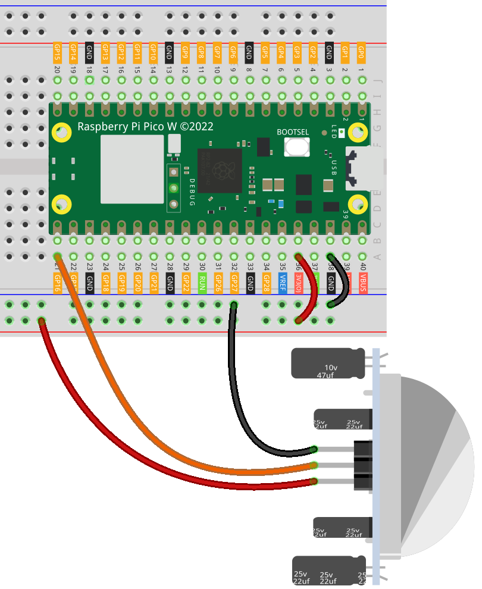

.. note::

    こんにちは、SunFounder Raspberry Pi & Arduino & ESP32 Enthusiasts Communityへようこそ！Facebook上で、仲間と一緒にRaspberry Pi、Arduino、ESP32をさらに深く探求しましょう。

    **なぜ参加するのか？**

    - **専門的なサポート**：購入後の問題や技術的な課題をコミュニティやチームの助けを借りて解決。
    - **学びと共有**：スキルを向上させるためのヒントやチュートリアルを交換。
    - **限定プレビュー**：新製品発表や予告編に早期アクセス。
    - **特別割引**：最新製品の特別割引を楽しむ。
    - **フェスティブプロモーションとプレゼント**：プレゼントやホリデープロモーションに参加。

    👉 私たちと一緒に探索と創造を始める準備はできましたか？[|link_sf_facebook|]をクリックして、今すぐ参加しましょう！
    
.. _pico_lesson12_pir_motion:

レッスン12: PIRモーションモジュール (HC-SR501)
===============================================

このレッスンでは、Raspberry Pi Pico WにPIRモーションセンサーを接続する方法を学びます。センサーをモーション検出用に設定し、基本的なMicroPythonコードを使用して動きに反応する方法を紹介します。PIRセンサーを監視することで、デジタル入力の管理や簡単なセキュリティ対策や自動化トリガーを作成する経験を積むことができます。

必要な部品
--------------------------

このプロジェクトでは、以下の部品が必要です。

キット全体を購入するのが便利です。リンクはこちら：

.. list-table::
    :widths: 20 20 20
    :header-rows: 1

    *   - Name	
        - ITEMS IN THIS KIT
        - LINK
    *   - Universal Maker Sensor Kit
        - 94
        - |link_umsk|

以下のリンクから個別に購入することもできます。

.. list-table::
    :widths: 30 20
    :header-rows: 1

    *   - Component Introduction
        - Purchase Link

    *   - Raspberry Pi Pico W
        - \-
    *   - :ref:`cpn_pir_motion`
        - \-
    *   - :ref:`cpn_breadboard`
        - |link_breadboard_buy|

配線
---------------------------

コード
---------------------------

.. code-block:: python

   from machine import Pin
   import time
   
   # Initialize PIR sensor connected to pin 16 as input
   pir_sensor = Pin(16, Pin.IN)
   
   while True:
       # Check the PIR sensor value
       if pir_sensor.value() == 0:  
           print("Monitoring...")  # No motion detected
       else:
           print("Somebody here!")  # Motion detected
   
       time.sleep(0.1)  # Short delay of 0.1 seconds to reduce CPU usage

コード解析
---------------------------

#. モジュールのインポート

   ``machine``モジュールはGPIOピンを制御するために ``Pin``クラスを使用するためにインポートされます。 ``time``モジュールはループ内で遅延を作成するためにインポートされます。

   .. code-block:: python

      from machine import Pin
      import time

#. PIRセンサーの初期化

   PIRセンサーはRaspberry Pi Pico WのGPIOピン16に接続されています。これはマイクロコントローラにデータを送信する入力デバイスとして設定されています。

   .. code-block:: python

      # Initialize PIR sensor connected to pin 16 as input
      pir_sensor = Pin(16, Pin.IN)

#. メインループ

   ``while True``ループはコードを継続的に実行させます。このループ内でPIRセンサーの値がチェックされます。値が ``0`` の場合、動きが検出されていないことを意味します。それ以外の場合は動きが検出されたことを意味します。CPU使用率を減らし、コードが速すぎて実行されないようにするために0.1秒の遅延が追加されます。

   .. code-block:: python

      while True:
          # Check the PIR sensor value
          if pir_sensor.value() == 0:  
              print("Monitoring...")  # No motion detected
          else:
              print("Somebody here!")  # Motion detected

          time.sleep(0.1)  # Short delay of 0.1 seconds to reduce CPU usage