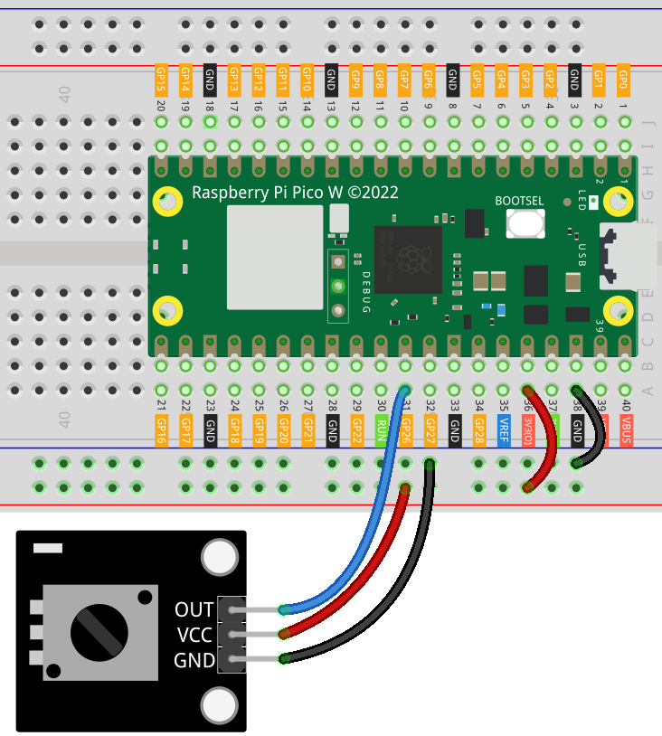

.. note::

   Hallo und willkommen in der SunFounder Raspberry Pi & Arduino & ESP32 Enthusiasten-Gemeinschaft auf Facebook! Tauchen Sie tiefer ein in die Welt von Raspberry Pi, Arduino und ESP32 mit anderen Enthusiasten.

   **Warum beitreten?**

   - **Expertenunterstützung**: Lösen Sie Nachverkaufsprobleme und technische Herausforderungen mit Hilfe unserer Gemeinschaft und unseres Teams.
   - **Lernen & Teilen**: Tauschen Sie Tipps und Anleitungen aus, um Ihre Fähigkeiten zu verbessern.
   - **Exklusive Vorschauen**: Erhalten Sie frühzeitigen Zugang zu neuen Produktankündigungen und exklusiven Einblicken.
   - **Spezialrabatte**: Genießen Sie exklusive Rabatte auf unsere neuesten Produkte.
   - **Festliche Aktionen und Gewinnspiele**: Nehmen Sie an Gewinnspielen und Feiertagsaktionen teil.

   👉 Sind Sie bereit, mit uns zu erkunden und zu erschaffen? Klicken Sie auf [|link_sf_facebook|] und treten Sie heute bei!

.. _pico_lesson13_potentiometer:
Lesson 13: Potentiometer Module
===================================

In dieser Lektion lernst du, wie du einen Potentiometer mit dem Raspberry Pi Pico W verwendest, um analoge Werte zu messen. Der Potentiometer, der ein veränderlicher Widerstand ist, ermöglicht es dir, die Spannung anzupassen, die der Raspberry Pi Pico W an einem seiner analogen Eingangspins liest. Durch Drehen des Knopfes am Potentiometer beobachtest du Veränderungen im Eingangswert. Dieses Projekt vermittelt ein grundlegendes Verständnis für analoge Eingänge und ihre Anwendung in elektronischen Projekten, was es zu einem idealen Einstiegspunkt für Anfänger in Elektronik und MicroPython-Programmierung macht.

Erforderliche Komponenten
----------------------------

Für dieses Projekt benötigen wir folgende Komponenten.

Es ist definitiv praktisch, ein ganzes Kit zu kaufen, hier ist der Link:

.. list-table::
    :widths: 20 20 20
    :header-rows: 1

    *   - Name	
        - ITEMS IN THIS KIT
        - LINK
    *   - Universal Maker Sensor Kit
        - 94
        - |link_umsk|

Sie können sie auch separat über die unten stehenden Links kaufen.

.. list-table::
    :widths: 30 20
    :header-rows: 1

    *   - Component Introduction
        - Purchase Link

    *   - Raspberry Pi Pico W
        - \-
    *   - :ref:`cpn_potentiometer`
        - |link_potentiometer_sensor_module_buy|
    *   - :ref:`cpn_breadboard`
        - |link_breadboard_buy|

Verdrahtung
---------------------------

Code
---------------------------

.. code-block:: python

   import machine  # Hardware control library
   import time  # Time control library
   
   potentiometer = machine.ADC(26)  # Initialize ADC on pin 26
   
   while True:
       value = potentiometer.read_u16()  # Read analog value
       print(value)  # Print the value
   
       time.sleep_ms(200)  # Delay of 200 ms between reads

Code-Analyse
---------------------------

#. Bibliotheken importieren

   Zuerst werden die erforderlichen Bibliotheken importiert. ``machine`` ist für die Hardwaresteuerung und ``time`` dient zur Verwaltung von Verzögerungen.

   .. code-block:: python

      import machine  # Hardware control library
      import time     # Time control library

#. ADC initialisieren (Analog-Digital-Wandler)

   Der Potentiometer ist mit Pin 26 des Pico W verbunden. Dieser Pin wird als ADC-Pin initialisiert, um analoge Werte zu lesen.

   .. code-block:: python

      potentiometer = machine.ADC(26)  # Initialize ADC on pin 26
#. Reading and Printing the Analog Value
   Der Code tritt in eine Endlosschleife (``while True:``) ein, in der er kontinuierlich den analogen Wert des Potentiometers mit ``potentiometer.read_u16()`` liest und ihn ausdruckt.

   .. code-block:: python

      while True:
          value = potentiometer.read_u16()  # Read analog value
          print(value)                      # Print the value

#. Verzögerung hinzufügen

   Um zu verhindern, dass die Schleife zu schnell läuft, wird eine Verzögerung von 200 Millisekunden mit ``time.sleep_ms(200)`` eingeführt. Dies sorgt für eine lesbare Ausgabe und reduziert die Prozessorlast.

   .. code-block:: python

      time.sleep_ms(200)                # Delay of 200 ms between reads