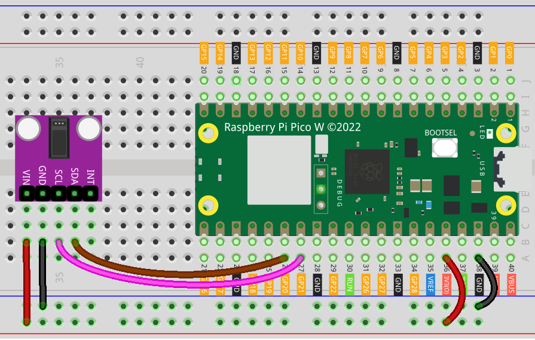

.. note::

    Hello, welcome to the SunFounder Raspberry Pi & Arduino & ESP32 Enthusiasts Community on Facebook! Dive deeper into Raspberry Pi, Arduino, and ESP32 with fellow enthusiasts.

    **Why Join?**

    - **Expert Support**: Solve post-sale issues and technical challenges with help from our community and team.
    - **Learn & Share**: Exchange tips and tutorials to enhance your skills.
    - **Exclusive Previews**: Get early access to new product announcements and sneak peeks.
    - **Special Discounts**: Enjoy exclusive discounts on our newest products.
    - **Festive Promotions and Giveaways**: Take part in giveaways and holiday promotions.

    👉 Ready to explore and create with us? Click [|link_sf_facebook|] and join today!

.. _pico_lesson14_max30102:

Lesson 14: Pulse Oximeter and Heart Rate Sensor Module (MAX30102)
====================================================================

In this lesson, you will learn how to use the Raspberry Pi Pico W to interface with the MAX30102 pulse oximeter and heart rate sensor. You will gain knowledge on setting up I2C communication, configuring the sensor, and reading raw data from the sensor. By observing changes in the data, you can obtain heartbeat information.

Required Components
--------------------------

In this project, we need the following components. 

It's definitely convenient to buy a whole kit, here's the link: 

.. list-table::
    :widths: 20 20 20
    :header-rows: 1

    *   - Name	
        - ITEMS IN THIS KIT
        - LINK
    *   - Universal Maker Sensor Kit
        - 94
        - |link_umsk|

You can also buy them separately from the links below.

.. list-table::
    :widths: 30 10
    :header-rows: 1

    *   - Component Introduction
        - Purchase Link

    *   - Raspberry Pi Pico W
        - \-
    *   - :ref:`cpn_max30102`
        - |link_max30102_module_buy|
    *   - :ref:`cpn_breadboard`
        - |link_breadboard_buy|

Wiring
---------------------------

Code
---------------------------

.. note::

    * Open the ``14_max30102_module.py`` file under the path of ``universal-maker-sensor-kit-main/pico/Lesson_14_MAX30102_Module`` or copy this code into Thonny, then click "Run Current Script" or simply press F5 to run it. For detailed tutorials, please refer to :ref:`open_run_code_py`. 

    * Here you need to use the ``max30102`` folder, please check if it has been uploaded to Pico W, for a detailed tutorial refer to :ref:`add_libraries_py`.

    * Don't forget to click on the "MicroPython (Raspberry Pi Pico)" interpreter in the bottom right corner. 

.. code-block:: python

   from machine import SoftI2C, Pin
   from time import ticks_diff, ticks_us, sleep
   
   from max30102 import MAX30102, MAX30105_PULSE_AMP_MEDIUM
   
   
   def main():
       # I2C software instance
       i2c = SoftI2C(sda=Pin(20),  # Here, use your I2C SDA pin
                     scl=Pin(21),  # Here, use your I2C SCL pin
                     freq=400000)  # Fast: 400kHz, slow: 100kHz
   
       # Sensor instance
       sensor = MAX30102(i2c=i2c)  # An I2C instance is required
   
       # Scan I2C bus to ensure that the sensor is connected
       if sensor.i2c_address not in i2c.scan():
           print("Sensor not found.")
           return
       elif not (sensor.check_part_id()):
           # Check that the targeted sensor is compatible
           print("I2C device ID not corresponding to MAX30102 or MAX30105.")
           return
       else:
           print("Sensor connected and recognized.")
   
       # It's possible to set up the sensor at once with the setup_sensor() method.
       # If no parameters are supplied, the default config is loaded:
       # Led mode: 2 (RED + IR)
       # ADC range: 16384
       # Sample rate: 400 Hz
       # Led power: maximum (50.0mA - Presence detection of ~12 inch)
       # Averaged samples: 8
       # pulse width: 411
       print("Setting up sensor with default configuration.", '\n')
       sensor.setup_sensor()
   
       # It is also possible to tune the configuration parameters one by one.
       # Set the sample rate to 400: 400 samples/s are collected by the sensor
       sensor.set_sample_rate(400)
       # Set the number of samples to be averaged per each reading
       sensor.set_fifo_average(8)
       # Set LED brightness to a medium value
       sensor.set_active_leds_amplitude(MAX30105_PULSE_AMP_MEDIUM)
   
       sleep(1)
   
       # The readTemperature() method allows to extract the die temperature in °C    
       print("Reading temperature in °C.", '\n')
       print(sensor.read_temperature())
   
       print("Starting data acquisition from RED & IR registers...", '\n')
       sleep(1)
   
       while True:
           # The check() method has to be continuously polled, to check if
           # there are new readings into the sensor's FIFO queue. When new
           # readings are available, this function will put them into the storage.
           sensor.check()
   
           # Check if the storage contains available samples
           if sensor.available():
               # Access the storage FIFO and gather the readings (integers)
               red_reading = sensor.pop_red_from_storage()
               ir_reading = sensor.pop_ir_from_storage()
   
               # Print the acquired data (so that it can be plotted with a Serial Plotter)
               print("red_reading",red_reading, "ir_reading", ir_reading)
   
   if __name__ == '__main__':
       main()

Code Analysis
---------------------------

#. Setting up I2C Interface

   ``SoftI2C`` is initialized with SDA and SCL pins, and a frequency of 400kHz is set for the communication.

   .. code-block:: python

      from machine import SoftI2C, Pin
      i2c = SoftI2C(sda=Pin(20), scl=Pin(21), freq=400000)

#. Initializing the Sensor

   The MAX30102 sensor is initialized using the I2C interface.
   A scan of the I2C bus is performed to ensure the sensor is connected and recognized.

   For more information about the ``max30102`` library, please visit |link_micropython_max30102_driver|.

   .. code-block:: python

      from max30102 import MAX30102
      sensor = MAX30102(i2c=i2c)

#. Sensor Configuration

   The sensor is configured with default settings for LED mode, ADC range, sample rate, LED power, averaged samples, and pulse width.
   Additional configurations like sample rate, FIFO average, and LED amplitude are set.

   .. code-block:: python

      sensor.setup_sensor()
      sensor.set_sample_rate(400)
      sensor.set_fifo_average(8)
      sensor.set_active_leds_amplitude(MAX30105_PULSE_AMP_MEDIUM)

#. Reading Temperature

   The temperature of the sensor is read and printed.

   .. code-block:: python

      print(sensor.read_temperature())

#. Data Acquisition

   A loop is set up to continuously acquire data from the sensor.
   The ``check()`` method is polled to see if new readings are available.
   Red and IR readings are retrieved from the sensor's storage and printed.

   .. code-block:: python

      while True:
          sensor.check()
          if sensor.available():
              red_reading = sensor.pop_red_from_storage()
              ir_reading = sensor.pop_ir_from_storage()
              print("red_reading",red_reading, "ir_reading", ir_reading)

   Open Plotter in Thonny to observe the heartbeat data.

   .. image:: img/Lesson_14_max30102_plotter.png
      :width: 60%
