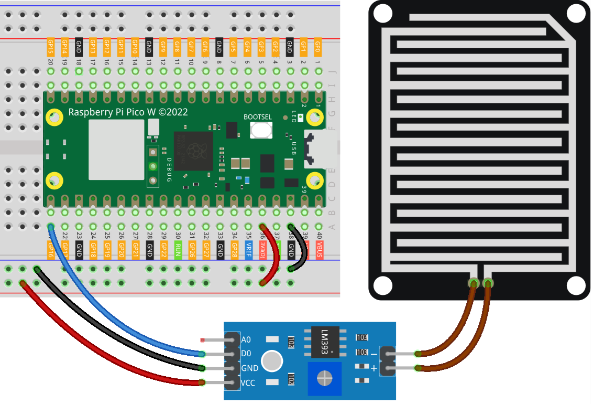

.. note::

    Hello, welcome to the SunFounder Raspberry Pi & Arduino & ESP32 Enthusiasts Community on Facebook! Dive deeper into Raspberry Pi, Arduino, and ESP32 with fellow enthusiasts.

    **Why Join?**

    - **Expert Support**: Solve post-sale issues and technical challenges with help from our community and team.
    - **Learn & Share**: Exchange tips and tutorials to enhance your skills.
    - **Exclusive Previews**: Get early access to new product announcements and sneak peeks.
    - **Special Discounts**: Enjoy exclusive discounts on our newest products.
    - **Festive Promotions and Giveaways**: Take part in giveaways and holiday promotions.

    👉 Ready to explore and create with us? Click [|link_sf_facebook|] and join today!

.. _pico_lesson15_raindrop:

Lesson 15: Raindrop Detection Module
=======================================

In this lesson, you'll learn how to use the Raspberry Pi Pico W to detect raindrops using a raindrop sensor connected to pin 16. The script continuously monitors for any indication of raindrops and prints "Raindrop detected!" when one is detected; otherwise, it displays "Monitoring..." as it waits for raindrops. This session offers hands-on experience in handling digital inputs with the Raspberry Pi Pico W and understanding environmental sensing in MicroPython, making it ideal for beginners in electronics and programming.

Required Components
--------------------------

In this project, we need the following components. 

It's definitely convenient to buy a whole kit, here's the link: 

.. list-table::
    :widths: 20 20 20
    :header-rows: 1

    *   - Name	
        - ITEMS IN THIS KIT
        - LINK
    *   - Universal Maker Sensor Kit
        - 94
        - |link_umsk|

You can also buy them separately from the links below.

.. list-table::
    :widths: 30 20
    :header-rows: 1

    *   - Component Introduction
        - Purchase Link

    *   - Raspberry Pi Pico W
        - \-
    *   - :ref:`cpn_raindrop`
        - |link_raindrop_sensor_module_buy|
    *   - :ref:`cpn_breadboard`
        - |link_breadboard_buy|

Wiring
---------------------------

Code
---------------------------

.. code-block:: python

   from machine import Pin
   import time
   
   # Initialize raindrop sensor connected to pin 16 as input
   raindrop_sensor = Pin(16, Pin.IN)
   
   while True:
       # Check the Raindrop sensor value
       if raindrop_sensor.value() == 0:  
           print("Raindrop detected!")  # Raindrop detected
       else:
           print("Monitoring...")  # No raindrop detected
   
       time.sleep(0.1)  # Short delay of 0.1 seconds to reduce CPU usage

Code Analysis
---------------------------

#. Initializing the Raindrop Sensor:

   The raindrop sensor is initialized using the ``Pin`` class from the ``machine`` module, set to pin 16 in input mode. This allows the Raspberry Pi Pico W to read the sensor output.

   .. code-block:: python
   
       from machine import Pin
       raindrop_sensor = Pin(16, Pin.IN)

#. Continuous Monitoring Loop:

   A continuous while loop is used to monitor the sensor. Inside the loop, the sensor value is checked. If the value is 0, it indicates raindrops are detected and prints "Raindrop detected!" Otherwise, it prints "Monitoring..." to indicate the absence of raindrops.

   .. code-block:: python
   
       while True:
           if raindrop_sensor.value() == 0:  
               print("Raindrop detected!")
           else:
               print("Monitoring...")

#. Introducing a Delay:

   To reduce CPU usage, a delay of 0.1 seconds is introduced in each iteration of the loop using ``time.sleep(0.1)``. This prevents the loop from executing too rapidly.

   .. code-block:: python
   
       time.sleep(0.1)