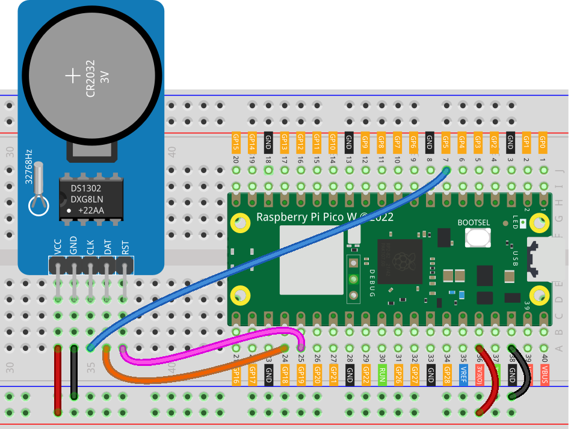

.. note::

    Hello, welcome to the SunFounder Raspberry Pi & Arduino & ESP32 Enthusiasts Community on Facebook! Dive deeper into Raspberry Pi, Arduino, and ESP32 with fellow enthusiasts.

    **Why Join?**

    - **Expert Support**: Solve post-sale issues and technical challenges with help from our community and team.
    - **Learn & Share**: Exchange tips and tutorials to enhance your skills.
    - **Exclusive Previews**: Get early access to new product announcements and sneak peeks.
    - **Special Discounts**: Enjoy exclusive discounts on our newest products.
    - **Festive Promotions and Giveaways**: Take part in giveaways and holiday promotions.

    👉 Ready to explore and create with us? Click [|link_sf_facebook|] and join today!

.. _pico_lesson16_ds1306:

Lesson 16: Real Time Clock Module (DS1302)
==================================================

In this lesson, you'll learn how to use the Raspberry Pi Pico W to interact with a DS1302 Real-Time Clock module. We'll start by setting up the DS1302 and connecting it to the Pico W using specific GPIO pins. You'll also learn how to retrieve and set the current date and time on the DS1302. Additionally, we'll explore continuously displaying the current datetime on your console, updating every half second.

Required Components
--------------------------

In this project, we need the following components. 

It's definitely convenient to buy a whole kit, here's the link: 

.. list-table::
    :widths: 20 20 20
    :header-rows: 1

    *   - Name	
        - ITEMS IN THIS KIT
        - LINK
    *   - Universal Maker Sensor Kit
        - 94
        - |link_umsk|

You can also buy them separately from the links below.

.. list-table::
    :widths: 30 20
    :header-rows: 1

    *   - Component Introduction
        - Purchase Link

    *   - Raspberry Pi Pico W
        - \-
    *   - :ref:`cpn_rtc_ds1302`
        - |link_ds1302_module_buy|
    *   - :ref:`cpn_breadboard`
        - |link_breadboard_buy|

Wiring
---------------------------

Code
---------------------------

.. note::

    * Open the ``16_ds1302_module.py`` file under the path of ``universal-maker-sensor-kit-main/pico/Lesson_16_DS1302_Module`` or copy this code into Thonny, then click "Run Current Script" or simply press F5 to run it. For detailed tutorials, please refer to :ref:`open_run_code_py`. 

    * Here you need to use the ``ds1302.py``, please check if it has been uploaded to Pico W, for a detailed tutorial refer to :ref:`add_libraries_py`.

    * Don't forget to click on the "MicroPython (Raspberry Pi Pico)" interpreter in the bottom right corner. 

.. code-block:: python

   from machine import Pin
   import ds1302
   import time
   
   # Initialize DS1302 RTC with specific GPIO pins
   ds = ds1302.DS1302(Pin(5), Pin(18), Pin(19))  # (clk, dio, cs)
   
   # Get current datetime from DS1302
   ds.date_time()
   
   # Set DS1302 datetime to 2024-01-01 Monday 00:00:00
   ds.date_time([2024, 1, 1, 1, 0, 0, 0])  # (year,month,day,weekday,hour,minute,second)
   
   # Set seconds to 10
   ds.second(10)
   
   # Continuously display current datetime every half second
   while True:
       print(ds.date_time())
       time.sleep(0.5)

Code Analysis
---------------------------

#. **Import Libraries**

   This section imports necessary libraries: ``machine`` for GPIO control, ``ds1302`` for the RTC module, and ``time`` for implementing delays.

   For more detail about the ``ds1302`` library, please refer to ``ds1302.py``.

   .. code-block:: python

      from machine import Pin
      import ds1302
      import time

#. **Initialize the DS1302 RTC**

   This code initializes the DS1302 module by defining which GPIO pins of the Raspberry Pi Pico W are connected to the clock (clk), data input/output (dio), and chip select (cs) pins of the DS1302.

   .. code-block:: python

      ds = ds1302.DS1302(Pin(5), Pin(18), Pin(19))  # (clk, dio, cs)

#. **Get Current DateTime**

   Retrieves the current date and time from the DS1302. The ``date_time()`` method returns a list containing year, month, day, weekday, hour, minute, and second.

   .. code-block:: python

      ds.date_time()

#. **Set DS1302 DateTime**

   Sets the DS1302's date and time to January 1, 2024, at 00:00:00. The day of the week (Monday) is represented by 1.
   
   .. code-block:: python

      ds.date_time([2024, 1, 1, 1, 0, 0, 0])  # (year,month,day,weekday,hour,minute,second)

#. **Set Seconds**

   Sets the seconds value of the DS1302's time to 10.

   .. code-block:: python

      ds.second(10)

#. **Display Current DateTime Continuously**

   This loop continuously displays the current date and time every half second. The ``time.sleep(0.5)`` function creates a half-second delay between each iteration.

   .. code-block:: python

      while True:
          print(ds.date_time())
          time.sleep(0.5)