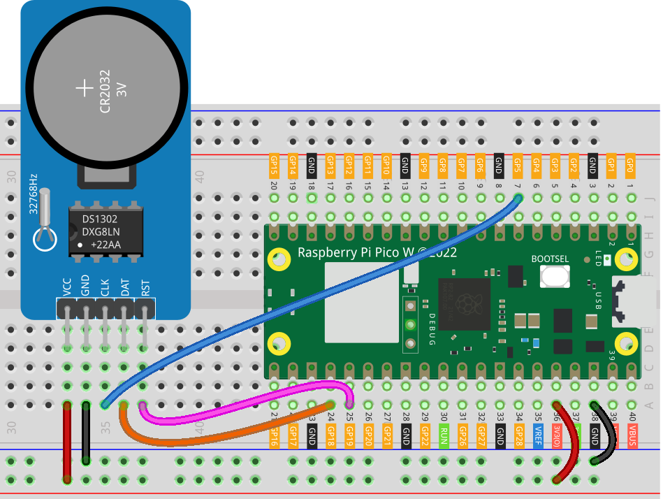

.. note::

   Hallo und willkommen in der SunFounder Raspberry Pi & Arduino & ESP32 Enthusiasten-Gemeinschaft auf Facebook! Tauchen Sie tiefer ein in die Welt von Raspberry Pi, Arduino und ESP32 mit anderen Enthusiasten.

   **Warum beitreten?**

   - **Expertenunterstützung**: Lösen Sie Nachverkaufsprobleme und technische Herausforderungen mit Hilfe unserer Gemeinschaft und unseres Teams.
   - **Lernen & Teilen**: Tauschen Sie Tipps und Anleitungen aus, um Ihre Fähigkeiten zu verbessern.
   - **Exklusive Vorschauen**: Erhalten Sie frühzeitigen Zugang zu neuen Produktankündigungen und exklusiven Einblicken.
   - **Spezialrabatte**: Genießen Sie exklusive Rabatte auf unsere neuesten Produkte.
   - **Festliche Aktionen und Gewinnspiele**: Nehmen Sie an Gewinnspielen und Feiertagsaktionen teil.

   👉 Sind Sie bereit, mit uns zu erkunden und zu erschaffen? Klicken Sie auf [|link_sf_facebook|] und treten Sie heute bei!

.. _pico_lesson16_ds1306:

Lesson 16: Echtzeituhrmodul (DS1302)
==================================================

In dieser Lektion lernen Sie, wie Sie den Raspberry Pi Pico W mit einem DS1302-Echtzeituhrmodul verwenden können. Wir beginnen mit dem Einrichten des DS1302 und seiner Verbindung mit dem Pico W über spezifische GPIO-Pins. Sie erfahren auch, wie Sie das aktuelle Datum und die aktuelle Uhrzeit auf dem DS1302 abrufen und einstellen. Zusätzlich werden wir kontinuierlich das aktuelle Datum und die aktuelle Uhrzeit auf Ihrer Konsole anzeigen und alle halbe Sekunde aktualisieren.

Benötigte Komponenten
--------------------------

Für dieses Projekt benötigen wir folgende Komponenten:

Ein ganzes Kit zu kaufen ist definitiv praktisch, hier ist der Link:

.. list-table::
    :widths: 20 20 20
    :header-rows: 1

    *   - Name
        - ITEMS IN THIS KIT
        - LINK
    *   - Universal Maker Sensor Kit
        - 94
        - |link_umsk|

Sie können sie auch separat über die unten stehenden Links kaufen.

.. list-table::
    :widths: 30 20
    :header-rows: 1

    *   - Component Introduction
        - Purchase Link

    *   - Raspberry Pi Pico W
        - |link_picow_buy|
    *   - :ref:`cpn_rtc_ds1302`
        - |link_ds1302_module_buy|
    *   - :ref:`cpn_breadboard`
        - |link_breadboard_buy|

Verkabelung
---------------------------

Code
---------------------------

.. note::

    * Öffnen Sie die Datei ``16_ds1302_module.py`` im Pfad ``universal-maker-sensor-kit-main/pico/Lesson_16_DS1302_Module`` oder kopieren Sie diesen Code in Thonny und klicken Sie dann auf "Aktuelles Skript ausführen" oder drücken Sie einfach F5, um es auszuführen. Für detaillierte Anleitungen lesen Sie bitte :ref:`open_run_code_py`.
    
    * Hier müssen Sie die Dateien ``ds1302.py`` verwenden. Bitte überprüfen Sie, ob sie auf dem Pico W hochgeladen wurden. Für eine detaillierte Anleitung siehe :ref:`add_libraries_py`.
    
    * Vergessen Sie nicht, auf den Interpreter "MicroPython (Raspberry Pi Pico)" in der unteren rechten Ecke zu klicken.

.. code-block:: python

   from machine import Pin
   import ds1302
   import time
   
   # Initialize DS1302 RTC with specific GPIO pins
   ds = ds1302.DS1302(Pin(5), Pin(18), Pin(19))  # (clk, dio, cs)
   
   # Get current datetime from DS1302
   ds.date_time()
   
   # Set DS1302 datetime to 2024-01-01 Monday 00:00:00
   ds.date_time([2024, 1, 1, 1, 0, 0, 0])  # (year,month,day,weekday,hour,minute,second)
   
   # Set seconds to 10
   ds.second(10)
   
   # Continuously display current datetime every half second
   while True:
       print(ds.date_time())
       time.sleep(0.5)

Codeanalyse
---------------------------

#. **Bibliotheken importieren**

   In diesem Abschnitt werden die benötigten Bibliotheken importiert: ``machine`` für die GPIO-Steuerung, ``ds1302`` für das RTC-Modul und ``time`` zur Implementierung von Verzögerungen.

   Weitere Details zur Bibliothek ``ds1302`` finden Sie in ``ds1302.py``.

   .. code-block:: python

      from machine import Pin
      import ds1302
      import time

#. **Initialisierung der DS1302-RTC**

   Dieser Code initialisiert das DS1302-Modul, indem definiert wird, welche GPIO-Pins des Raspberry Pi Pico W mit den Takt (clk), Daten-Ein-/Ausgang (dio) und Chip-Auswahl (cs) Pins des DS1302 verbunden sind.

   .. code-block:: python

      ds = ds1302.DS1302(Pin(5), Pin(18), Pin(19))  # (clk, dio, cs)

#. **Aktuelles Datum und Uhrzeit abrufen**

   Ruft das aktuelle Datum und die aktuelle Uhrzeit vom DS1302 ab. Die Methode ``date_time()`` gibt eine Liste zurück, die Jahr, Monat, Tag, Wochentag, Stunde, Minute und Sekunde enthält.

   .. code-block:: python

      ds.date_time()

#. **DS1302-Datum und -Uhrzeit einstellen**

   Setzt das Datum und die Uhrzeit des DS1302 auf den 1. Januar 2024 um 00:00:00 Uhr. Der Wochentag (Montag) wird durch 1 repräsentiert.

   .. code-block:: python

      ds.date_time([2024, 1, 1, 1, 0, 0, 0])  # (year,month,day,weekday,hour,minute,second)

#. **Sekunden einstellen**

   Setzt den Sekundenwert der Uhrzeit des DS1302 auf 10.

   .. code-block:: python

      ds.second(10)

#. **Aktuelle Datum und Uhrzeit kontinuierlich anzeigen**

   Diese Schleife zeigt kontinuierlich das aktuelle Datum und die aktuelle Uhrzeit alle halbe Sekunde an. Die Funktion ``time.sleep(0.5)`` erzeugt eine halbe Sekunde Verzögerung zwischen jeder Iteration.

   .. code-block:: python

      while True:
          print(ds.date_time())
          time.sleep(0.5)