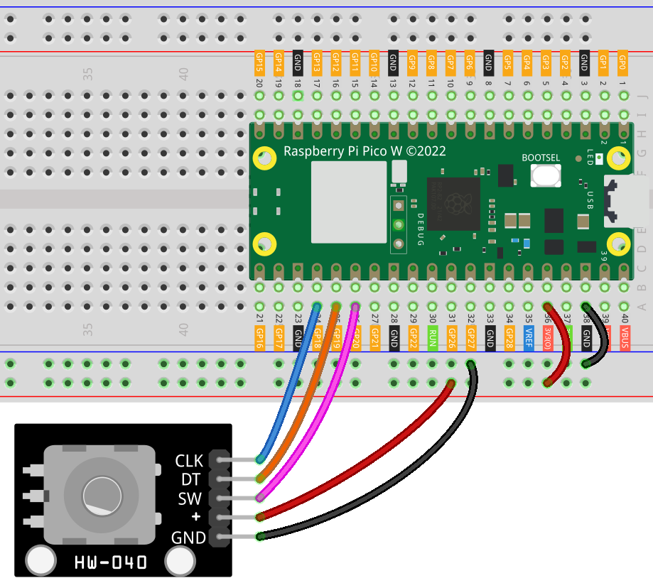

.. _pico_lesson17_rotary_encoder:

Lesson 17: Rotary Encoder Module
==================================

In this lesson, you'll learn how to use the Raspberry Pi Pico W to control a rotary encoder. The rotary encoder is an advanced sensor that translates knob rotation into an output signal, indicating both the amount and direction of rotation. This project offers hands-on experience with digital input devices, enhancing your ability to work with more complex sensors. You'll configure the rotary encoder using specific GPIO pins, read its output to determine rotation direction and amount, and master using a button to trigger events.

Required Components
---------------------------

.. list-table::
    :widths: 30 20
    :header-rows: 1

    *   - Component Introduction
        - Purchase Link

    *   - Raspberry Pi Pico W
        - \-
    *   - :ref:`cpn_rotary_encoder`
        - \-
    *   - :ref:`cpn_breadboard`
        - |link_breadboard_buy|

Wiring
---------------------------

Code
---------------------------

.. code-block:: python

   from rotary_irq_rp2 import RotaryIRQ
   import time
   from machine import Pin
   
   # Set GPIO 20 as an input pin for reading the button(sw)'s state
   button_pin = Pin(20, Pin.IN, Pin.PULL_UP)
   
   # Initialize the rotary encoder with specific GPIO pins and settings
   rotary_encoder = RotaryIRQ(
       pin_num_clk=18,
       pin_num_dt=19,
       min_val=0,
       max_val=14,
       reverse=False,
       range_mode=RotaryIRQ.RANGE_WRAP,
   )
   
   # Store the initial value of the rotary encoder and button state
   last_rotary_value = rotary_encoder.value()
   last_button_state = button_pin.value()
   
   # Main loop
   while True:
       # Read the current value of the rotary encoder and button state
       current_rotary_value = rotary_encoder.value()
       current_button_state = button_pin.value()
   
       # Check if the rotary encoder's value has changed
       if last_rotary_value != current_rotary_value:
           last_rotary_value = current_rotary_value
           print("result =", current_rotary_value)
   
       # Check if the button's state changed from not pressed to pressed
       if last_button_state and not current_button_state:
           print("Button pressed!")
   
       # Update the previous state of the button for the next loop iteration
       last_button_state = current_button_state
   
       # Short delay to prevent debouncing issues
       time.sleep_ms(50)

Code Analysis
---------------------------

#. **Importing Libraries**

   First, the necessary libraries are imported. ``rotary_irq_rp2`` is for the rotary encoder, ``time`` for delays, and ``machine`` for hardware control.

   For more information about the ``rotary_irq_rp2`` library, please visit |link_rotary_irq_rp2_library|.

   .. code-block:: python

      from rotary_irq_rp2 import RotaryIRQ
      import time
      from machine import Pin

#. **Setting up the Button Pin**

   The GPIO pin connected to the SW pin is configured as an input with a pull-up resistor. This ensures a stable HIGH signal when the button is not pressed.

   .. code-block:: python

      button_pin = Pin(20, Pin.IN, Pin.PULL_UP)

#. **Initializing the Rotary Encoder**

   The encoder is set up with specified GPIO pins for CLK and DT. ``min_val`` and ``max_val`` define the range of values, and ``range_mode`` sets how the value behaves at limits (wraps around in this case).

   .. code-block:: python

      rotary_encoder = RotaryIRQ(
          pin_num_clk=18,
          pin_num_dt=19,
          min_val=0,
          max_val=14,
          reverse=False,
          range_mode=RotaryIRQ.RANGE_WRAP,
      )

#. **Storing Initial Values**

   The initial values of the rotary encoder and the button are stored to detect changes in their states later.

   .. code-block:: python

      last_rotary_value = rotary_encoder.value()
      last_button_state = button_pin.value()

#. **Main Loop**

   The loop continuously checks for changes in the rotary encoder value and button state. If the rotary value changes, it prints the new value. If the button state changes from unpressed to pressed, it prints "Button pressed!".

   .. code-block:: python

      while True:
          current_rotary_value = rotary_encoder.value()
          current_button_state = button_pin.value()

          if last_rotary_value != current_rotary_value:
              last_rotary_value = current_rotary_value
              print("result =", current_rotary_value)

          if last_button_state and not current_button_state:
              print("Button pressed!")

          last_button_state = current_button_state
          time.sleep_ms(50)

   The ``time.sleep_ms(50)`` at the end of the loop is to prevent debouncing issues, which can cause erratic readings.