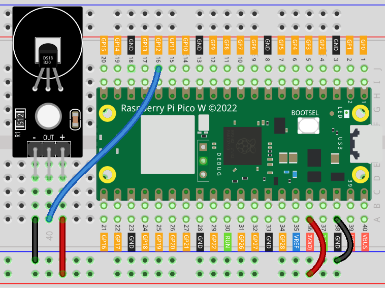

 
.. note::

   Hallo und willkommen in der SunFounder Raspberry Pi & Arduino & ESP32 Enthusiasten-Gemeinschaft auf Facebook! Tauchen Sie tiefer ein in die Welt von Raspberry Pi, Arduino und ESP32 mit anderen Enthusiasten.

   **Warum beitreten?**

   - **Expertenunterstützung**: Lösen Sie Nachverkaufsprobleme und technische Herausforderungen mit Hilfe unserer Gemeinschaft und unseres Teams.
   - **Lernen & Teilen**: Tauschen Sie Tipps und Anleitungen aus, um Ihre Fähigkeiten zu verbessern.
   - **Exklusive Vorschauen**: Erhalten Sie frühzeitigen Zugang zu neuen Produktankündigungen und exklusiven Einblicken.
   - **Spezialrabatte**: Genießen Sie exklusive Rabatte auf unsere neuesten Produkte.
   - **Festliche Aktionen und Gewinnspiele**: Nehmen Sie an Gewinnspielen und Feiertagsaktionen teil.

   👉 Sind Sie bereit, mit uns zu erkunden und zu erschaffen? Klicken Sie auf [|link_sf_facebook|] und treten Sie heute bei!

.. _pico_lesson18_ds18b20:
Lektion 18: Temperatursensor-Modul (DS18B20)
================================================

In dieser Lektion lernst du, wie du Temperaturdaten von DS18B20-Sensoren mit dem Raspberry Pi Pico W integrieren und auslesen kannst. Du beginnst damit, einen OneWire-Bus am GPIO-Pin einzurichten und nach DS18X20-Geräten zu suchen. Der Schwerpunkt der Lektion liegt darauf, kontinuierlich Temperaturmessungen von diesen Sensoren zu lesen und anzuzeigen.

Erforderliche Komponenten
----------------------------

Für dieses Projekt benötigen wir folgende Komponenten.

Es ist definitiv praktisch, ein ganzes Kit zu kaufen, hier ist der Link:

.. list-table::
    :widths: 20 20 20
    :header-rows: 1

    *   - Name	
        - ITEMS IN THIS KIT
        - LINK
    *   - Universal Maker Sensor Kit
        - 94
        - |link_umsk|

Du kannst sie auch einzeln über die folgenden Links kaufen.

.. list-table::
    :widths: 30 20
    :header-rows: 1

    *   - Component Introduction
        - Purchase Link

    *   - Raspberry Pi Pico W
        - \-
    *   - :ref:`cpn_ds18b20`
        - \-
    *   - :ref:`cpn_breadboard`
        - |link_breadboard_buy|

Verkabelung
---------------------------

Code
---------------------------

.. note::

    * Öffnen Sie die Datei ``18_ds18b20_module.py`` im Pfad ``universal-maker-sensor-kit-main/pico/Lesson_18_DS18B20_Module`` oder kopieren Sie diesen Code in Thonny und klicken Sie dann auf "Aktuelles Skript ausführen" oder drücken Sie einfach F5, um es auszuführen. Für detaillierte Anleitungen lesen Sie bitte :ref:`open_run_code_py`.
    
    * Vergessen Sie nicht, auf den Interpreter "MicroPython (Raspberry Pi Pico)" in der unteren rechten Ecke zu klicken.

.. code-block:: python

   from machine import Pin
   import onewire
   import time, ds18x20
   
   # Initialize the OneWire bus on GPIO pin 12
   ow = onewire.OneWire(Pin(12))
   
   # Create a DS18X20 instance using the OneWire bus
   ds = ds18x20.DS18X20(ow)
   
   # Scan for DS18X20 devices on the bus and print their addresses
   roms = ds.scan()
   print('found devices:', roms)
   
   # Continuously read and print temperature data from the sensors
   while True:
       # Start the temperature conversion process
       ds.convert_temp()
       # Wait for the conversion to complete (750 ms for DS18X20)
       time.sleep_ms(750)
       
       # Read and print the temperature from each sensor found on the bus
       for rom in roms:
           print(ds.read_temp(rom))
       
       # Wait for a short period before the next reading (1000 ms)
       time.sleep_ms(1000)

Code-Analyse
---------------------------

#. Bibliotheken importieren

   Der Code beginnt mit dem Importieren der benötigten Bibliotheken. ``machine`` wird zur Steuerung der GPIO-Pins verwendet, ``onewire`` für das OneWire-Kommunikationsprotokoll, ``ds18x20`` für den spezifischen Temperatursensor und ``time`` für Verzögerungen.

   Bezüglich OneWire in MicroPython kannst du |link_micropython_onewire_driver| nachschlagen.

   .. code-block:: python

      from machine import Pin
      import onewire
      import time, ds18x20

#. Initialisierung des OneWire-Busses

   Ein OneWire-Bus wird am GPIO-Pin 12 initialisiert. Dadurch wird die Kommunikation zwischen dem Raspberry Pi Pico W und dem DS18B20-Sensor eingerichtet.

   .. code-block:: python

      ow = onewire.OneWire(Pin(12))

#. Erstellen einer DS18X20-Instanz

   Eine DS18X20-Instanz wird unter Verwendung des OneWire-Busses erstellt. Diese Instanz wird verwendet, um mit dem Temperatursensor zu interagieren.

   .. code-block:: python

      ds = ds18x20.DS18X20(ow)

#. Geräte suchen

   Der Code sucht nach DS18X20-Geräten auf dem OneWire-Bus und gibt ihre Adressen aus. Dies ist wichtig, um die angeschlossenen Sensoren zu identifizieren.

   .. code-block:: python

      roms = ds.scan()
      print('found devices:', roms)

#. Temperaturdaten lesen

   - Die Hauptschleife des Programms liest kontinuierlich Temperaturdaten vom Sensor.
   - Sie startet den Temperaturumwandlungsprozess und wartet darauf, dass er abgeschlossen ist, was etwa 750 Millisekunden dauert.
   - Dann liest und gibt sie die Temperatur von jedem auf dem Bus gefundenen Sensor aus.
   - Die Schleife pausiert für 1000 Millisekunden, bevor sie wiederholt wird.

   .. raw:: html

       

   .. code-block:: python

      while True:
          ds.convert_temp()
          time.sleep_ms(750)
          for rom in roms:
              print(ds.read_temp(rom))
          time.sleep_ms(1000)