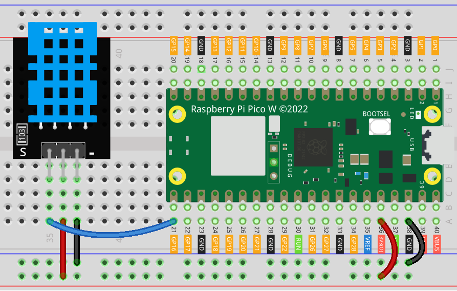

.. _pico_lesson19_dht11:

Lesson 19: Temperature and Humidity Sensor Module (DHT11)
====================================================================

In this lesson, you'll learn how to use the Raspberry Pi Pico W to connect with a DHT11 temperature and humidity sensor. You'll explore accurate measurement of environmental conditions by recording temperature and humidity data. This tutorial offers practical guidance on using digital sensors with the Raspberry Pi Pico W, programming with MicroPython, and managing real-time data processing. 

Required Components
--------------------------

In this project, we need the following components. 

It's definitely convenient to buy a whole kit, here's the link: 

.. list-table::
    :widths: 20 20 20
    :header-rows: 1

    *   - Name	
        - ITEMS IN THIS KIT
        - LINK
    *   - Universal Maker Sensor Kit
        - 94
        - |link_umsk|

You can also buy them separately from the links below.

.. list-table::
    :widths: 30 10
    :header-rows: 1

    *   - Component Introduction
        - Purchase Link

    *   - Raspberry Pi Pico W
        - \-
    *   - :ref:`cpn_dht11`
        - |link_dht11_humiture_buy|
    *   - :ref:`cpn_breadboard`
        - |link_breadboard_buy|

Wiring
---------------------------

Code
---------------------------

.. code-block:: python

   import dht
   import machine
   import time
   
   # Initialize DHT11 sensor on GPIO 16
   d = dht.DHT11(machine.Pin(16))
   
   # Continuously read and print temperature and humidity
   while True: 
       d.measure()    
       print("Temperature:" ,d.temperature())  # Print temperature
       print("Humidity:" ,d.humidity())  # Print humidity
       time.sleep_ms(1000)  # Read every second

Code Analysis
---------------------------

#. Importing Libraries:

   The code begins by importing necessary libraries. ``dht`` is for the DHT11 sensor, ``machine`` is for interacting with the hardware, and ``time`` is for adding delays in the loop.

   .. code-block:: python
      
      import dht
      import machine
      import time

#. Initializing the DHT11 Sensor:

   The DHT11 sensor is initialized by specifying its connected GPIO pin. Here, it's connected to GPIO 16 on the Raspberry Pi Pico W. This is done using the ``machine.Pin`` function.

   .. code-block:: python

      d = dht.DHT11(machine.Pin(16))

#. Reading and Printing Data in a Loop:

   The ``while True`` loop enables the program to continuously read temperature and humidity data. Inside the loop, ``d.measure()`` is called to take a new measurement. ``d.temperature()`` and ``d.humidity()`` are used to retrieve the temperature and humidity data, respectively. These values are then printed. The loop pauses for one second (``1000`` milliseconds) using ``time.sleep_ms(1000)``, ensuring the data is read and printed every second.

   .. code-block:: python

      while True: 
          d.measure()    
          print("Temperature:" ,d.temperature())  # Print temperature
          print("Humidity:" ,d.humidity())  # Print humidity
          time.sleep_ms(1000)  # Read every second