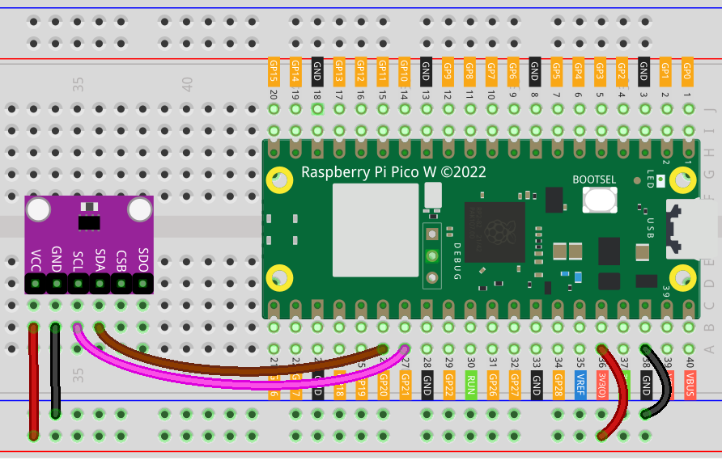

.. note::

    こんにちは、SunFounder Raspberry Pi & Arduino & ESP32 Enthusiasts Communityへようこそ！Facebook上で、仲間と一緒にRaspberry Pi、Arduino、ESP32をさらに深く探求しましょう。

    **なぜ参加するのか？**

    - **専門的なサポート**：購入後の問題や技術的な課題をコミュニティやチームの助けを借りて解決。
    - **学びと共有**：スキルを向上させるためのヒントやチュートリアルを交換。
    - **限定プレビュー**：新製品発表や予告編に早期アクセス。
    - **特別割引**：最新製品の特別割引を楽しむ。
    - **フェスティブプロモーションとプレゼント**：プレゼントやホリデープロモーションに参加。

    👉 私たちと一緒に探索と創造を始める準備はできましたか？[|link_sf_facebook|]をクリックして、今すぐ参加しましょう！
    
.. _pico_lesson20_bmp280:

レッスン20: 温度、湿度、気圧センサー (BMP280)
====================================================================

このレッスンでは、BMP280 温度、湿度、および気圧センサーを Raspberry Pi Pico W に接続し、MicroPython を使用して制御する方法を学びます。I2C 通信の設定、BMP280 センサーの設定、および温度と気圧データの取得について実践的な経験を得ることができます。このチュートリアルの最後には、コンソール上でリアルタイムの環境データを表示できるようになります。

必要な部品
--------------------------

このプロジェクトでは、以下の部品が必要です。

キット全体を購入するのが便利です。リンクはこちらです：

.. list-table::
    :widths: 20 20 20
    :header-rows: 1

    *   - Name	
        - ITEMS IN THIS KIT
        - LINK
    *   - Universal Maker Sensor Kit
        - 94
        - |link_umsk|

以下のリンクから別々に購入することもできます。

.. list-table::
    :widths: 30 10
    :header-rows: 1

    *   - Component Introduction
        - Purchase Link

    *   - Raspberry Pi Pico W
        - \-
    *   - :ref:`cpn_bmp280`
        - |link_bmp280_module_buy|
    *   - :ref:`cpn_breadboard`
        - |link_breadboard_buy|

配線
---------------------------

コード
---------------------------

.. note::

    * ``universal-maker-sensor-kit-main/pico/Lesson_20_BMP280_Module`` のパスにある ``20_bmp280_module.py`` ファイルを開くか、このコードを Thonny にコピーし、「現在のスクリプトを実行」をクリックするか、F5 キーを押して実行します。詳細なチュートリアルについては :ref:`open_run_code_py` を参照してください。

    * ここでは ``bmp280.py`` を使用する必要があります。Pico W にアップロードされているか確認してください。詳細なチュートリアルについては :ref:`add_libraries_py` を参照してください。
    * 右下隅にある「MicroPython (Raspberry Pi Pico)」インタープリタをクリックするのを忘れないでください。

.. code-block:: python

   from machine import I2C, Pin
   import bmp280
   import time
   
   # Initialize I2C communication
   i2c = I2C(0, sda=Pin(20), scl=Pin(21), freq=100000)
   
   # Configure BMP280 sensor
   bmp = bmp280.BMP280(i2c)
   bmp.oversample(bmp280.BMP280_OS_HIGH)
   
   while True:
       # Set sensor to weather monitoring mode
       bmp.use_case(bmp280.BMP280_CASE_WEATHER)
   
       # Print temperature and pressure data
       print("tempC: {}".format(bmp.temperature))
       print("pressure: {}Pa".format(bmp.pressure))
   
       # Read data every second
       time.sleep_ms(1000)

コード分析
---------------------------

#. **ライブラリのインポートとI2C通信の初期化**:

   このコードセグメントは、必要なライブラリをインポートし、I2C通信を初期化します。 ``machine`` モジュールはI2Cやピンなどのハードウェアコンポーネントと対話するために使用されます。 ``bmp280`` ライブラリはBMP280センサーと対話するためにインポートされます。

   ``bmp280`` ライブラリの詳細については、|link_micropython_bmp280_driver| を参照してください。

   .. code-block:: python

      from machine import I2C, Pin
      import bmp280
      import time

      # Initialize I2C communication
      i2c = I2C(0, sda=Pin(20), scl=Pin(21), freq=100000)

#. **BMP280センサーの設定**:

   ここでは、BMP280センサーを設定します。センサーと対話するためのオブジェクト ``bmp`` が作成されます。高精度のためにオーバーサンプリング設定が調整されます。

   .. code-block:: python

      # Configure BMP280 sensor
      bmp = bmp280.BMP280(i2c)
      bmp.oversample(bmp280.BMP280_OS_HIGH)

#. **ループ内でのセンサーデータの読み取りと表示**:

   センサーは無限ループ内で継続的に読み取られます。各イテレーションでは、センサーを気象監視モードに設定し、温度と気圧を読み取って表示します。 ``time.sleep_ms(1000)`` はループが毎秒1回実行されるようにします。

   .. code-block:: python

      while True:
          # Set sensor to weather monitoring mode
          bmp.use_case(bmp280.BMP280_CASE_WEATHER)

          # Print temperature and pressure data
          print("tempC: {}".format(bmp.temperature))
          print("pressure: {}Pa".format(bmp.pressure))

          # Read data every second
          time.sleep_ms(1000)