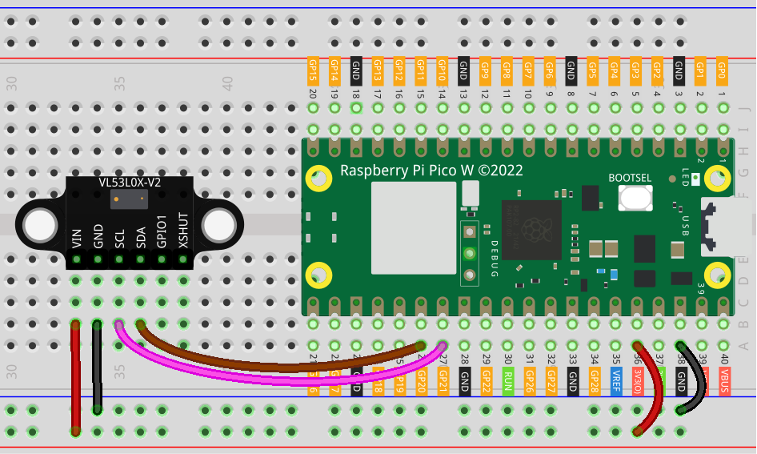

.. _pico_lesson21_vl53l0x:

Lesson 21: Time of Flight Micro-LIDAR Distance Sensor (VL53L0X)
====================================================================

In this lesson, you'll learn how to use the Raspberry Pi Pico W for measuring distances with the VL53L0X Time of Flight Micro-LIDAR Distance Sensor. We'll walk you through setting up I2C communication between the Raspberry Pi Pico W and the sensor, and then we'll explore configuring the sensor's settings for optimal performance. You will also learn how to adjust the measurement timing budget and VCSEL pulse periods to improve accuracy and range.

Required Components
---------------------------

* Raspberry Pi Pico W
* :ref:`cpn_VL53L0X`
* :ref:`cpn_breadboard`

Wiring
---------------------------

Code
---------------------------

.. code-block:: python

   import time
   from machine import Pin, I2C
   from vl53l0x import VL53L0X
   
   print("setting up i2c")
   id = 0
   sda = Pin(20)
   scl = Pin(21)
   
   i2c = I2C(id=id, sda=sda, scl=scl)
   
   print(i2c.scan())
   
   # print("creating vl53lox object")
   # Create a VL53L0X object
   tof = VL53L0X(i2c)
   
   # Pre: 12 to 18 (initialized to 14 by default)
   # Final: 8 to 14 (initialized to 10 by default)
   
   # the measuting_timing_budget is a value in ms, the longer the budget, the more accurate the reading.
   budget = tof.measurement_timing_budget_us
   print("Budget was:", budget)
   tof.set_measurement_timing_budget(40000)
   
   # Sets the VCSEL (vertical cavity surface emitting laser) pulse period for the
   # given period type (VL53L0X::VcselPeriodPreRange or VL53L0X::VcselPeriodFinalRange)
   # to the given value (in PCLKs). Longer periods increase the potential range of the sensor.
   # Valid values are (even numbers only):
   
   # tof.set_Vcsel_pulse_period(tof.vcsel_period_type[0], 18)
   tof.set_Vcsel_pulse_period(tof.vcsel_period_type[0], 12)
   
   # tof.set_Vcsel_pulse_period(tof.vcsel_period_type[1], 14)
   tof.set_Vcsel_pulse_period(tof.vcsel_period_type[1], 8)
   
   while True:
       # Start ranging
       print(tof.ping() - 50, "mm")
   
       time.sleep_ms(100)  # Short delay of 0.1 seconds to reduce CPU usage

Code Analysis
---------------------------

#. **Setting up the I2C Interface**:

   The code begins by importing necessary modules and initializing the I2C communication. The ``machine`` module is used to set up I2C with the correct pins of the Raspberry Pi Pico W.

   For more information about the ``vl53l0x`` library, please visit |link_micropython_vl53l0x_driver|.

   .. code-block:: python

      import time
      from machine import Pin, I2C
      from vl53l0x import VL53L0X

      print("setting up i2c")
      id = 0
      sda = Pin(20)
      scl = Pin(21)
      i2c = I2C(id=id, sda=sda, scl=scl)
      print(i2c.scan())

#. **Creating VL53L0X Object**:

   An object of ``VL53L0X`` class is created. This object will be used to interact with the VL53L0X sensor.

   .. code-block:: python

      tof = VL53L0X(i2c)

#. **Configuring Measurement Timing Budget**:

   The measurement timing budget is set up. This determines how long the sensor takes to perform a measurement. A longer timing budget allows for more accurate readings.

   .. code-block:: python

      budget = tof.measurement_timing_budget_us
      print("Budget was:", budget)
      tof.set_measurement_timing_budget(40000)

#. **Setting VCSEL Pulse Periods**:

   Here, the pulse periods for the VCSEL (Vertical Cavity Surface Emitting Laser) are set. This affects the range and accuracy of the sensor.

   .. code-block:: python

      tof.set_Vcsel_pulse_period(tof.vcsel_period_type[0], 12)
      tof.set_Vcsel_pulse_period(tof.vcsel_period_type[1], 8)

#. **Continuous Measurement Loop**:

   The sensor continuously measures the distance and prints it. The ``ping()`` method of ``VL53L0X`` class is used to get the distance in millimeters. A small delay is added to reduce CPU usage.

   .. code-block:: python

      while True:
          print(tof.ping() - 50, "mm")
          time.sleep_ms(100)