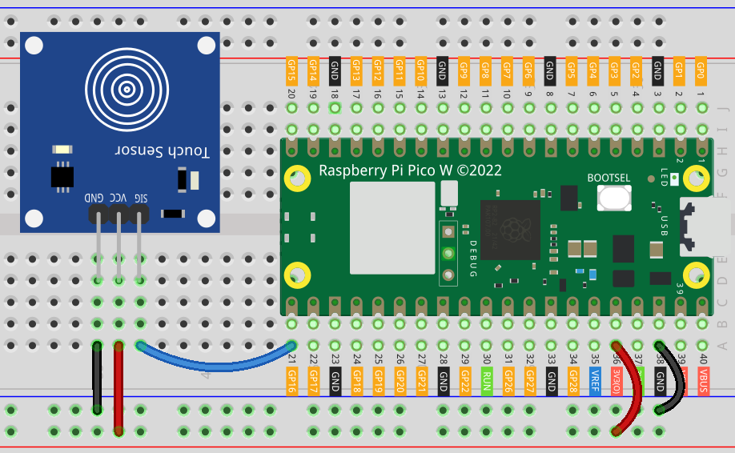

.. note::

    Hello, welcome to the SunFounder Raspberry Pi & Arduino & ESP32 Enthusiasts Community on Facebook! Dive deeper into Raspberry Pi, Arduino, and ESP32 with fellow enthusiasts.

    **Why Join?**

    - **Expert Support**: Solve post-sale issues and technical challenges with help from our community and team.
    - **Learn & Share**: Exchange tips and tutorials to enhance your skills.
    - **Exclusive Previews**: Get early access to new product announcements and sneak peeks.
    - **Special Discounts**: Enjoy exclusive discounts on our newest products.
    - **Festive Promotions and Giveaways**: Take part in giveaways and holiday promotions.

    👉 Ready to explore and create with us? Click [|link_sf_facebook|] and join today!

.. _pico_lesson22_touch_sensor:

Lesson 22: Touch Sensor Module
==================================

In this lesson, you'll learn how to connect a touch sensor to the Raspberry Pi Pico W in order to control an onboard LED. By using straightforward Python code, you'll configure the touch sensor as an input device. When the sensor detects a touch, it will send a signal to turn on the LED, providing a visual indication that a touch has been detected. Conversely, when there's no touch, the LED stays off. 

Required Components
---------------------------

.. list-table::
    :widths: 30 20
    :header-rows: 1

    *   - Component Introduction
        - Purchase Link

    *   - Raspberry Pi Pico W
        - \-
    *   - :ref:`cpn_touch`
        - |link_touch_buy|
    *   - :ref:`cpn_breadboard`
        - |link_breadboard_buy|

Wiring
---------------------------

Code
---------------------------

.. code-block:: python

   from machine import Pin
   import time
   
   # Set GPIO 16 as an input pin to read the touch sensor state
   touch_sensor = Pin(16, Pin.IN)
   
   # Initialize the onboard LED of the Raspberry Pi Pico W
   led = Pin("LED", Pin.OUT)
   
   while True:
       if touch_sensor.value() == 1:
           led.value(1)  # Turn on the LED
           print("Touch detected!")
       else:
           led.value(0)  # Turn off the LED
           print("No touch detected")
   
       time.sleep(0.1)  # Short delay to reduce CPU usage

Code Analysis
---------------------------

#. **Setting up the pins**:

   Here, we import necessary libraries and set up GPIO pins. The touch sensor is connected to GPIO 16 as an input, and the onboard LED is configured as an output.

   .. code-block:: python

      from machine import Pin
      import time

      touch_sensor = Pin(16, Pin.IN)
      led = Pin("LED", Pin.OUT)

#. **Main loop and touch detection**:

   In an infinite loop, the code constantly checks the state of the touch sensor. If a touch is detected (value equals 1), the LED is turned on and a message is printed. Otherwise, the LED remains off, and a different message is printed. A short delay is added to reduce CPU usage.

   .. code-block:: python

      while True:
          if touch_sensor.value() == 1:
              led.value(1)  # Turn on the LED
              print("Touch detected!")
          else:
              led.value(0)  # Turn off the LED
              print("No touch detected")

          time.sleep(0.1)  # Short delay to reduce CPU usage