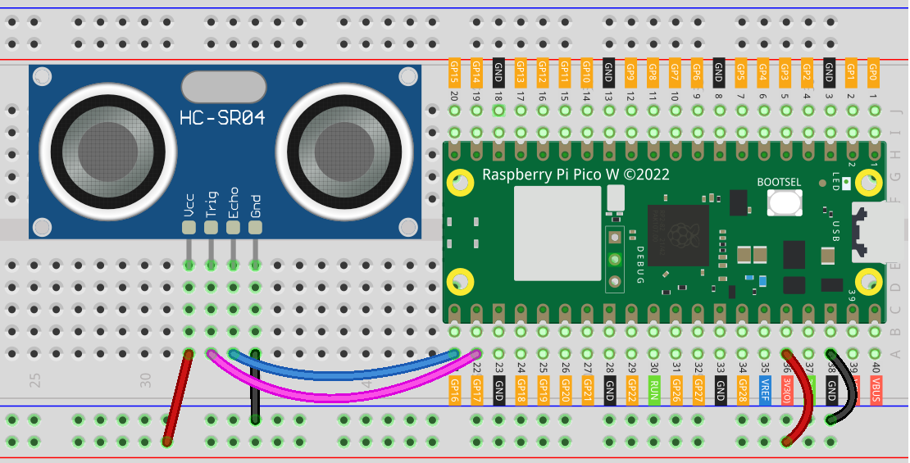

.. note::

    こんにちは、SunFounder Raspberry Pi & Arduino & ESP32 Enthusiasts Communityへようこそ！Facebook上で、仲間と一緒にRaspberry Pi、Arduino、ESP32をさらに深く探求しましょう。

    **なぜ参加するのか？**

    - **専門的なサポート**：購入後の問題や技術的な課題をコミュニティやチームの助けを借りて解決。
    - **学びと共有**：スキルを向上させるためのヒントやチュートリアルを交換。
    - **限定プレビュー**：新製品発表や予告編に早期アクセス。
    - **特別割引**：最新製品の特別割引を楽しむ。
    - **フェスティブプロモーションとプレゼント**：プレゼントやホリデープロモーションに参加。

    👉 私たちと一緒に探索と創造を始める準備はできましたか？[|link_sf_facebook|]をクリックして、今すぐ参加しましょう！
.. _pico_lesson23_ultrasonic:

レッスン 23: 超音波センサーモジュール (HC-SR04)
================================================

このレッスンでは、Raspberry Pi Pico WとHC-SR04超音波センサーを使用して距離を測定する方法を学びます。センサーをPico Wに接続し、制御するためのMicroPythonスクリプトを作成する方法について説明します。レッスンでは、超音波が物体から反射して戻るまでの時間に基づいて距離を計算する方法を取り上げます。この実践的なプロジェクトは、センサーの扱い、デジタル信号の処理、およびMicroPythonでの基本的な計算に関する洞察を提供し、Raspberry Pi Pico Wを使用したハードウェアインターフェースに興味のある方に適しています。

必要な部品
--------------------------

このプロジェクトでは、以下の部品が必要です。

全てが揃ったキットを購入すると便利です。リンクはこちら：

.. list-table::
    :widths: 20 20 20
    :header-rows: 1

    *   - Name	
        - ITEMS IN THIS KIT
        - LINK
    *   - Universal Maker Sensor Kit
        - 94
        - |link_umsk|

以下のリンクから別々に購入することもできます。

.. list-table::
    :widths: 30 20
    :header-rows: 1

    *   - Component Introduction
        - Purchase Link

    *   - Raspberry Pi Pico W
        - \-
    *   - :ref:`cpn_ultrasonic`
        - |link_ultrasonic_buy|
    *   - :ref:`cpn_breadboard`
        - |link_breadboard_buy|

配線
---------------------------

コード
---------------------------

.. code-block:: python

   import machine  # Import machine module for hardware control
   import time  # Import time module for delays
   
   # Define pin numbers for ultrasonic sensor's TRIG and ECHO pins
   TRIG = machine.Pin(17, machine.Pin.OUT)  # TRIG pin set as output
   ECHO = machine.Pin(16, machine.Pin.IN)  # ECHO pin set as input
   
   
   def distance():
       # Function to calculate distance in centimeters
       TRIG.low()  # Set TRIG low
       time.sleep_us(2)  # Wait for 2 microseconds
       TRIG.high()  # Set TRIG high
       time.sleep_us(10)  # Wait for 10 microseconds
       TRIG.low()  # Set TRIG low again
   
       # Wait for ECHO pin to go high
       while not ECHO.value():
           pass
   
       time1 = time.ticks_us()  # Record time when ECHO goes high
   
       # Wait for ECHO pin to go low
       while ECHO.value():
           pass
   
       time2 = time.ticks_us()  # Record time when ECHO goes low
   
       # Calculate the duration of the ECHO pin being high
       during = time.ticks_diff(time2, time1)
   
       # Return the calculated distance (using speed of sound)
       return during * 340 / 2 / 10000  # Distance in centimeters
   
   
   # Main loop
   while True:
       dis = distance()  # Get distance from sensor
       print("Distance: %.2f cm" % dis)  # Print distance
       time.sleep_ms(300)  # Wait for 300 milliseconds before next measurement

コード解析
---------------------------

#. **ライブラリのインポート**

   ``machine``モジュールと ``time``モジュールは、それぞれハードウェア固有の機能と時間関連の機能にアクセスするためにインポートされます。

   .. code-block:: python

      import machine
      import time

#. **HC-SR04のピン設定**

   HC-SR04センサー用に2つのGPIOピンが定義されています。 ``TRIG``は超音波パルスをトリガーするための出力ピンであり、 ``ECHO``は反射パルスを受信するための入力ピンです。

   .. code-block:: python

      TRIG = machine.Pin(17, machine.Pin.OUT)
      ECHO = machine.Pin(16, machine.Pin.IN)

#. **距離測定関数**

   ``distance``関数は超音波パルスをトリガーし、エコーが戻るまでの時間に基づいて距離を計算します。エコーの持続時間を測定するために時間関連の関数を使用します。

   詳細については、超音波センサーモジュールの動作原理についての :ref:`principle <cpn_ultrasonic_principle>` を参照してください。

   .. code-block:: python

      def distance():
          TRIG.low()
          time.sleep_us(2)
          TRIG.high()
          time.sleep_us(10)
          TRIG.low()

          while not ECHO.value():
              pass

          time1 = time.ticks_us()

          while ECHO.value():
              pass

          time2 = time.ticks_us()
          during = time.ticks_diff(time2, time1)
          return during * 340 / 2 / 10000

#. **メインループ**

   メインループは継続的に ``distance``関数を呼び出し、測定された距離を表示します。センサーの飽和を防ぐために各測定の間に300ミリ秒待機します。

   .. code-block:: python
    
      while True:
          dis = distance()
          print("Distance: %.2f cm" % dis)
          time.sleep_ms(300)