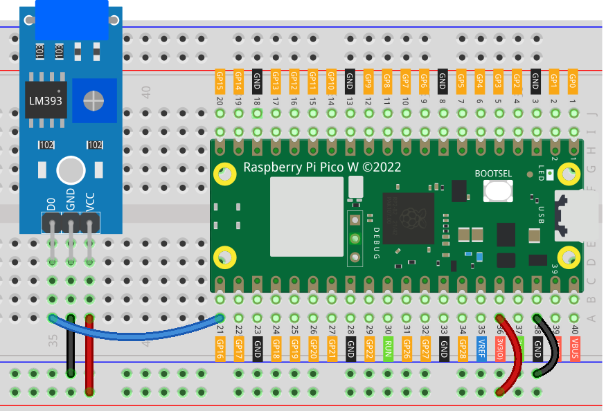

.. note::

    こんにちは、SunFounder Raspberry Pi & Arduino & ESP32 Enthusiasts Communityへようこそ！Facebook上で、仲間と一緒にRaspberry Pi、Arduino、ESP32をさらに深く探求しましょう。

    **なぜ参加するのか？**

    - **専門的なサポート**：購入後の問題や技術的な課題をコミュニティやチームの助けを借りて解決。
    - **学びと共有**：スキルを向上させるためのヒントやチュートリアルを交換。
    - **限定プレビュー**：新製品発表や予告編に早期アクセス。
    - **特別割引**：最新製品の特別割引を楽しむ。
    - **フェスティブプロモーションとプレゼント**：プレゼントやホリデープロモーションに参加。

    👉 私たちと一緒に探索と創造を始める準備はできましたか？[|link_sf_facebook|]をクリックして、今すぐ参加しましょう！
    
.. _pico_lesson24_vibration_sensor:

レッスン24: 振動センサーモジュール (SW-420)
==============================================

このレッスンでは、SW-420振動センサーモジュールをRaspberry Pi Pico Wに接続して使用する方法を学びます。このコースでは、GPIO 16に振動センサーを設定し、振動を監視するMicroPythonスクリプトの作成方法を案内します。センサーの出力を継続的にチェックし、振動が検出されたときにメッセージを表示するループを作成します。この実践的な演習により、Raspberry Pi Pico Wでの外部センサーの使用に慣れ、ハードウェアインターフェースとMicroPythonでのプログラミングに対する理解が深まります。

必要なコンポーネント
--------------------------

このプロジェクトでは、以下のコンポーネントが必要です。

以下のリンクからキット全体を購入することができます：

.. list-table::
    :widths: 20 20 20
    :header-rows: 1

    *   - Name	
        - ITEMS IN THIS KIT
        - LINK
    *   - Universal Maker Sensor Kit
        - 94
        - |link_umsk|

また、以下のリンクから個別に購入することも可能です。

.. list-table::
    :widths: 30 20
    :header-rows: 1

    *   - Component Introduction
        - Purchase Link

    *   - Raspberry Pi Pico W
        - \-
    *   - :ref:`cpn_vibration`
        - |link_sw420_vibration_module_buy|
    *   - :ref:`cpn_breadboard`
        - |link_breadboard_buy|

配線
---------------------------

コード
---------------------------

.. code-block:: python

   from machine import Pin
   import time
   
   # Initialize GPIO 16 as an input pin for the vibration sensor
   vibration_sensor = Pin(16, Pin.IN)
   
   # Continuously check the vibration sensor's state
   while True:
       # If the sensor detects vibration (value is 1), print a message
       if vibration_sensor.value() == 1:
           print("Vibration detected!")
       # If no vibration is detected, print ellipses
       else:
           print("...")
   
       # Pause for 0.1 seconds to lower the demand on the CPU
       time.sleep(0.1)

コード解析
---------------------------

#. 必要なライブラリのインポート

   .. code-block:: python

      from machine import Pin
      import time

   これは、ハードウェア関連の操作に使用する ``machine`` モジュールと、時間関連のタスクを処理するための ``time`` モジュールをインポートします。

#. 振動センサーの初期化

   .. code-block:: python
 
      # Initialize GPIO 16 as an input pin for the vibration sensor
      vibration_sensor = Pin(16, Pin.IN)
 
   ここでは、GPIO 16を入力ピンとして設定します。 ``machine`` モジュールの ``Pin`` クラスを使用してGPIOピンと対話します。 ``Pin.IN`` は、ピンを入力として設定します。

#. センサーの継続的な監視

   .. code-block:: python

      # Continuously check the vibration sensor's state
      while True:

   ``while True`` ループを使用して、センサーの状態を継続的にチェックする無限ループを作成します。

#. センサーの状態をチェックして応答する

   .. code-block:: python

          # If the sensor detects vibration (value is 1), print a message
          if vibration_sensor.value() == 1:
              print("Vibration detected!")
          # If no vibration is detected, print ellipses
          else:
              print("...")

   ループ内で、 ``vibration_sensor.value()`` がセンサーの現在の状態をチェックします。 ``1`` を返す場合、振動が検出されたことを示し、メッセージが表示されます。そうでない場合、省略記号が表示されます。

#. CPU使用率の管理

   .. code-block:: python

          # Pause for 0.1 seconds to lower the demand on the CPU
          time.sleep(0.1)

   ``time.sleep(0.1)`` は、ループを0.1秒間一時停止させます。これは、スクリプトがCPU時間を過剰に消費するのを防ぐために重要です。
