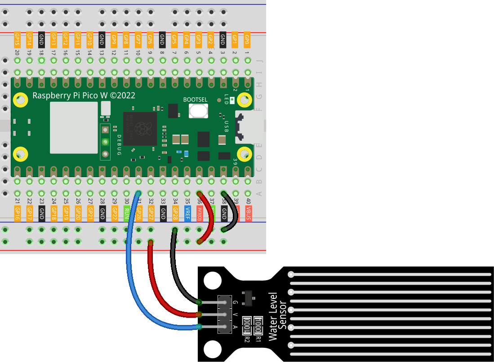

.. note::

    こんにちは、SunFounder Raspberry Pi & Arduino & ESP32 Enthusiasts Communityへようこそ！Facebook上で、仲間と一緒にRaspberry Pi、Arduino、ESP32をさらに深く探求しましょう。

    **なぜ参加するのか？**

    - **専門的なサポート**：購入後の問題や技術的な課題をコミュニティやチームの助けを借りて解決。
    - **学びと共有**：スキルを向上させるためのヒントやチュートリアルを交換。
    - **限定プレビュー**：新製品発表や予告編に早期アクセス。
    - **特別割引**：最新製品の特別割引を楽しむ。
    - **フェスティブプロモーションとプレゼント**：プレゼントやホリデープロモーションに参加。

    👉 私たちと一緒に探索と創造を始める準備はできましたか？[|link_sf_facebook|]をクリックして、今すぐ参加しましょう！
.. _pico_lesson25_water_level:

レッスン25: 水位センサーモジュール
=========================================

このレッスンでは、Raspberry Pi Pico Wを使用して水位センサーで水位を測定する方法を学びます。センサーをボードに接続し、MicroPythonを使用してそのアナログ出力を読み取り、これらの読み取り値を解釈して水位を判断する方法を理解します。この実践的なセッションは、Raspberry Pi Pico Wを使用したセンサー統合とデータ取得のスキルを向上させることを目的としています。

必要な部品
--------------------------

このプロジェクトでは、以下の部品が必要です。

キット全体を購入すると便利です。リンクはこちら：

.. list-table::
    :widths: 20 20 20
    :header-rows: 1

    *   - Name	
        - ITEMS IN THIS KIT
        - LINK
    *   - Universal Maker Sensor Kit
        - 94
        - |link_umsk|

以下のリンクから個別に購入することもできます。

.. list-table::
    :widths: 30 20
    :header-rows: 1

    *   - Component Introduction
        - Purchase Link

    *   - Raspberry Pi Pico W
        - \-
    *   - :ref:`cpn_water_level`
        - \-
    *   - :ref:`cpn_breadboard`
        - |link_breadboard_buy|

配線
---------------------------

コード
---------------------------

.. code-block:: python

   import machine
   import utime
   
   # Initialize an ADC object on GPIO pin 26.
   # This is typically used for reading analog signals.
   water_level_sensor = machine.ADC(26)
   
   # Continuously read and print sensor data.
   while True:
       value = water_level_sensor.read_u16()  # Read and convert analog value to 16-bit integer
       print("AO:", value)  # Print the analog value
   
       utime.sleep_ms(200)  # Wait for 200 milliseconds before the next read

コード解析
---------------------------

#. ライブラリのインポート

   ここでは、ハードウェアとの対話に必要な ``machine`` と、時間関連の関数に必要な ``utime`` ライブラリをインポートします。

   .. code-block:: python

      import machine
      import utime

#. 水位センサーの初期化

   GPIOピン26にADCオブジェクトを作成し、水位センサーからのアナログ信号を読み取ります。ADCは、センサーのアナログ信号をマイクロコントローラーが処理できるデジタル形式に変換するために重要です。

   .. code-block:: python

      # Initialize an ADC object on GPIO pin 26.
      water_level_sensor = machine.ADC(26)

#. センサーデータの読み取りと出力

   ``while True`` ループは、センサーデータの継続的な読み取りを可能にします。 ``read_u16`` メソッドはアナログ信号を16ビットの整数に変換します。この値を出力し、 ``utime.sleep_ms(200)`` を使用して200ミリ秒間ループを一時停止させ、急速な繰り返しを防ぎます。

   .. code-block:: python

      while True:
          value = water_level_sensor.read_u16()  # Read and convert analog value to 16-bit integer
          print("AO:", value)  # Print the analog value

          utime.sleep_ms(200)  # Wait for 200 milliseconds before the next read