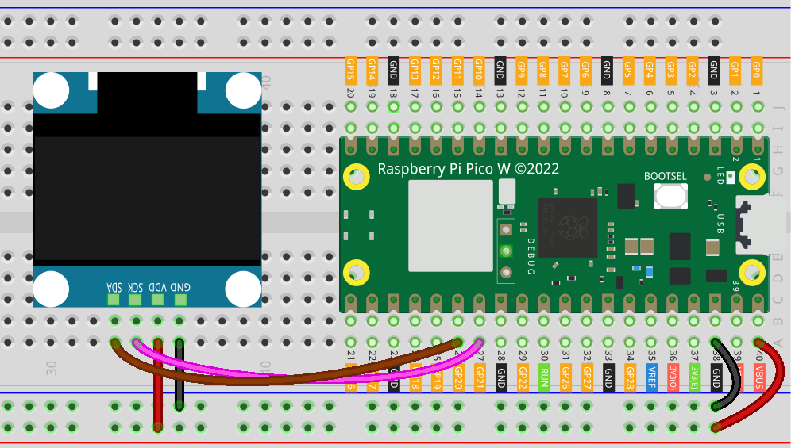

 
.. note::

   Hallo und willkommen in der SunFounder Raspberry Pi & Arduino & ESP32 Enthusiasten-Gemeinschaft auf Facebook! Tauchen Sie tiefer ein in die Welt von Raspberry Pi, Arduino und ESP32 mit anderen Enthusiasten.

   **Warum beitreten?**

   - **Expertenunterstützung**: Lösen Sie Nachverkaufsprobleme und technische Herausforderungen mit Hilfe unserer Gemeinschaft und unseres Teams.
   - **Lernen & Teilen**: Tauschen Sie Tipps und Anleitungen aus, um Ihre Fähigkeiten zu verbessern.
   - **Exklusive Vorschauen**: Erhalten Sie frühzeitigen Zugang zu neuen Produktankündigungen und exklusiven Einblicken.
   - **Spezialrabatte**: Genießen Sie exklusive Rabatte auf unsere neuesten Produkte.
   - **Festliche Aktionen und Gewinnspiele**: Nehmen Sie an Gewinnspielen und Feiertagsaktionen teil.

   👉 Sind Sie bereit, mit uns zu erkunden und zu erschaffen? Klicken Sie auf [|link_sf_facebook|] und treten Sie heute bei!

.. _pico_lesson27_oled:

Lektion 27: OLED-Display-Modul (SSD1306)
============================================

In dieser Lektion lernen Sie, wie Sie ein OLED-Display-Modul (SSD1306) mit dem Raspberry Pi Pico W verbinden und Text und Grafiken darauf anzeigen können. Sie richten die I2C-Kommunikation ein, verwenden MicroPython, um den Pico W zur Steuerung des OLED-Displays zu programmieren, und üben das Anzeigen einfacher Textnachrichten.

Benötigte Komponenten
--------------------------

Für dieses Projekt benötigen wir folgende Komponenten.

Es ist definitiv praktisch, ein ganzes Kit zu kaufen, hier ist der Link:

.. list-table::
    :widths: 20 20 20
    :header-rows: 1

    *   - Name	
        - ITEMS IN THIS KIT
        - LINK
    *   - Universal Maker Sensor Kit
        - 94
        - |link_umsk|

Sie können sie auch separat über die unten stehenden Links kaufen.

.. list-table::
    :widths: 30 20
    :header-rows: 1

    *   - Component Introduction
        - Purchase Link

    *   - Raspberry Pi Pico W
        - |link_picow_buy|
    *   - :ref:`cpn_oled`
        - \-
    *   - :ref:`cpn_breadboard`
        - |link_breadboard_buy|

Verkabelung
---------------------------

.. note:: 
   Um sicherzustellen, dass das OLED-Modul normal funktioniert, verwenden Sie bitte den VBUS-Pin am Pico, um es mit Strom zu versorgen.

Code
---------------------------

.. note::

    * Öffnen Sie die Datei ``27_ssd1306_oled_module.py`` im Pfad ``universal-maker-sensor-kit-main/pico/Lesson_27_SSD1306_OLED_Module`` oder kopieren Sie diesen Code in Thonny und klicken Sie dann auf "Aktuelles Skript ausführen" oder drücken Sie einfach F5, um es auszuführen. Für detaillierte Anleitungen lesen Sie bitte :ref:`open_run_code_py`.
    
    * Hier müssen Sie die Dateien ``ssd1306.py`` verwenden. Bitte überprüfen Sie, ob sie auf dem Pico W hochgeladen wurden. Für eine detaillierte Anleitung siehe :ref:`add_libraries_py`.
    
    * Vergessen Sie nicht, auf den Interpreter "MicroPython (Raspberry Pi Pico)" in der unteren rechten Ecke zu klicken.

.. code-block:: python

   from machine import Pin, I2C
   import ssd1306
   import time
   
   # setup the I2C communication
   i2c = I2C(0, sda=Pin(20), scl=Pin(21))
   
   # Set up the OLED display (128x64 pixels) on the I2C bus
   # SSD1306_I2C is a subclass of FrameBuffer. FrameBuffer provides support for graphics primitives.
   # http://docs.micropython.org/en/latest/pyboard/library/framebuf.html
   oled = ssd1306.SSD1306_I2C(128, 64, i2c)
   
   # Clear the display by filling it with white and then showing the update
   oled.fill(1)
   oled.show()
   time.sleep(1)  # Wait for 1 second
   
   # Clear the display again by filling it with black
   oled.fill(0)
   oled.show()
   time.sleep(1)  # Wait for another second
   
   # Display text on the OLED screen
   oled.text('Hello,', 0, 0)  # Display "Hello," at position (0, 0)
   oled.text('sunfounder.com', 0, 16)  # Display "sunfounder.com" at position (0, 16)
   
   # The following line sends what to show to the display
   oled.show()

Code-Analyse
---------------------------

#. Initialisierung der I2C-Kommunikation:

   Dieser Codeabschnitt richtet die I2C-Kommunikationsprotokolle ein. I2C ist ein Standardprotokoll für die Kommunikation zwischen Geräten. Es verwendet zwei Leitungen: SDA (Datenleitung) und SCL (Taktleitung).
   
   .. code-block:: python

      from machine import Pin, I2C
      i2c = I2C(0, sda=Pin(20), scl=Pin(21))

#. Einrichten des OLED-Displays:

   Hier initialisieren wir das SSD1306 OLED-Display mit dem I2C-Protokoll. Die Parameter 128 und 64 definieren die Breite und Höhe des Displays in Pixeln.

   Für weitere Informationen zur ``ssd1306``-Bibliothek besuchen Sie bitte |link_micropython_ssd1306_driver|.

   .. code-block:: python

      import ssd1306
      oled = ssd1306.SSD1306_I2C(128, 64, i2c)

#. Löschen des Displays:

   Das Display wird gelöscht, indem es mit Weiß (1) gefüllt und dann das Display mit ``oled.show()`` aktualisiert wird. Der Befehl ``time.sleep(1)`` fügt eine Verzögerung von einer Sekunde hinzu. Dann wird das Display erneut gelöscht, indem es mit Schwarz (0) gefüllt wird.

   SSD1306_I2C ist eine Unterklasse von FrameBuffer, die Grafikprimitive unterstützt. Wenn Sie andere Muster anzeigen möchten, lesen Sie bitte |link_FrameBuffer_doc|.

   .. code-block:: python
      
      oled.fill(1)
      oled.show()
      time.sleep(1)
      oled.fill(0)
      oled.show()
      time.sleep(1)

#. Anzeigen von Text:

   Die Methode ``oled.text`` wird verwendet, um Text auf dem Bildschirm anzuzeigen. Die Parameter sind der anzuzeigende Text und die x-, y-Koordinaten auf dem Bildschirm. Schließlich aktualisiert ``oled.show()`` das Display, um den Text anzuzeigen.

   .. code-block:: python

      oled.text('Hello,', 0, 0)
      oled.text('sunfounder.com', 0, 16)
      oled.show()