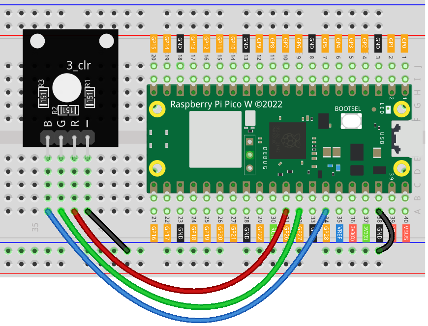

.. note::

    こんにちは、SunFounder Raspberry Pi & Arduino & ESP32 Enthusiasts Communityへようこそ！Facebook上で、仲間と一緒にRaspberry Pi、Arduino、ESP32をさらに深く探求しましょう。

    **なぜ参加するのか？**

    - **専門的なサポート**：購入後の問題や技術的な課題をコミュニティやチームの助けを借りて解決。
    - **学びと共有**：スキルを向上させるためのヒントやチュートリアルを交換。
    - **限定プレビュー**：新製品発表や予告編に早期アクセス。
    - **特別割引**：最新製品の特別割引を楽しむ。
    - **フェスティブプロモーションとプレゼント**：プレゼントやホリデープロモーションに参加。

    👉 私たちと一緒に探索と創造を始める準備はできましたか？[|link_sf_facebook|]をクリックして、今すぐ参加しましょう！

.. _pico_lesson28_rgb_module:

Lesson 28: RGB LED Module
==================================

In this lesson, you'll learn how to control an RGB LED using the Raspberry Pi Pico W. You'll discover how to set up PWM (Pulse Width Modulation) on different GPIO pins for each color channel of the RGB LED, allowing you to create various colors by adjusting the intensity of red, green, and blue components. This project offers beginners a great opportunity to gain practical experience with PWM and color mixing on Raspberry Pi Pico W using MicroPython. Additionally, you'll learn how to handle interrupts to safely turn off the LED. This lesson provides a fun and interactive way to explore the basics of electronics and programming.

Required Components
--------------------------

In this project, we need the following components. 

It's definitely convenient to buy a whole kit, here's the link: 

.. list-table::
    :widths: 20 20 20
    :header-rows: 1

    *   - Name	
        - ITEMS IN THIS KIT
        - LINK
    *   - Universal Maker Sensor Kit
        - 94
        - |link_umsk|

You can also buy them separately from the links below.

.. list-table::
    :widths: 30 20
    :header-rows: 1

    *   - Component Introduction
        - Purchase Link

    *   - Raspberry Pi Pico W
        - \-
    *   - :ref:`cpn_rgb`
        - \-
    *   - :ref:`cpn_breadboard`
        - |link_breadboard_buy|

Wiring
---------------------------

Code
---------------------------

.. code-block:: python

   from machine import Pin, PWM
   from time import sleep
   
   # Initialize PWM for each color channel of an RGB LED
   red = PWM(Pin(26))  # Red channel on GPIO pin 26
   green = PWM(Pin(27))  # Green channel on GPIO pin 27
   blue = PWM(Pin(28))  # Blue channel on GPIO pin 28
   
   # Set 1000 Hz frequency for all channels
   red.freq(1000)
   green.freq(1000)
   blue.freq(1000)
   
   
   # Function to set RGB LED color
   def set_color(r, g, b):
       red.duty_u16(r)  # Red intensity
       green.duty_u16(g)  # Green intensity
       blue.duty_u16(b)  # Blue intensity
   
   
   try:
       while True:
           set_color(65535, 0, 0)  # Red
           sleep(1)
           set_color(0, 65535, 0)  # Green
           sleep(1)
           set_color(0, 0, 65535)  # Blue
           sleep(1)
   except KeyboardInterrupt:
       set_color(0, 0, 0)  # Turn off RGB LED on interrupt

Code Analysis
---------------------------

#. Importing Libraries

   The ``machine`` module is imported to use the PWM class and Pin class. The ``time`` module is imported to use the ``sleep`` function for creating delays.

   .. code-block:: python

      from machine import Pin, PWM
      from time import sleep

#. Initializing PWM for RGB LED

   The RGB LED has three channels (Red, Green, Blue), each controlled by a separate PWM signal. The PWM signals are connected to GPIO pins 26, 27, and 28.

   .. code-block:: python

      red = PWM(Pin(26))  # Red channel on GPIO pin 26
      green = PWM(Pin(27))  # Green channel on GPIO pin 27
      blue = PWM(Pin(28))  # Blue channel on GPIO pin 28

#. Setting Frequency for PWM Signals

   The frequency of the PWM signals is set to 1000 Hz for all three channels.

   .. code-block:: python

      red.freq(1000)
      green.freq(1000)
      blue.freq(1000)

#. Defining the set_color Function

   This function sets the color of the RGB LED. The ``duty_u16`` method is used to set the duty cycle for each color channel, which determines the intensity of that color.

   .. code-block:: python

      def set_color(r, g, b):
          red.duty_u16(r)
          green.duty_u16(g)
          blue.duty_u16(b)

#. Main Program Loop

   An infinite loop is used to change the color of the LED. The ``set_color`` function is called with different values to display red, green, and blue colors. Each color is displayed for 1 second.

   .. code-block:: python

      try:
          while True:
              set_color(65535, 0, 0)  # Red
              sleep(1)
              set_color(0, 65535, 0)  # Green
              sleep(1)
              set_color(0, 0, 65535)  # Blue
              sleep(1)
      except KeyboardInterrupt:
          set_color(0, 0, 0)  # Turn off RGB LED on interrupt