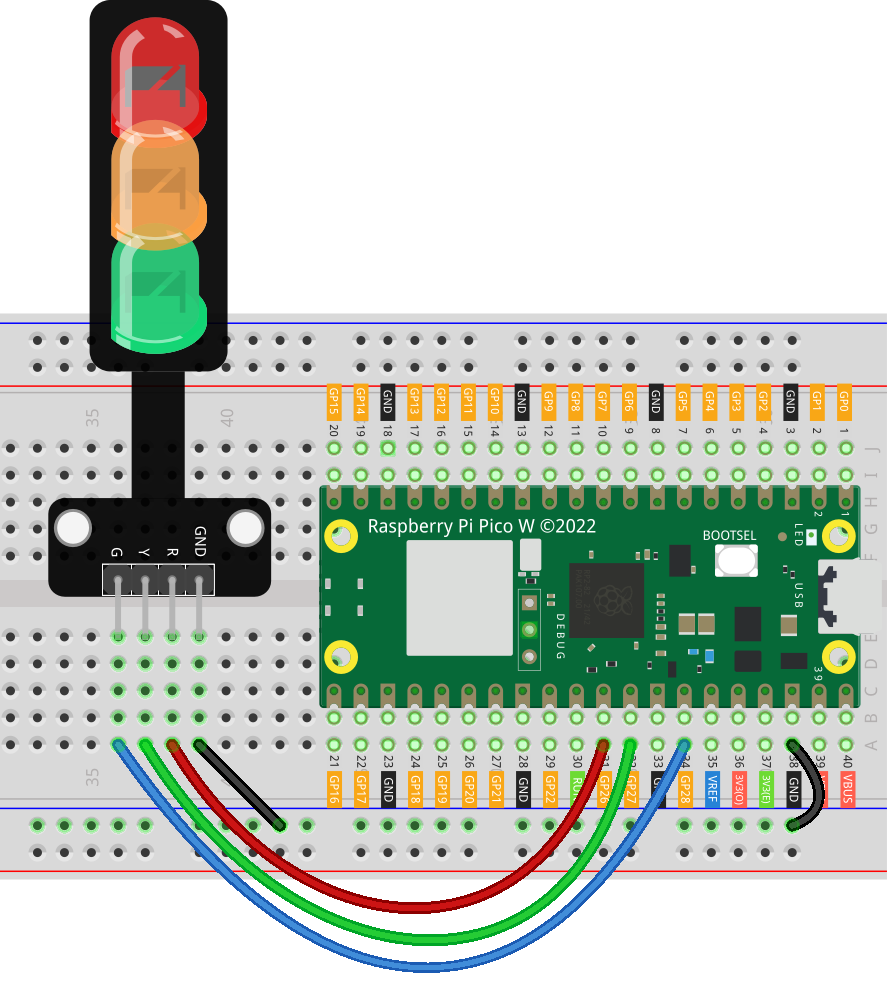

.. _pico_lesson29_traffic_light_module:

Lesson 29: Traffic Light Module
==================================

In this lesson, you will learn to create a traffic light system using the Raspberry Pi Pico W. You'll program the Pico W to control three LEDs – red, yellow, and green – mimicking a real traffic light. This project offers a practical introduction to using Pulse Width Modulation (PWM) for LED brightness control and basic control structures in MicroPython. It's ideal for beginners looking to explore digital signal processing and gain confidence in coding on the Raspberry Pi Pico W platform.

Required Components
---------------------------

.. list-table::
    :widths: 30 20
    :header-rows: 1

    *   - Component Introduction
        - Purchase Link

    *   - Raspberry Pi Pico W
        - \-
    *   - :ref:`cpn_traffic`
        - |link_traffic_light_module_buy|
    *   - :ref:`cpn_breadboard`
        - |link_breadboard_buy|

Wiring
---------------------------

Code
---------------------------

.. code-block:: python

   from machine import Pin, PWM
   import time
   
   # Initialize pins for LEDs
   red = PWM(Pin(26), freq=1000)  #  red LED
   yellow = PWM(Pin(27), freq=1000)  #  yellow LED
   green = PWM(Pin(28), freq=1000)  # green LED
   
   
   # Function to set the brightness of an LED (0-100%)
   def set_brightness(led, brightness):
       if brightness < 0 or brightness > 100:
           raise ValueError("Brightness should be between 0 and 100")
       led.duty_u16(int(brightness / 100 * 65535))
   
   
   try:
       # Example sequence
       while True:
           
           # Green light for 5 seconds
           set_brightness(green, 100)
           time.sleep(5)
           set_brightness(green, 0)
   
           # Blink Yellow light
           set_brightness(yellow, 100)
           time.sleep(0.5)
           set_brightness(yellow, 0)
           time.sleep(0.5)
           set_brightness(yellow, 100)
           time.sleep(0.5)
           set_brightness(yellow, 0)
           time.sleep(0.5)
           set_brightness(yellow, 100)
           time.sleep(0.5)
           set_brightness(yellow, 0)
           time.sleep(0.5)
           
           # Red light for 5 seconds
           set_brightness(red, 100)
           time.sleep(5)
           set_brightness(red, 0)
           
   except KeyboardInterrupt:
       # Turn off RGB LED on interrupt
       set_brightness(red, 0)
       set_brightness(yellow, 0)
       set_brightness(green, 0)

Code Analysis
---------------------------

#. Importing Libraries

   The ``machine`` library is used for controlling hardware components, and ``time`` is used for creating delays.

   .. code-block:: python

      from machine import Pin, PWM
      import time

#. Initializing LED Pins

   Here, we initialize the pins connected to the LEDs. PWM is used to control the brightness of the LEDs.

   .. code-block:: python

      red = PWM(Pin(26), freq=1000)  #  red LED
      yellow = PWM(Pin(27), freq=1000)  #  yellow LED
      green = PWM(Pin(28), freq=1000)  # green LED

#. Defining the Set Brightness Function

   .. note::
      Due to the fact that the pins of Raspberry Pi Pico can only output a maximum voltage of 3.3V, the green LED will appear dim.

   This function sets the brightness of the LEDs. It takes two parameters: the LED and the desired brightness level (0-100%). The ``duty_u16`` method is used to set the PWM duty cycle.

   .. code-block:: python

      def set_brightness(led, brightness):
          if brightness < 0 or brightness > 100:
              raise ValueError("Brightness should be between 0 and 100")
          led.duty_u16(int(brightness / 100 * 65535))

#. Main Loop and Traffic Light Sequence

   The ``while True`` loop makes the code run continuously. It controls the sequence of the traffic light: green, yellow (blinking), and red.

   .. code-block:: python

      try:
          while True:
              # Green light for 5 seconds
              set_brightness(green, 100)
              time.sleep(5)
              set_brightness(green, 0)
              ...

#. Handling Keyboard Interrupt

   The ``except KeyboardInterrupt`` block is used to handle a manual interruption (like Ctrl+C). It turns off all LEDs when the script is interrupted.

   .. code-block:: python

      except KeyboardInterrupt:
          set_brightness(red, 0)
          set_brightness(yellow, 0)
          set_brightness(green, 0)