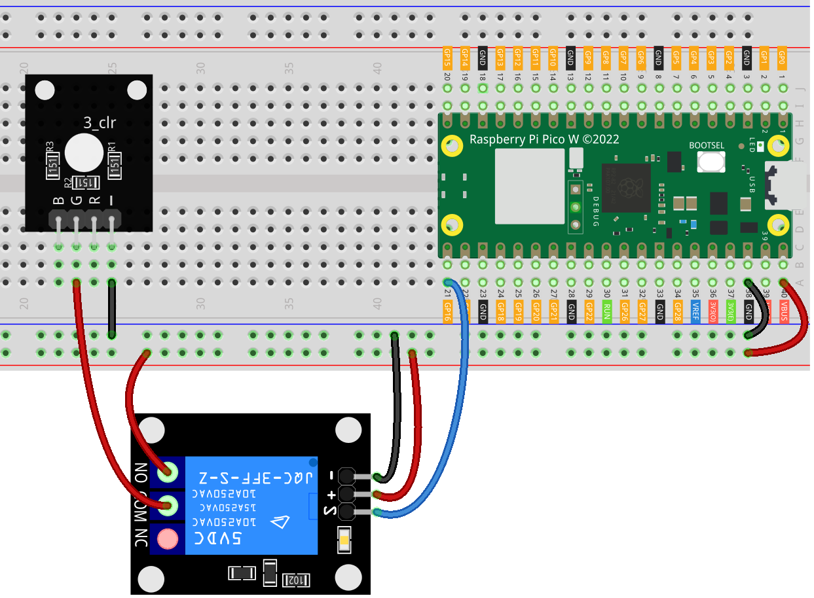

 
.. note::

   Hallo und willkommen in der SunFounder Raspberry Pi & Arduino & ESP32 Enthusiasten-Gemeinschaft auf Facebook! Tauchen Sie tiefer ein in die Welt von Raspberry Pi, Arduino und ESP32 mit anderen Enthusiasten.

   **Warum beitreten?**

   - **Expertenunterstützung**: Lösen Sie Nachverkaufsprobleme und technische Herausforderungen mit Hilfe unserer Gemeinschaft und unseres Teams.
   - **Lernen & Teilen**: Tauschen Sie Tipps und Anleitungen aus, um Ihre Fähigkeiten zu verbessern.
   - **Exklusive Vorschauen**: Erhalten Sie frühzeitigen Zugang zu neuen Produktankündigungen und exklusiven Einblicken.
   - **Spezialrabatte**: Genießen Sie exklusive Rabatte auf unsere neuesten Produkte.
   - **Festliche Aktionen und Gewinnspiele**: Nehmen Sie an Gewinnspielen und Feiertagsaktionen teil.

   👉 Sind Sie bereit, mit uns zu erkunden und zu erschaffen? Klicken Sie auf [|link_sf_facebook|] und treten Sie heute bei!

.. _pico_lesson30_relay_module:

Lektion 30: Relaismodul
==================================

In dieser Lektion lernen Sie, wie Sie das Raspberry Pi Pico W verwenden, um ein Relaismodul zu steuern. Wir werden eine grundlegende Schaltung einrichten, die das Relais mit dem Pi verbindet, und ein MicroPython-Skript schreiben, um das Relais in Ein-Sekunden-Intervallen ein- und auszuschalten. Dieses Projekt führt Sie in die Steuerung externer Geräte wie Relais ein und demonstriert praktische Ausgabeoperationen unter Verwendung der GPIO-Pins des Raspberry Pi Pico W. Ideal für diejenigen, die sich für Heimautomatisierung interessieren oder andere Hochleistungsgeräte verwalten möchten, bietet diese Lektion grundlegende Einblicke, wie Mikrocontroller mit externer Hardware interagieren und diese steuern können.

Benötigte Komponenten
--------------------------

Für dieses Projekt benötigen wir folgende Komponenten.

Es ist definitiv bequem, ein ganzes Set zu kaufen, hier ist der Link:

.. list-table::
    :widths: 20 20 20
    :header-rows: 1

    *   - Name	
        - ITEMS IN THIS KIT
        - LINK
    *   - Universal Maker Sensor Kit
        - 94
        - |link_umsk|

Sie können sie auch separat über die folgenden Links kaufen.

.. list-table::
    :widths: 30 20
    :header-rows: 1

    *   - Component Introduction
        - Purchase Link

    *   - Raspberry Pi Pico W
        - \-
    *   - :ref:`cpn_relay`
        - \-
    *   - :ref:`cpn_rgb`
        - \-
    *   - :ref:`cpn_breadboard`
        - |link_breadboard_buy|

Verdrahtung
---------------------------

Code
---------------------------

.. code-block:: python

   from machine import Pin
   import time
   
   # Replace this number with the GPIO pin number your relay is connected to
   relay_pin = Pin(16, Pin.OUT)
   
   def relay_on():
       relay_pin.value(1)  # Set relay to ON state
   
   def relay_off():
       relay_pin.value(0)  # Set relay to OFF state
   
   try:
       while True:
           relay_on()
           print("on....")
           time.sleep(1)  # Wait for 1 second
           relay_off()
           print("off....")
           time.sleep(1)  # Wait for 1 second
   except:
       relay_off()  # Ensure the relay is turned off in case of an exception
       print("Program interrupted, relay turned off.")

Code-Analyse
---------------------------

#. Bibliotheken importieren
   
   Die Bibliotheken ``machine`` und ``time`` werden importiert, um mit GPIO-Pins zu interagieren und zeitbezogene Funktionen zu handhaben.

   .. code-block:: python

      from machine import Pin
      import time

#. Initialisierung des Relais-Pins

   Ein GPIO-Pin wird als Ausgangspin konfiguriert, um das Relais zu steuern. Die Variable ``relay_pin`` repräsentiert den mit dem Relais verbundenen GPIO-Pin.

   .. code-block:: python

      relay_pin = Pin(16, Pin.OUT)

#. Definition von Relaisschaltfunktionen
   
   Zwei Funktionen, ``relay_on`` und ``relay_off``, werden definiert, um das Relais jeweils ein- und auszuschalten. Diese Funktionen ändern den Wert des GPIO-Pins auf hoch (1) oder niedrig (0).

   .. code-block:: python

      def relay_on():
          relay_pin.value(1)  # Set relay to ON state

      def relay_off():
          relay_pin.value(0)  # Set relay to OFF state

#. Hauptschleife und Ausnahmebehandlung
   
   Eine kontinuierliche Schleife wird mit ``while True`` erstellt. Innerhalb dieser Schleife wird das Relais ein- und ausgeschaltet, jeweils mit einer 1-sekündigen Verzögerung zwischen jedem Zustand. Wenn eine Unterbrechung auftritt (wie eine Tastaturunterbrechung), wird das Relais aus Sicherheitsgründen ausgeschaltet, und eine Nachricht wird ausgegeben.

   .. code-block:: python

      try:
          while True:
              relay_on()
              print("on....")
              time.sleep(1)  # Wait for 1 second
              relay_off()
              print("off....")
              time.sleep(1)  # Wait for 1 second
      except:
          relay_off()  # Ensure the relay is turned off in case of an exception
          print("Program interrupted, relay turned off.")