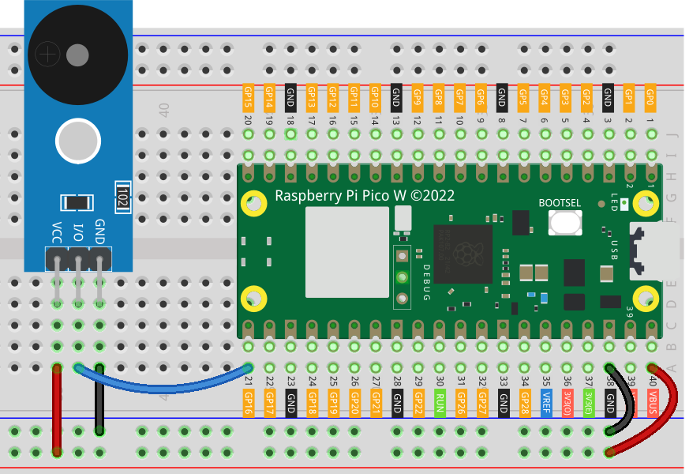

.. note::

    こんにちは、SunFounder Raspberry Pi & Arduino & ESP32 Enthusiasts Communityへようこそ！Facebook上で、仲間と一緒にRaspberry Pi、Arduino、ESP32をさらに深く探求しましょう。

    **なぜ参加するのか？**

    - **専門的なサポート**：購入後の問題や技術的な課題をコミュニティやチームの助けを借りて解決。
    - **学びと共有**：スキルを向上させるためのヒントやチュートリアルを交換。
    - **限定プレビュー**：新製品発表や予告編に早期アクセス。
    - **特別割引**：最新製品の特別割引を楽しむ。
    - **フェスティブプロモーションとプレゼント**：プレゼントやホリデープロモーションに参加。

    👉 私たちと一緒に探索と創造を始める準備はできましたか？[|link_sf_facebook|]をクリックして、今すぐ参加しましょう！
.. _pico_lesson32_passive_buzzer:

レッスン 32: パッシブブザー モジュール
========================================

このレッスンでは、Raspberry Pi Pico Wを使用してパッシブブザーで単音を鳴らし、音楽を演奏する方法を学びます。GPIO 16でPWM（パルス幅変調）を使用してブザーを設定し、buzzer_musicライブラリのmusicクラスを使用して完全な曲を演奏する方法を理解します。このコースは、単音の演奏から始め、「ハッピーバースデー」などのメロディを完全に実行する方法まで、ステップバイステップでガイドします。このプロジェクトは初心者に非常に適しており、音楽のトーンを理解し、MicroPythonで外部ライブラリを統合する実践的な方法を提供します。

必要な部品
--------------------------

このプロジェクトでは、以下の部品が必要です。

以下のリンクからキット全体を購入すると便利です：

.. list-table::
    :widths: 20 20 20
    :header-rows: 1

    *   - Name	
        - ITEMS IN THIS KIT
        - LINK
    *   - Universal Maker Sensor Kit
        - 94
        - |link_umsk|

以下のリンクから個別に購入することもできます。

.. list-table::
    :widths: 30 20
    :header-rows: 1

    *   - Component Introduction
        - Purchase Link

    *   - Raspberry Pi Pico W
        - \-
    *   - :ref:`cpn_buzzer`
        - |link_passive_buzzer_module_buy|
    *   - :ref:`cpn_breadboard`
        - |link_breadboard_buy|

配線
---------------------------

コード
---------------------------

.. code-block:: python

   import machine
   import time
   
   # Initialize the PWM on GPIO 16 for the buzzer
   buzzer = machine.PWM(machine.Pin(16))
   
   def tone(pin, frequency, duration):
       """Play a tone on the given pin at the specified frequency and duration."""
       pin.freq(frequency)
       pin.duty_u16(30000)
       time.sleep_ms(duration)
       pin.duty_u16(0)
   
   # Play individual notes
   tone(buzzer, 440, 250)  # A4
   time.sleep(0.5)
   tone(buzzer, 494, 250)  # B4
   time.sleep(0.5)
   tone(buzzer, 523, 250)  # C5
   time.sleep(1)

      
   
   # Import the music class from the buzzer_music module for easy song playback.
   from buzzer_music import music
   
   # Find some music on onlinesequencer.net, click edit, select all notes with CTRL + A and then copy them with CTRL + C
   # Paste the string to song, making sure to remove the "Online Sequencer:120233:" from the start and the ";:" from the end
   # https://onlinesequencer.net/2474257 Happy Birthday (by Sudirth)
   song = "0 G4 3 0;3 G4 1 0;4 A4 4 0;8 G4 4 0;12 C5 4 0;16 B4 8 0;24 G4 3 0;27 G4 1 0;28 A4 4 0;32 G4 4 0;36 D5 4 0;40 C5 8 0;48 G4 3 0;51 G4 1 0;52 G5 4 0;56 E5 4 0;60 C5 4 0;64 B4 4 0;68 A4 4 0;72 F5 3 0;75 F5 1 0;76 E5 4 0;80 C5 4 0;84 D5 4 0;88 C5 8 0"
   
   # Initialize the music class with the song and set the buzzer pin
   mySong = music(song, pins=[machine.Pin(16)])
   
   # Play music using the music class.
   while True:
       print(mySong.tick())
       time.sleep(0.04)

コード解析
---------------------------

#. 初期化

   必要なモジュールをインポートし、ブザーを制御するために特定のGPIOピンでPWMを初期化します。

   .. code-block:: python

       import machine
       import time

       # Initialize the PWM on GPIO 16 for the buzzer
       buzzer = machine.PWM(machine.Pin(16))

#. tone関数の定義

   この関数は、指定された周波数と期間で単音を再生します。PWM信号の周波数とデューティサイクル（音量）を設定します。

   .. code-block:: python

       def tone(pin, frequency, duration):
           """Play a tone on the given pin at the specified frequency and duration."""
           pin.freq(frequency)
           pin.duty_u16(30000)
           time.sleep_ms(duration)
           pin.duty_u16(0)

#. 個別の音符を再生

   ここでは、 ``tone`` 関数を使用して個別の音符を再生します。パラメータには音符の周波数（Hz単位）とその期間（ミリ秒単位）が含まれます。

   .. code-block:: python

       # Play individual notes
       tone(buzzer, 440, 250)  # A4
       time.sleep(0.5)
       tone(buzzer, 494, 250)  # B4
       time.sleep(0.5)
       tone(buzzer, 523, 250)  # C5
       time.sleep(1)

#. buzzer_musicライブラリの使用

   ``buzzer_music``ライブラリをインポートし、曲の文字列を準備します。

   onlinesequencer.netで音楽を見つけ、編集し、CTRL + Aで全ての音符を選択し、CTRL + Cでコピーします。文字列を ``song`` に貼り付け、開始部分の"Online Sequencer:120233:"と末尾の";:"を削除してください。

   ``buzzer_music``ライブラリの詳細については、|link_buzzer_music|をご覧ください。

   .. code-block:: python

       # Import the music class from the buzzer_music module for easy song playback.
       from buzzer_music import music

       # https://onlinesequencer.net/2474257 Happy Birthday (by Sudirth)
       song = "0 G4 3 0;3 G4 1 0;4 A4 4 0;8 G4 4 0;12 C5 4 0;16 B4 8 0;24 G4 3 0;27 G4 1 0;28 A4 4 0;32 G4 4 0;36 D5 4 0;40 C5 8 0;48 G4 3 0;51 G4 1 0;52 G5 4 0;56 E5 4 0;60 C5 4 0;64 B4 4 0;68 A4 4 0;72 F5 3 0;75 F5 1 0;76 E5 4 0;80 C5 4 0;84 D5 4 0;88 C5 8 0"

#. 曲の初期化と再生

   ``music``クラスを曲の文字列とブザーのGPIOピンで初期化します。 ``music`` クラスの ``tick`` メソッドを使用して、音楽をループ再生します。

   .. code-block:: python

       # Initialize the music class with the song and set the buzzer pin
       mySong = music(song, pins=[machine.Pin(16)])

       # Play music using the music class.
       while True:
           print(mySong.tick())
           time.sleep(0.04)
