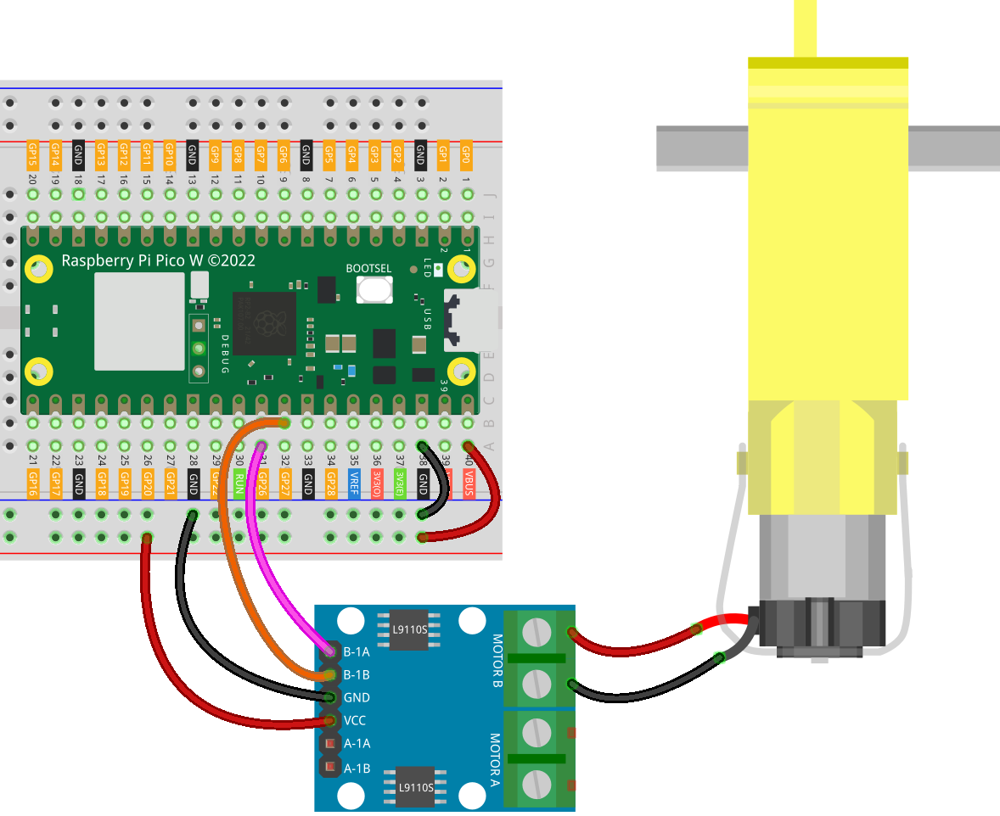

.. note::

    Hello, welcome to the SunFounder Raspberry Pi & Arduino & ESP32 Enthusiasts Community on Facebook! Dive deeper into Raspberry Pi, Arduino, and ESP32 with fellow enthusiasts.

    **Why Join?**

    - **Expert Support**: Solve post-sale issues and technical challenges with help from our community and team.
    - **Learn & Share**: Exchange tips and tutorials to enhance your skills.
    - **Exclusive Previews**: Get early access to new product announcements and sneak peeks.
    - **Special Discounts**: Enjoy exclusive discounts on our newest products.
    - **Festive Promotions and Giveaways**: Take part in giveaways and holiday promotions.

    👉 Ready to explore and create with us? Click [|link_sf_facebook|] and join today!

.. _pico_lesson34_motor:

Lesson 34: TT Motor
==================================

In this lesson, you will learn how to operate a TT motor using the Raspberry Pi Pico W and an L9110 motor control board. We'll guide you through the process of configuring two PWM (Pulse Width Modulation) pins to control the motor. You'll set up the motor to run for 5 seconds and then turn off. This practical exercise offers a valuable opportunity to delve into motor control mechanisms and PWM signals, crucial in microcontroller programming. 

Required Components
--------------------------

In this project, we need the following components. 

It's definitely convenient to buy a whole kit, here's the link: 

.. list-table::
    :widths: 20 20 20
    :header-rows: 1

    *   - Name	
        - ITEMS IN THIS KIT
        - LINK
    *   - Universal Maker Sensor Kit
        - 94
        - |link_umsk|

You can also buy them separately from the links below.

.. list-table::
    :widths: 30 20
    :header-rows: 1

    *   - Component Introduction
        - Purchase Link

    *   - Raspberry Pi Pico W
        - \-
    *   - :ref:`cpn_ttmotor`
        - \-
    *   - :ref:`cpn_l9110`
        - \-
    *   - :ref:`cpn_breadboard`
        - |link_breadboard_buy|

Wiring
---------------------------

Code
---------------------------

.. code-block:: python

   from machine import Pin, PWM
   import time
   
   motor_a = PWM(Pin(26), freq=1000)
   motor_b = PWM(Pin(27), freq=1000)
   
   # turn on motor
   motor_a.duty_u16(0)
   motor_b.duty_u16(65535)  # speed(0-65535)
   
   time.sleep(5)
   
   # turn off motor
   motor_a.duty_u16(0)
   motor_b.duty_u16(0)

Code Analysis
---------------------------

#. Importing Libraries

   - The ``machine`` module is imported to interact with the GPIO pins and PWM functionalities of the Raspberry Pi Pico W.
   - The ``time`` module is used for creating delays in the code.

   .. raw:: html

       

   .. code-block:: python

      from machine import Pin, PWM
      import time

#. Initializing PWM Objects

   - Two PWM objects, ``motor_a`` and ``motor_b``, are created. They correspond to GPIO pins 26 and 27, respectively.
   - The frequency for PWM is set to 1000 Hz, a common frequency for motor control.

   .. raw:: html

       

   .. code-block:: python

      motor_a = PWM(Pin(26), freq=1000)
      motor_b = PWM(Pin(27), freq=1000)

#. Turning on the Motor

   - ``motor_a.duty_u16(0)`` sets the duty cycle of ``motor_a`` pin to 0, while ``motor_b.duty_u16(65535)`` sets the duty cycle of ``motor_b`` pin to 65535, running the motor at full speed. For more details, please refer to :ref:`the working principle of L9110 <cpn_l9110_principle>`.
   - The motor runs for 5 seconds, controlled by ``time.sleep(5)``.

   .. raw:: html

       

   .. code-block:: python

      # turn on motor
      motor_a.duty_u16(0)
      motor_b.duty_u16(65535)  # speed(0-65535)
      time.sleep(5)

#. Turning off the Motor

   Both ``motor_a`` and ``motor_b`` are set to a duty cycle of 0, stopping the motor.

   .. code-block:: python

      # turn off motor
      motor_a.duty_u16(0)
      motor_b.duty_u16(0)