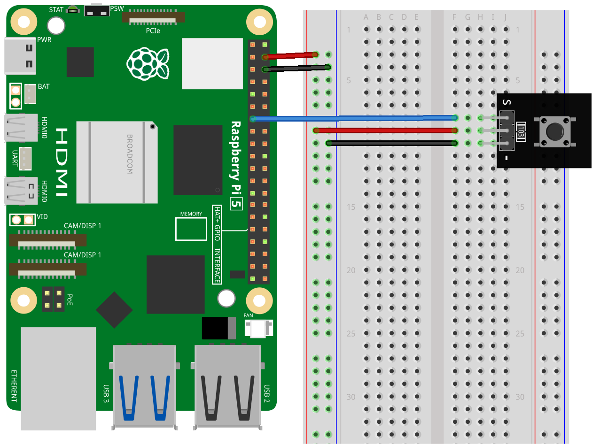

.. note::

    こんにちは、SunFounder Raspberry Pi & Arduino & ESP32 Enthusiasts Communityへようこそ！Facebook上で、仲間と一緒にRaspberry Pi、Arduino、ESP32をさらに深く探求しましょう。

    **なぜ参加するのか？**

    - **専門的なサポート**：購入後の問題や技術的な課題をコミュニティやチームの助けを借りて解決。
    - **学びと共有**：スキルを向上させるためのヒントやチュートリアルを交換。
    - **限定プレビュー**：新製品発表や予告編に早期アクセス。
    - **特別割引**：最新製品の特別割引を楽しむ。
    - **フェスティブプロモーションとプレゼント**：プレゼントやホリデープロモーションに参加。

    👉 私たちと一緒に探索と創造を始める準備はできましたか？[|link_sf_facebook|]をクリックして、今すぐ参加しましょう！

.. _pi_lesson01_button:

レッスン 01: ボタンモジュール
==================================

このレッスンでは、Raspberry Piでボタンを使用する基本を学びます。ボタンをGPIOピン17に接続し、その状態を監視する簡単なPythonスクリプトを書く方法を紹介します。ボタンが押された時と離された時を検出し、適切なメッセージを表示するようにRaspberry Piをプログラムする方法を学びます。この入門プロジェクトは、GPIOの操作や基本的なPythonスクリプトに慣れるのに最適で、Raspberry Piとハードウェアプログラミングを始める初心者に適しています。

必要なコンポーネント
--------------------------

このプロジェクトでは、以下のコンポーネントが必要です。

一式揃ったキットを購入すると便利です。リンクはこちら:

.. list-table::
    :widths: 20 20 20
    :header-rows: 1

    *   - Name	
        - ITEMS IN THIS KIT
        - LINK
    *   - Universal Maker Sensor Kit
        - 94
        - |link_umsk|

以下のリンクから個別に購入することもできます。

.. list-table::
    :widths: 30 20
    :header-rows: 1

    *   - Component Introduction
        - Purchase Link

    *   - Raspberry Pi 5
        - \-
    *   - :ref:`cpn_button`
        - \-
    *   - :ref:`cpn_breadboard`
        - |link_breadboard_buy|

配線
---------------------------

コード
---------------------------

.. code-block:: python

   from gpiozero import Button

   # Initialize button connected to GPIO pin 17
   button = Button(17)

   # Continuously check the button state
   while True:
      if button.is_pressed:
         print("Button is pressed")  # Print when button is pressed
      else:
         print("Button is not pressed")  # Print when button is not pressed

コード解析
---------------------------

#. ライブラリのインポート
   
   ``gpiozero``ライブラリから ``Button`` クラスをインポートします。

   .. code-block:: python

      from gpiozero import Button

#. ボタンの初期化
   
   GPIOピン17に接続された ``Button`` オブジェクトを作成します。

   .. code-block:: python

      button = Button(17)

#. ボタンの状態を継続的に監視
   
   ``while True``ループを使用して、ボタンの状態を継続的にチェックします。ボタンが押されている場合（ ``button.is_pressed`` ）、"Button is pressed"と表示します。それ以外の場合は、"Button is not pressed"と表示します。

   .. code-block:: python

      while True:
          if button.is_pressed:
              print("Button is pressed")
          else:
              print("Button is not pressed")