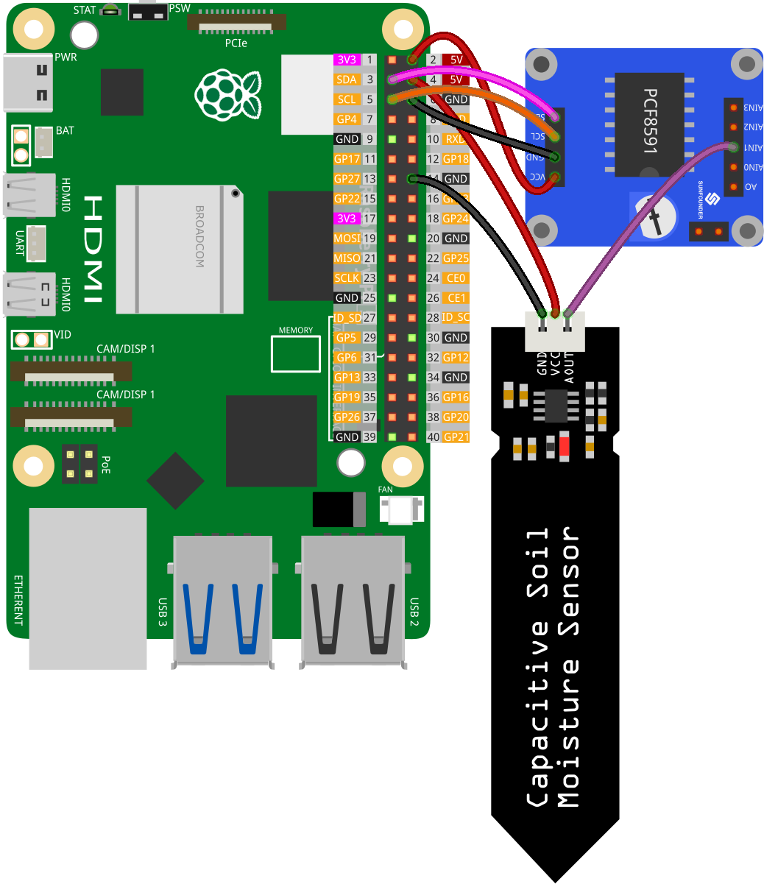

.. note::

    こんにちは、SunFounder Raspberry Pi & Arduino & ESP32 Enthusiasts Communityへようこそ！Facebook上で、仲間と一緒にRaspberry Pi、Arduino、ESP32をさらに深く探求しましょう。

    **なぜ参加するのか？**

    - **専門的なサポート**：購入後の問題や技術的な課題をコミュニティやチームの助けを借りて解決。
    - **学びと共有**：スキルを向上させるためのヒントやチュートリアルを交換。
    - **限定プレビュー**：新製品発表や予告編に早期アクセス。
    - **特別割引**：最新製品の特別割引を楽しむ。
    - **フェスティブプロモーションとプレゼント**：プレゼントやホリデープロモーションに参加。

    👉 私たちと一緒に探索と創造を始める準備はできましたか？[|link_sf_facebook|]をクリックして、今すぐ参加しましょう！

.. _pi_lesson02_soil_moisture:

レッスン 02: 静電容量式土壌湿度モジュール
============================================

.. note::
   Raspberry Piにはアナログ入力機能がないため、アナログ信号を処理するには :ref:`cpn_pcf8591` のようなモジュールが必要です。

このチュートリアルでは、Raspberry Piを使用して土壌の湿度レベルを監視する方法を学びます。PCF8591モジュールを使用してアナログからデジタルへの変換を行い、静電容量式土壌湿度センサーをセットアップし、Pythonを使って土壌の湿度を継続的に監視します。このプロジェクトは、センサー、ADC（アナログ-デジタル変換器）、およびRaspberry Piでのリアルタイムデータ監視の実践的な入門編です。

必要なコンポーネント
--------------------------

このプロジェクトでは、以下のコンポーネントが必要です。

一式揃ったキットを購入すると便利です。リンクはこちら:

.. list-table::
    :widths: 20 20 20
    :header-rows: 1

    *   - Name	
        - ITEMS IN THIS KIT
        - LINK
    *   - Universal Maker Sensor Kit
        - 94
        - |link_umsk|

以下のリンクから個別に購入することもできます。

.. list-table::
    :widths: 30 20
    :header-rows: 1

    *   - Component Introduction
        - Purchase Link

    *   - Raspberry Pi 5
        - \-
    *   - :ref:`cpn_soil`
        - |link_soil_moisture_buy|
    *   - :ref:`cpn_pcf8591`
        - |link_pcf8591_module_buy|

配線
---------------------------

コード
---------------------------

.. code-block:: Python

   import PCF8591 as ADC  # Import PCF8591 module
   import time  # Import time for delay
   
   ADC.setup(0x48)  # Initialize PCF8591 at address 0x48
   
   try:
       while True:  # Continuously read and print moisture level
           print(ADC.read(1))  # Read from Soil Moisture Sensor at AIN1
           time.sleep(0.2)  # Delay of 0.2 seconds
   except KeyboardInterrupt:
       print("Exit")  # Exit on CTRL+C

コード解析
---------------------------

1. **ライブラリのインポート**:

   このセクションでは必要なPythonライブラリをインポートします。 ``PCF8591`` ライブラリはPCF8591モジュールと対話するために使用され、 ``time`` はコード内でディレイを実装するために使用されます。

   .. code-block:: python

      import PCF8591 as ADC  # Import PCF8591 module
      import time  # Import time for delay

2. **PCF8591モジュールの初期化**:

   ここではPCF8591モジュールを初期化します。アドレス ``0x48`` はPCF8591モジュールのI²Cアドレスです。これにより、Raspberry Piがモジュールと通信できるようになります。

   .. code-block:: python

      ADC.setup(0x48)  # Initialize PCF8591 at address 0x48

3. **メインループとデータの読み取り**:

   ``try``ブロックには、静電容量式土壌湿度モジュールからのデータを一貫して読み取る連続ループが含まれています。 ``ADC.read(1)`` 関数は、PCF8591モジュールのチャネル1（AIN1）に接続されたセンサーからアナログ入力をキャプチャします。 ``time.sleep(0.2)`` を組み込むことで、各読み取りの間に0.2秒のポーズを作ります。これにより、Raspberry PiのCPU使用率を削減し、過剰なデータ処理要求を避けるだけでなく、ターミナルが迅速にスクロールする情報で圧倒されるのを防ぎ、出力の監視と分析を容易にします。

   .. code-block:: python

      try:
          while True:  # Continuously read and print moisture level
              print(ADC.read(1))  # Read from Soil Moisture Sensor at AIN1
              time.sleep(0.2)  # Delay of 0.2 seconds

4. **キーボード割り込みの処理**:

   ``except``ブロックはKeyboardInterrupt（CTRL+Cを押すなど）をキャッチするために設計されています。この割り込みが発生すると、スクリプトは「終了」と表示して実行を停止します。これは、Pythonで継続的に実行されるスクリプトを優雅に終了させる一般的な方法です。

   .. code-block:: python

      except KeyboardInterrupt:
          print("exit")  # Exit on CTRL+C