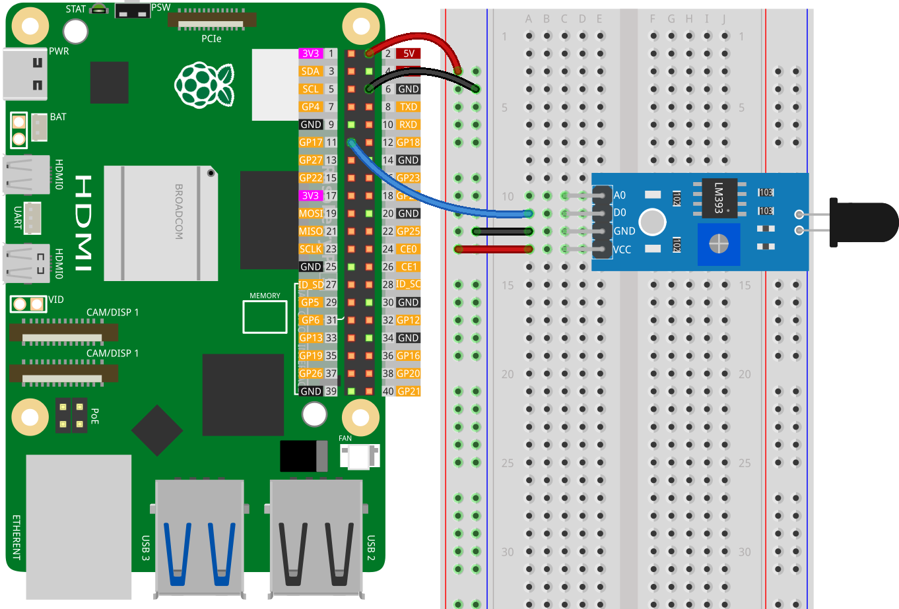

.. note::

    こんにちは、SunFounder Raspberry Pi & Arduino & ESP32 Enthusiasts Communityへようこそ！Facebook上で、仲間と一緒にRaspberry Pi、Arduino、ESP32をさらに深く探求しましょう。

    **なぜ参加するのか？**

    - **専門的なサポート**：購入後の問題や技術的な課題をコミュニティやチームの助けを借りて解決。
    - **学びと共有**：スキルを向上させるためのヒントやチュートリアルを交換。
    - **限定プレビュー**：新製品発表や予告編に早期アクセス。
    - **特別割引**：最新製品の特別割引を楽しむ。
    - **フェスティブプロモーションとプレゼント**：プレゼントやホリデープロモーションに参加。

    👉 私たちと一緒に探索と創造を始める準備はできましたか？[|link_sf_facebook|]をクリックして、今すぐ参加しましょう！

.. _pi_lesson03_flame:

レッスン03: 炎センサーモジュール
==================================

このレッスンでは、Raspberry Piを使用して炎センサーで火災を検出する方法を学びます。炎センサーをGPIO17に接続し、その出力を読み取るPythonスクリプトを書く方法を紹介します。センサーが炎を検出したときの状態変化を識別する方法を学びます。この実践的なプロジェクトは、Raspberry PiでのセンサーインターフェースとPythonコーディングの基本を紹介し、安全関連のプロジェクトに興味のある初心者に適しています。

必要なコンポーネント
--------------------------

このプロジェクトでは、以下のコンポーネントが必要です。

一式揃ったキットを購入すると便利です。リンクはこちら:

.. list-table::
    :widths: 20 20 20
    :header-rows: 1

    *   - Name	
        - ITEMS IN THIS KIT
        - LINK
    *   - Universal Maker Sensor Kit
        - 94
        - |link_umsk|

以下のリンクから個別に購入することもできます。

.. list-table::
    :widths: 30 20
    :header-rows: 1

    *   - Component Introduction
        - Purchase Link

    *   - Raspberry Pi 5
        - \-
    *   - :ref:`cpn_flame`
        - |link_flame_sensor_module_buy|
    *   - :ref:`cpn_breadboard`
        - |link_breadboard_buy|

配線
---------------------------

コード
---------------------------

.. code-block:: python

   from gpiozero import InputDevice
   import time

   # Connect the digital output of the flame sensor to GPIO17 on the Raspberry Pi
   flame_sensor = InputDevice(17)

   # Continuous loop to read from the sensor
   while True:
       # Check if the sensor is active (no flame detected)
       if flame_sensor.is_active:
           print("No flame detected.")
       else:
           # When the sensor is inactive (flame detected)
           print("Flame detected!")
       # Wait for 1 second before reading the sensor again
       time.sleep(1)

コード解析
---------------------------

#. ライブラリのインポート
   
   スクリプトは、gpiozeroライブラリから必要なクラスと、Python標準ライブラリのtimeモジュールをインポートすることから始まります。

   .. code-block:: python

      from gpiozero import InputDevice
      import time

#. 炎センサーの初期化
   
   ``InputDevice``オブジェクトの ``flame_sensor`` を作成し、Raspberry PiのGPIOピン17に接続された炎センサーを表します。この設定では、炎センサーのデジタル出力がGPIO17に接続されていることを前提としています。

   .. code-block:: python

      flame_sensor = InputDevice(17)

#. 連続読み取りループ
   
   - スクリプトは ``while True:`` ループを使用してセンサーのデータを継続的に読み取ります。このループは無期限に実行されます。
   - ループ内では、 ``if`` 文を使用して ``is_active`` プロパティを使用して炎センサーの状態を確認します。
   - ``flame_sensor.is_active``が ``True`` の場合、炎が検出されていないことを示し、「炎は検出されませんでした。」と表示されます。
   - ``flame_sensor.is_active``が ``False`` の場合、炎が検出されたことを示し、「炎が検出されました！」と表示されます。
   - ``time.sleep(1)``コマンドは、各センサーの読み取り間でループを1秒間一時停止し、スクリプトがCPUを過負荷にしないようにします。

   .. raw:: html

       

   .. code-block:: python

      while True:
          if flame_sensor.is_active:
              print("炎は検出されませんでした。")
          else:
              print("炎が検出されました！")
          time.sleep(1)
