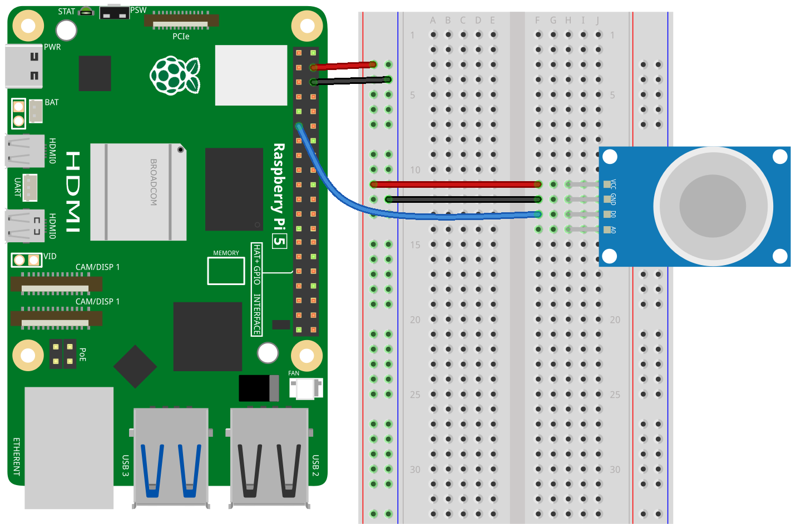

.. note::

   Hallo und willkommen in der SunFounder Raspberry Pi & Arduino & ESP32 Enthusiasten-Gemeinschaft auf Facebook! Tauchen Sie tiefer ein in die Welt von Raspberry Pi, Arduino und ESP32 mit anderen Enthusiasten.

   **Warum beitreten?**

   - **Expertenunterstützung**: Lösen Sie Nachverkaufsprobleme und technische Herausforderungen mit Hilfe unserer Gemeinschaft und unseres Teams.
   - **Lernen & Teilen**: Tauschen Sie Tipps und Anleitungen aus, um Ihre Fähigkeiten zu verbessern.
   - **Exklusive Vorschauen**: Erhalten Sie frühzeitigen Zugang zu neuen Produktankündigungen und exklusiven Einblicken.
   - **Spezialrabatte**: Genießen Sie exklusive Rabatte auf unsere neuesten Produkte.
   - **Festliche Aktionen und Gewinnspiele**: Nehmen Sie an Gewinnspielen und Feiertagsaktionen teil.

   👉 Sind Sie bereit, mit uns zu erkunden und zu erschaffen? Klicken Sie auf [|link_sf_facebook|] und treten Sie heute bei!

.. _pi_lesson04_mq2:

Lektion 04: Gassensormodul (MQ-2)
============================================

In dieser Lektion lernen Sie, wie Sie den MQ2-Gassensor mit dem Raspberry Pi zur Gasdetektion verwenden. Der Kurs behandelt den Anschluss des MQ2-Sensors an den GPIO17-Pin und die Programmierung des Raspberry Pi in Python, um die Sensorausgabe zu lesen. Sie lernen, wie man das Vorhandensein von Gas erkennt, wobei ein niedriges Signal vom Sensor auf die Detektion von Gas hinweist. Dieses Projekt bietet eine praktische Einführung in die Verwendung von Sensoren und das Schreiben von Python-Skripten auf dem Raspberry Pi und ist ideal für Anfänger, die sich für Umweltüberwachung und Sicherheitsanwendungen interessieren.

Benötigte Komponenten
--------------------------

In diesem Projekt benötigen wir die folgenden Komponenten.

Es ist definitiv praktisch, ein ganzes Kit zu kaufen, hier ist der Link:

.. list-table::
    :widths: 20 20 20
    :header-rows: 1

    *   - Name	
        - ITEMS IN THIS KIT
        - LINK
    *   - Universal Maker Sensor Kit
        - 94
        - |link_umsk|

Sie können sie auch einzeln über die unten stehenden Links kaufen.

.. list-table::
    :widths: 30 20
    :header-rows: 1

    *   - Component Introduction
        - Purchase Link

    *   - Raspberry Pi 5
        - \-
    *   - :ref:`cpn_gas`
        - |link_mq2_gas_sensor_module_buy|
    *   - :ref:`cpn_breadboard`
        - |link_breadboard_buy|

Verkabelung
---------------------------

Code
---------------------------

.. code-block:: python

   from gpiozero import DigitalInputDevice
   import time
 
   # Initialize MQ2 sensor on GPIO17
   mq2 = DigitalInputDevice(17)
 
   while True:
      # Detect gas presence (LOW signal indicates gas)
      if mq2.value == 0:
         print("Gas detected!")
      else:
         print("No gas detected.")
 
      # Delay between readings
      time.sleep(1)
 

Code-Analyse
---------------------------

#. Bibliotheken importieren

   .. code-block:: python
      
      from gpiozero import DigitalInputDevice
      import time

   Dieser Abschnitt importiert die notwendigen Bibliotheken. ``gpiozero`` wird zur Interaktion mit den GPIO-Pins des Raspberry Pi verwendet, und ``time`` wird für zeitbezogene Aufgaben wie Verzögerungen verwendet.

#. Initialisierung des MQ2-Sensors

   .. code-block:: python

      mq2 = DigitalInputDevice(17)

   Hier wird der MQ2-Sensor als digitales Eingabegerät an GPIO-Pin 17 des Raspberry Pi initialisiert. Die Klasse ``DigitalInputDevice`` aus gpiozero wird dafür verwendet.

#. Endlosschleife zur Sensorabfrage

   .. code-block:: python

      while True:
         if mq2.value == 0:
            print("Gas detected!")
         else:
            print("No gas detected.")
         time.sleep(1)

   In diesem Abschnitt:

   .. note::
      Der DO-Pin des MQ-2-Sensormoduls zeigt das Vorhandensein brennbarer Gase an. Wenn die Gaskonzentration den Schwellenwert überschreitet (wie durch das Potentiometer auf dem Modul eingestellt), wird D0 LOW; andernfalls bleibt es HIGH.
   
   - Eine Endlosschleife wird mit ``while True`` erstellt. Diese Schleife läuft weiter, bis das Programm manuell gestoppt wird.
   - Innerhalb der Schleife wird der Wert des MQ2-Sensors mit ``mq2.value`` überprüft. Wenn der Wert 0 ist, zeigt dies das Vorhandensein von Gas an und "Gas erkannt!" wird ausgegeben. Andernfalls wird "Kein Gas erkannt." ausgegeben.
   - ``time.sleep(1)`` erzeugt eine Verzögerung von 1 Sekunde zwischen den Messungen, wodurch die Häufigkeit der Sensorüberprüfungen und der Ausgabemeldungen verringert wird.
