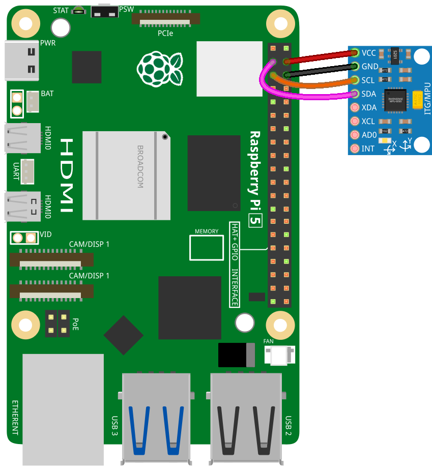

 .. note::

    Hallo und willkommen in der SunFounder Raspberry Pi & Arduino & ESP32 Enthusiasten-Gemeinschaft auf Facebook! Tauchen Sie tiefer ein in die Welt von Raspberry Pi, Arduino und ESP32 mit anderen Enthusiasten.

    **Warum beitreten?**

    - **Expertenunterstützung**: Lösen Sie Nachverkaufsprobleme und technische Herausforderungen mit Hilfe unserer Gemeinschaft und unseres Teams.
    - **Lernen & Teilen**: Tauschen Sie Tipps und Anleitungen aus, um Ihre Fähigkeiten zu verbessern.
    - **Exklusive Vorschauen**: Erhalten Sie frühzeitigen Zugang zu neuen Produktankündigungen und exklusiven Einblicken.
    - **Spezialrabatte**: Genießen Sie exklusive Rabatte auf unsere neuesten Produkte.
    - **Festliche Aktionen und Gewinnspiele**: Nehmen Sie an Gewinnspielen und Feiertagsaktionen teil.

    👉 Sind Sie bereit, mit uns zu erkunden und zu erschaffen? Klicken Sie auf [|link_sf_facebook|] und treten Sie heute bei!

.. _pi_lesson05_mpu6050:

Lektion 05: Gyroskop- und Beschleunigungsmessermodul (MPU6050)
=====================================================================

In dieser Lektion lernen Sie, wie Sie den Raspberry Pi mit dem MPU6050 verbinden, einem Sensor, der ein 3-Achsen-Gyroskop und einen Beschleunigungsmesser integriert. Sie werden erfahren, wie man Beschleunigung, Orientierung und Rotation misst. Dieses Projekt bietet praktische Erfahrungen im Lesen von Sensordaten, der Nutzung von Python für die Hardware-Interaktion und dem Verständnis der I2C-Kommunikation. Sie werden auch lernen, kontinuierlich die Beschleunigung in drei Achsen, die Rotationsgeschwindigkeit und die Temperatur vom Sensor zu erfassen. Es ist ein idealer Ausgangspunkt für Anfänger, die sich für Sensoren und Bewegungserfassung mit dem Raspberry Pi interessieren.

Benötigte Komponenten
--------------------------

In diesem Projekt benötigen wir die folgenden Komponenten.

Es ist definitiv praktisch, ein ganzes Kit zu kaufen, hier ist der Link:

.. list-table::
    :widths: 20 20 20
    :header-rows: 1

    *   - Name	
        - ITEMS IN THIS KIT
        - LINK
    *   - Universal Maker Sensor Kit
        - 94
        - |link_umsk|

Sie können sie auch einzeln über die unten stehenden Links kaufen.

.. list-table::
    :widths: 30 20
    :header-rows: 1

    *   - Component Introduction
        - Purchase Link

    *   - Raspberry Pi 5
        - \-
    *   - :ref:`cpn_mpu6050`
        - |link_mpu6050_buy|

Verkabelung
---------------------------

Code
---------------------------

.. code-block:: python

   # Import the mpu6050 class and sleep function from respective modules.
   from mpu6050 import mpu6050
   from time import sleep
   
   # Initialize the MPU-6050 sensor with the I2C address 0x68.
   sensor = mpu6050(0x68)
   
   # Infinite loop to continuously read data from the sensor.
   while True:
       # Retrieve accelerometer data from the sensor.
       accel_data = sensor.get_accel_data()
       # Retrieve gyroscope data from the sensor.
       gyro_data = sensor.get_gyro_data()
       # Retrieve temperature data from the sensor.
       temp = sensor.get_temp()
   
       # Print accelerometer data.
       print("Accelerometer data")
       print("x: " + str(accel_data['x']))
       print("y: " + str(accel_data['y']))
       print("z: " + str(accel_data['z']))
   
       # Print gyroscope data.
       print("Gyroscope data")
       print("x: " + str(gyro_data['x']))
       print("y: " + str(gyro_data['y']))
       print("z: " + str(gyro_data['z']))
   
       # Print the temperature in Celsius.
       print("Temp: " + str(temp) + " C")
   
       # Pause for 0.5 seconds before the next read cycle.
       sleep(0.5)

   
Code-Analyse
---------------------------

#. Importanweisungen

   Die Klasse ``mpu6050`` wird aus der Bibliothek ``mpu6050`` importiert und die Funktion ``sleep`` aus dem Modul ``time``. Diese Importe sind notwendig, um mit dem MPU-6050-Sensor zu interagieren und Verzögerungen im Code einzuführen.

   Weitere Informationen zur Bibliothek ``mpu6050`` finden Sie unter |link_mpu6050_python_driver|.

   .. code-block:: python

      from mpu6050 import mpu6050
      from time import sleep

#. Sensorinitialisierung

   Eine Instanz der Klasse ``mpu6050`` wird mit der I2C-Adresse 0x68 (der Standardadresse des MPU-6050-Sensors) erstellt. Dieser Schritt initialisiert den Sensor zum Datenlesen.

   .. code-block:: python

      sensor = mpu6050(0x68)

#. Endlosschleife für kontinuierliches Lesen

   Eine Endlosschleife (``while True``) wird verwendet, um kontinuierlich Daten vom Sensor zu lesen. Dies ist eine gängige Praxis bei sensorbasierten Anwendungen, bei denen eine ständige Überwachung erforderlich ist.

   .. code-block:: python

      while True:

#. Sensordaten lesen

   Innerhalb der Schleife werden Daten vom Beschleunigungssensor, Gyroskop und Temperatursensor mit den Methoden ``get_accel_data``, ``get_gyro_data`` und ``get_temp`` der ``mpu6050``-Klasseninstanz gelesen. Diese Methoden geben die Sensordaten in einem benutzerfreundlichen Format zurück.

   .. code-block:: python

      accel_data = sensor.get_accel_data()
      gyro_data = sensor.get_gyro_data()
      temp = sensor.get_temp()

#. Sensordaten ausgeben

   Die abgerufenen Daten werden dann ausgegeben. Die Daten des Beschleunigungssensors und des Gyroskops werden als Dictionary-Werte (x, y, z-Achsen) abgerufen und die Temperatur wird direkt als Celsius-Wert ausgegeben.

   .. code-block:: python

      print("Accelerometer data")
      print("x: " + str(accel_data['x']))
      print("y: " + str(accel_data['y']))
      print("z: " + str(accel_data['z']))

      print("Gyroscope data")
      print("x: " + str(gyro_data['x']))
      print("y: " + str(gyro_data['y']))
      print("z: " + str(gyro_data['z']))

      print("Temp: " + str(temp) + " C")

#. Verzögerung zwischen den Messungen

   Schließlich wird eine Verzögerung von einer halben Sekunde mit ``sleep(0.5)`` eingeführt. Diese Verzögerung ist wichtig, um zu verhindern, dass der Raspberry Pi mit kontinuierlichen Datenlesungen überlastet wird.

   .. code-block:: python

      sleep(0.5)