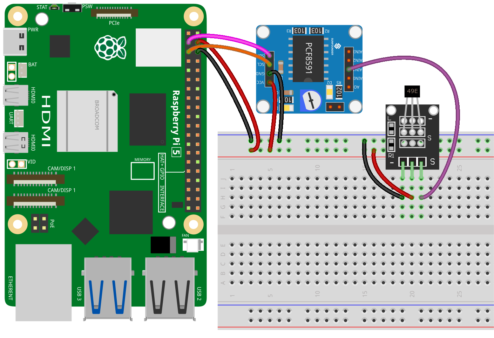

.. _pi_lesson06_hall_sensor:

Lesson 06: Hall Sensor Module
==================================

.. note::
   The Raspberry Pi does not have analog input capabilities, so it needs a module like the :ref:`cpn_pcf8591` to read analog signals for processing.

In this lesson, we will learn how to use a Raspberry Pi to read from a hall sensor module. You will learn how to connect a photoresistor module to the PCF8591 for analog-to-digital conversion and monitor its output in real-time using Python. Additionally, you will explore reading analog values and interpreting them to detect the presence and type of magnetic poles.

Required Components
---------------------------

.. list-table::
    :widths: 30 20
    :header-rows: 1

    *   - Component Introduction
        - Purchase Link

    *   - Raspberry Pi 5
        - \-
    *   - :ref:`cpn_hall`
        - \-
    *   - :ref:`cpn_pcf8591`
        - |link_pcf8591_module_buy|
    *   - :ref:`cpn_breadboard`
        - |link_breadboard_buy|

Wiring
---------------------------

Code
---------------------------

.. code-block:: python

   import PCF8591 as ADC  # Import PCF8591 module
   import time  # Import time for delay
   
   ADC.setup(0x48)  # Initialize PCF8591 at address 0x48
   
   try:
       while True:  # Continuously read and print
           sensor_value = ADC.read(1) # Read from hall sensor module at AIN1
           print(sensor_value,end="")  # Print the sensor raw data
   
           # Determine the polarity of the magnet
           if sensor_value >= 180:
               print(" - South pole detected")   # Determined as South pole.
           elif sensor_value <= 80:
               print(" - North pole detected")   # Determined as North pole.
   
           time.sleep(0.2)  # Wait for 0.2 seconds before the next read
   
   except KeyboardInterrupt:
       print("Exit")  # Exit on CTRL+C

Code Analysis
---------------------------

#. **Import Libraries**:

   .. code-block:: python
      
      import PCF8591 as ADC  # Import PCF8591 module
      import time  # Import time for delay

   This imports necessary libraries. ``PCF8591`` is used to interact with the ADC module, and ``time`` is for implementing delays in the loop.

#. **Initialize ADC Module**:

   .. code-block:: python
      
      ADC.setup(0x48)  # Initialize PCF8591 at address 0x48

   Sets up the PCF8591 module. ``0x48`` is the I2C address of the PCF8591 module. This line prepares the Raspberry Pi to communicate with the module.

#. **Main Loop for Reading Sensor Data**:

   .. code-block:: python

      try:
          while True:  # Continuously read and print
              sensor_value = ADC.read(1) # Read from hall sensor module at AIN1
              print(sensor_value, end="")  # Print the sensor raw data

   In this loop, ``sensor_value`` is read continuously from the Hall sensor (connected to AIN1 on the PCF8591). The ``print`` statement outputs the raw sensor data.

#. **Determine Magnet Polarity**:

   .. code-block:: python
      
              # Determine the polarity of the magnet
              if sensor_value >= 180:
                  print(" - South pole detected")   # Determined as South pole.
              elif sensor_value <= 80:
                  print(" - North pole detected")   # Determined as North pole.
 
   Here, the code determines the polarity of the magnet. If ``sensor_value`` is 180 or higher, it is identified as the South pole. If it is 80 or lower, it is considered the North pole. You need to modify these two threshold values based on your actual measurement results.

   The Hall sensor module is equipped with a 49E linear Hall effect sensor, which can measure the polarity of the magnetic field's north and south poles as well as the relative strength of the magnetic field. If you place a magnet's south pole near the side marked with 49E (the side with text engraved on it), the value read by the code will increase linearly in proportion to the applied magnetic field strength. Conversely, if you place a north pole near this side, the value read by the code will decrease linearly in proportion to that magnetic field strength. For more details, please refer to :ref:`cpn_hall`.

#. **Delay and Exception Handling**:

   .. code-block:: python

      time.sleep(0.2)  # Wait for 0.2 seconds before the next read

      except KeyboardInterrupt:
          print("Exit")  # Exit on CTRL+C

   ``time.sleep(0.2)`` creates a 0.2-second delay between each loop iteration to prevent excessive reading speed. The ``except`` block catches a keyboard interrupt (CTRL+C) to exit the program gracefully.