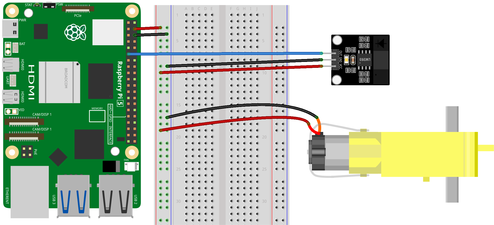

.. note::

    こんにちは、SunFounder Raspberry Pi & Arduino & ESP32 Enthusiasts Communityへようこそ！Facebook上で、仲間と一緒にRaspberry Pi、Arduino、ESP32をさらに深く探求しましょう。

    **なぜ参加するのか？**

    - **専門的なサポート**：購入後の問題や技術的な課題をコミュニティやチームの助けを借りて解決。
    - **学びと共有**：スキルを向上させるためのヒントやチュートリアルを交換。
    - **限定プレビュー**：新製品発表や予告編に早期アクセス。
    - **特別割引**：最新製品の特別割引を楽しむ。
    - **フェスティブプロモーションとプレゼント**：プレゼントやホリデープロモーションに参加。

    👉 私たちと一緒に探索と創造を始める準備はできましたか？[|link_sf_facebook|]をクリックして、今すぐ参加しましょう！

.. _pi_lesson07_speed:

レッスン 07: 赤外線速度センサーモジュール
==========================================

このレッスンでは、Raspberry Piとシンプルなセンサーを使用して回転速度を測定する方法を学びます。デジタル入力センサーをGPIOピン17に接続し、その状態変化をPythonで監視します。特定の時間内にセンサーの作動回数をカウントすることで、1秒あたりの回転数（RPS）を計算することに焦点を当てます。Python関数を作成して、このデータを正確にキャプチャし、測定可能な速度に変換します。この実践的なプロジェクトは、Raspberry Piを使用した現実のデータ収集と分析のシンプルでありながら実用的な入門編で、応用Pythonプログラミングやハードウェアインターフェースに興味のある初心者に最適です。

必要なコンポーネント
--------------------------

このプロジェクトでは、以下のコンポーネントが必要です。

一式揃ったキットを購入すると便利です。リンクはこちら:

.. list-table::
    :widths: 20 20 20
    :header-rows: 1

    *   - Name	
        - ITEMS IN THIS KIT
        - LINK
    *   - Universal Maker Sensor Kit
        - 94
        - |link_umsk|

以下のリンクから個別に購入することもできます。

.. list-table::
    :widths: 30 20
    :header-rows: 1

    *   - Component Introduction
        - Purchase Link

    *   - Raspberry Pi 5
        - \-
    *   - :ref:`cpn_speed`
        - |link_speed_sensor_module_buy|
    *   - :ref:`cpn_ttmotor`
        - \-
    *   - :ref:`cpn_breadboard`
        - |link_breadboard_buy|

配線
---------------------------

コード
---------------------------

.. code-block:: python

   from gpiozero import DigitalInputDevice
   from time import time

   # Initialize the sensor
   sensor = DigitalInputDevice(17)  # Assuming the sensor is connected to GPIO17

   def calculate_rps(sample_time=1, steps_per_revolution=20):
       """
       Calculate Revolutions Per Second (RPS)

       :param sample_time: Sampling time in seconds
       :param steps_per_revolution: Number of steps in each complete revolution
       :return: Revolutions per second
       """
       start_time = time()
       end_time = start_time + sample_time
       steps = 0
       last_state = False

       while time() < end_time:
           current_state = sensor.is_active
           if current_state and not last_state:
               # Detect a transition from inactive to active state
               steps += 1
           last_state = current_state

       # Calculate RPS
       rps = steps / steps_per_revolution
       return rps

   # Example usage
   print("Measuring RPS...")

   try:
       while True:
           rps = calculate_rps()  # Default sampling for 1 second
           print(f"RPS: {rps}")
   except KeyboardInterrupt:
       # Safely exit the program when a keyboard interrupt is detected
       pass

コード解析
---------------------------

#. ライブラリのインポート
   
   スクリプトは、センサーとの対話のためにgpiozeroから ``DigitalInputDevice`` を、時間管理のために ``time`` をインポートすることから始まります。

   .. code-block:: python

      from gpiozero import DigitalInputDevice
      from time import time

#. センサーの初期化
   
   ``DigitalInputDevice``オブジェクトの ``sensor`` がGPIOピン17に接続されて作成されます。この設定では、デジタルセンサーがGPIO17に接続されていることを前提としています。

   .. code-block:: python

      sensor = DigitalInputDevice(17)

#. ``calculate_rps``関数の定義
   
   - この関数は、回転体の1秒あたりの回転数（RPS）を計算します。
   - ``sample_time``は、センサーの出力がサンプリングされる秒数を表します。
   - ``steps_per_revolution``は、1回転あたりのセンサーの作動回数を示します。
   - 関数は、サンプル時間内のステップ（センサーの作動回数）をカウントするためにwhileループを使用します。
   - 非アクティブ状態からアクティブ状態への遷移を検出し、それに応じて ``steps`` カウントを増加させます。
   - RPSは、ステップ数を ``steps_per_revolution`` で割ったものとして計算されます。

   .. raw:: html

       

   .. code-block:: python

      def calculate_rps(sample_time=1, steps_per_revolution=20):
          """
          Calculate Revolutions Per Second (RPS)
          
          :param sample_time: Sampling time in seconds
          :param steps_per_revolution: Number of steps in each complete revolution
          :return: Revolutions per second
          """
          start_time = time()
          end_time = start_time + sample_time
          steps = 0
          last_state = False
      
          while time() < end_time:
              current_state = sensor.is_active
              if current_state and not last_state:
                  # Detect a transition from inactive to active state
                  steps += 1
              last_state = current_state
      
          # Calculate RPS
          rps = steps / steps_per_revolution
          return rps

#. メインループの実行
   
   - 次にスクリプトは、 ``calculate_rps`` を呼び出してRPSを計算し、出力する連続ループに入ります。
   - ループはキーボード割り込み（Ctrl+C）が検出されるまで無期限に実行されます。
   - ``try-except``ブロックを使用して割り込みを適切に処理し、安全に終了できるようにします。

   .. code-block:: python

      try:
          while True:
              rps = calculate_rps()  # Default sampling for 1 second
              print(f"RPS: {rps}")
      except KeyboardInterrupt:
          pass

