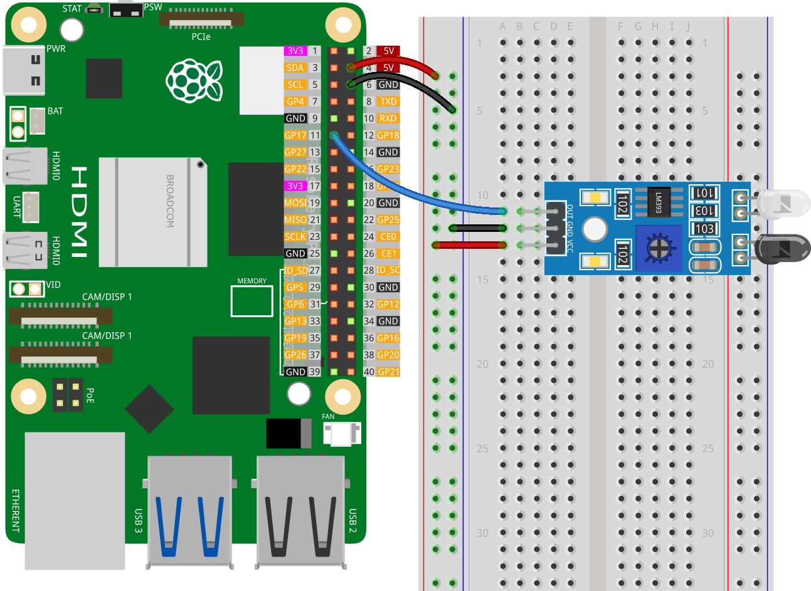

.. note::

    こんにちは、SunFounder Raspberry Pi & Arduino & ESP32 Enthusiasts Communityへようこそ！Facebook上で、仲間と一緒にRaspberry Pi、Arduino、ESP32をさらに深く探求しましょう。

    **なぜ参加するのか？**

    - **専門的なサポート**：購入後の問題や技術的な課題をコミュニティやチームの助けを借りて解決。
    - **学びと共有**：スキルを向上させるためのヒントやチュートリアルを交換。
    - **限定プレビュー**：新製品発表や予告編に早期アクセス。
    - **特別割引**：最新製品の特別割引を楽しむ。
    - **フェスティブプロモーションとプレゼント**：プレゼントやホリデープロモーションに参加。

    👉 私たちと一緒に探索と創造を始める準備はできましたか？[|link_sf_facebook|]をクリックして、今すぐ参加しましょう！

.. _pi_lesson08_ir_obstacle_avoidance:

レッスン 08: 赤外線障害物回避センサーモジュール
====================================================

このレッスンでは、Raspberry Piを使用して障害物を検出する方法を学びます。デジタル入力センサーをGPIOピン17に接続する方法を案内します。センサーを継続的に監視して障害物の有無を判断するPythonスクリプトの書き方を学びます。プログラムは障害物が検出されたかどうかを示すメッセージを出力します。このシンプルでありながら実用的なプロジェクトは、GPIOインターフェースとPythonプログラミングの入門として最適で、Raspberry Piを使用したセンサー統合に興味のある初心者に理想的です。

必要なコンポーネント
--------------------------

このプロジェクトでは、以下のコンポーネントが必要です。

一式揃ったキットを購入すると便利です。リンクはこちら:

.. list-table::
    :widths: 20 20 20
    :header-rows: 1

    *   - Name	
        - ITEMS IN THIS KIT
        - LINK
    *   - Universal Maker Sensor Kit
        - 94
        - |link_umsk|

以下のリンクから個別に購入することもできます。

.. list-table::
    :widths: 30 20
    :header-rows: 1

    *   - Component Introduction
        - Purchase Link

    *   - Raspberry Pi 5
        - \-
    *   - :ref:`cpn_ir_obstacle`
        - |link_obstacle_avoidance_module_buy|
    *   - :ref:`cpn_breadboard`
        - |link_breadboard_buy|

配線
---------------------------

コード
---------------------------

.. code-block:: python

   from gpiozero import InputDevice
   from time import sleep

   # センサーをGPIO17のデジタル入力デバイスとして初期化
   sensor = InputDevice(17)

   while True:
      if sensor.is_active:
         print("No obstacle detected")  # Prints when no obstacle is detected
      else:
         print("Obstacle detected")     # Prints when an obstacle is detected
      sleep(0.5)

コード解析
---------------------------

#. ライブラリのインポート
   
   スクリプトは、センサーと対話するためのgpiozeroライブラリから ``InputDevice`` クラスと、実行を一時停止するためのPythonのtimeモジュールから ``sleep`` 関数をインポートすることから始まります。

   .. code-block:: python

      from gpiozero import InputDevice
      from time import sleep

#. センサーの初期化
   
   ``InputDevice``オブジェクトである ``sensor`` をGPIOピン17に接続して作成します。この行は、障害物センサーがこの特定のGPIOピンに接続されていることを前提としています。

   .. code-block:: python

      sensor = InputDevice(17)

#. 継続的な監視ループの実装
   
   - スクリプトは ``while True:`` ループを使用してセンサーの状態を継続的にチェックします。このループはプログラムが停止されるまで無期限に実行されます。
   - ループ内で、 ``if`` ステートメントが ``sensor`` の ``is_active`` プロパティをチェックします。
   - ``is_active``が ``True`` の場合、障害物が検出されていないことを示し、「障害物なし」と表示されます。
   - ``is_active``が ``False`` の場合、障害物が検出されたことを示し、「障害物検出」と表示されます。
   - ``sleep(0.5)``は、各チェックの間に0.5秒間ループを一時停止し、スクリプトの処理負荷を軽減し、連続するセンサー読み取りの間に遅延を提供します。

   .. raw:: html

       

   .. code-block:: python

      while True:
          if sensor.is_active:
              print("No obstacle detected")
          else:
              print("Obstacle detected")
          sleep(0.5)

   .. note:: 
   
      センサーが正常に動作しない場合、赤外線送信機と受信機を並行に調整してください。また、内蔵ポテンショメータを使用して検出範囲を調整できます。
