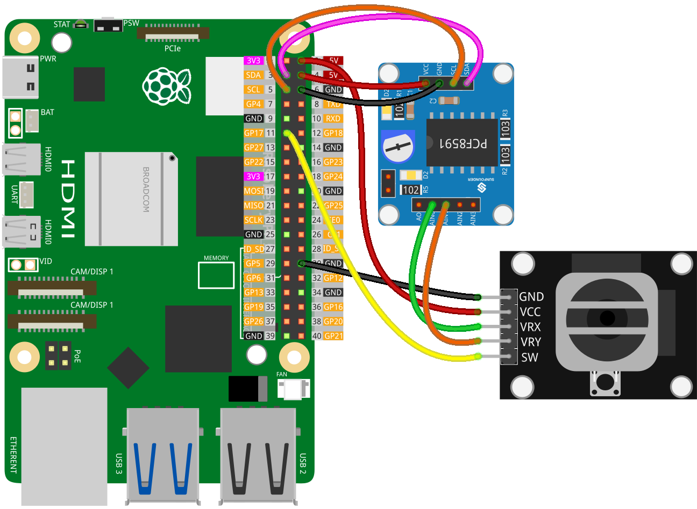

.. note::

    Hello, welcome to the SunFounder Raspberry Pi & Arduino & ESP32 Enthusiasts Community on Facebook! Dive deeper into Raspberry Pi, Arduino, and ESP32 with fellow enthusiasts.

    **Why Join?**

    - **Expert Support**: Solve post-sale issues and technical challenges with help from our community and team.
    - **Learn & Share**: Exchange tips and tutorials to enhance your skills.
    - **Exclusive Previews**: Get early access to new product announcements and sneak peeks.
    - **Special Discounts**: Enjoy exclusive discounts on our newest products.
    - **Festive Promotions and Giveaways**: Take part in giveaways and holiday promotions.

    👉 Ready to explore and create with us? Click [|link_sf_facebook|] and join today!

.. _pi_lesson09_joystick:

Lesson 09: Joystick Module
==================================

.. note::
   The Raspberry Pi does not have analog input capabilities, so it needs a module like the :ref:`cpn_pcf8591` to read analog signals for processing.

In this lesson, you will learn how to use a Raspberry Pi to interface with a joystick module using the PCF8591 ADC. You'll be able to read the X and Y positions of the joystick from its analog outputs and detect button presses. This setup demonstrates how to handle both analog and digital inputs on a Raspberry Pi. 

Required Components
---------------------------

.. list-table::
    :widths: 30 20
    :header-rows: 1

    *   - Component Introduction
        - Purchase Link

    *   - Raspberry Pi 5
        - \-
    *   - :ref:`cpn_joystick`
        - |link_joystick_buy|
    *   - :ref:`cpn_pcf8591`
        - |link_pcf8591_module_buy|

Wiring
---------------------------

.. note::
   In this project, we utilized the AIN0 pin of the PCF8591 module, which is linked to a potentiometer on the module through a jumper cap. **To prevent data interference, please disconnect the jumper cap from the module.** For more details, please refer to the PCF8591 module :ref:`schematic <cpn_pcf8591_sch>`.

Code
---------------------------

.. code-block:: python

   import PCF8591 as ADC  # Import ADC module for analog input
   import time  # Import time module for creating delay
   from gpiozero import Button  # Import Button for button input
   
   ADC.setup(0x48)  # Set up PCF8591 module at I2C address 0x48
   
   button = Button(17)  # Initialize button connected to GPIO 17
   
   try:
       while True:  # Loop continuously
           print("x:", ADC.read(0))  # Read analog value from channel AIN0
           print("y:", ADC.read(1))  # Read analog value from channel AIN1
           print("sw:", button.is_active)  # Check if button is pressed
           time.sleep(0.2)  # Wait for 0.2 seconds before next loop
   except KeyboardInterrupt:
       print("Exit")  # End program on keyboard interrupt

Code Analysis
---------------------------

1. **Import Libraries**:

   The script starts with importing necessary libraries for the project.

   .. code-block:: python

      import PCF8591 as ADC  # Import ADC module for analog input
      import time  # Import time module for creating delay
      from gpiozero import Button  # Import Button for button input

2. **Setup PCF8591 Module**:

   The PCF8591 module is set up at I2C address 0x48 which allows the Raspberry Pi to communicate with it.

   .. code-block:: python

      ADC.setup(0x48)  # Set up PCF8591 module at I2C address 0x48

3. **Initialize Button**:

   A button is initialized, connected to GPIO pin 17 on the Raspberry Pi.

   .. code-block:: python

      button = Button(17)  # Initialize button connected to GPIO 17

4. **Main Loop**:

   The main part of the script is an infinite loop that continuously reads analog values from two channels of the PCF8591 (AIN0 and AIN1) and checks if the button is pressed. ``AIN0`` and ``AIN1`` are analog pins for the joystick’s X and Y axes.

   .. code-block:: python

      try:
          while True:  # Loop continuously
              print("x:", ADC.read(0))  # Read analog value from channel AIN0
              print("y:", ADC.read(1))  # Read analog value from channel AIN1
              print("sw:", button.is_active)  # Check if button is pressed
              time.sleep(0.2)  # Wait for 0.2 seconds before next loop

5. **Interrupt Handling**:

   The script can be exited gracefully using a keyboard interrupt (CTRL+C), which is a common practice in Python for stopping an infinite loop.

   .. code-block:: python

      except KeyboardInterrupt:
          print("Exit")  # End program on keyboard interrupt