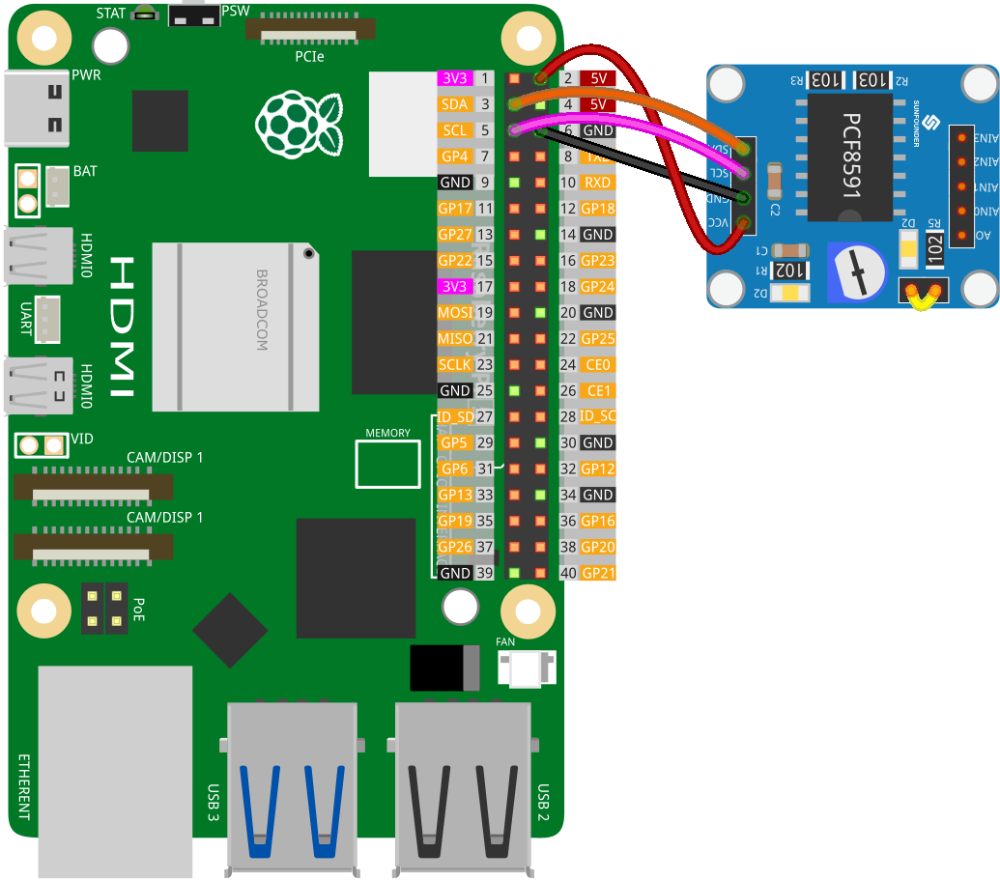

.. note::

   Hallo und willkommen in der SunFounder Raspberry Pi & Arduino & ESP32 Enthusiasten-Gemeinschaft auf Facebook! Tauchen Sie tiefer ein in die Welt von Raspberry Pi, Arduino und ESP32 mit anderen Enthusiasten.

   **Warum beitreten?**

   - **Expertenunterstützung**: Lösen Sie Nachverkaufsprobleme und technische Herausforderungen mit Hilfe unserer Gemeinschaft und unseres Teams.
   - **Lernen & Teilen**: Tauschen Sie Tipps und Anleitungen aus, um Ihre Fähigkeiten zu verbessern.
   - **Exklusive Vorschauen**: Erhalten Sie frühzeitigen Zugang zu neuen Produktankündigungen und exklusiven Einblicken.
   - **Spezialrabatte**: Genießen Sie exklusive Rabatte auf unsere neuesten Produkte.
   - **Festliche Aktionen und Gewinnspiele**: Nehmen Sie an Gewinnspielen und Feiertagsaktionen teil.

   👉 Sind Sie bereit, mit uns zu erkunden und zu erschaffen? Klicken Sie auf [|link_sf_facebook|] und treten Sie heute bei!

.. _pi_lesson10_pcf8591:

Lektion 10: PCF8591 ADC-DAC Konverter Modul
==============================================

.. note::
   Der Raspberry Pi verfügt nicht über analoge Eingänge, daher benötigt er ein Modul wie das :ref:`cpn_pcf8591`, um analoge Signale zur Verarbeitung auszulesen.

In dieser Lektion lernen Sie, wie Sie einen Raspberry Pi verwenden, um mit dem PCF8591-Modul für Analog-Digital- und Digital-Analog-Umwandlung zu interagieren. Wir werden das Auslesen von analogen Werten vom Eingang AIN0 und das Senden dieser Werte an den DAC (AOUT) behandeln. Das Potentiometer des Moduls ist über Jumper-Kappen mit AIN0 verbunden, und die D2-LED auf dem Modul ist mit AOUT verbunden, sodass Sie sehen können, dass die Helligkeit der D2-LED sich ändert, wenn Sie das Potentiometer drehen.

Erforderliche Komponenten
-----------------------------

In diesem Projekt benötigen wir die folgenden Komponenten.

Es ist definitiv praktisch, ein ganzes Kit zu kaufen, hier ist der Link:

.. list-table::
    :widths: 20 20 20
    :header-rows: 1

    *   - Name	
        - ITEMS IN THIS KIT
        - LINK
    *   - Universal Maker Sensor Kit
        - 94
        - |link_umsk|

Sie können sie auch einzeln über die untenstehenden Links kaufen.

.. list-table::
    :widths: 30 20
    :header-rows: 1

    *   - Component Introduction
        - Purchase Link

    *   - Raspberry Pi 5
        - \-
    *   - :ref:`cpn_pcf8591`
        - |link_pcf8591_module_buy|
    *   - :ref:`cpn_breadboard`
        - |link_breadboard_buy|

Verkabelung
---------------------------

.. note::
   In diesem Projekt haben wir den AIN0-Pin des PCF8591-Moduls verwendet, der über einen Jumper-Kappen mit einem Potentiometer auf dem Modul verbunden ist. **Bitte stellen Sie sicher, dass der Jumper-Kappen korrekt auf dem Modul platziert ist.** Weitere Details finden Sie im :ref:`schematic <cpn_pcf8591_sch>`.

Code
---------------------------

.. code-block:: Python

   import PCF8591 as ADC  # Import the library for the PCF8591 module
   import time  # Import the time library for adding delays
   
   # Initialize the PCF8591 module at I2C address 0x48.
   # This address is used for communication with the Raspberry Pi.
   ADC.setup(0x48)
   
   try:
       while True:  # Start an infinite loop to continuously monitor the sensor.
           # Read the analog value from the potentiometer connected to AIN0.
           # Channel range from 0 to 3 represents AIN0 to AIN3.
           # The potentiometer's rotation alters the voltage, which is read by the PCF8591.
           potentiometer_value = ADC.read(0)
           print(potentiometer_value)
   
           # Write the value back to AOUT. This will change the brightness of the D2 LED on the module.
           # LED won't light up below 80, so convert '0-255' to '80-255'
           # As the potentiometer is adjusted, the LED's brightness varies proportionally.
           tmp = potentiometer_value*(255-80)/255+80
           ADC.write(tmp)
   
           # Add a short delay of 0.2 seconds to make the loop more manageable.
           time.sleep(0.2)
   
   except KeyboardInterrupt:
       # If a KeyboardInterrupt (CTRL+C) is detected, exit the loop and end the program.
       print("Exit")

Code-Analyse
---------------------------

1. **Bibliotheken importieren**:

   Das Skript beginnt mit dem Import der erforderlichen Bibliotheken. Die ``PCF8591``-Bibliothek wird für die Interaktion mit dem ADC/DAC-Modul verwendet, und ``time`` dient zur Erstellung von Verzögerungen.

   .. code-block:: python

      import PCF8591 as ADC  # Import the library for the PCF8591 module
      import time  # Import the time library for adding delays

2. **PCF8591-Modul initialisieren**:

   Das PCF8591-Modul wird an der I²C-Adresse 0x48 initialisiert. Dieser Schritt ist entscheidend, um die Kommunikation zwischen dem Raspberry Pi und dem Modul einzurichten.

   .. code-block:: python

      ADC.setup(0x48)  # Initialize the PCF8591 module at I2C address 0x48

3. **Werte vom Potentiometer lesen und an die LED schreiben**:

   Innerhalb eines ``try``-Blocks liest eine kontinuierliche ``while True``-Schleife den Wert vom Potentiometer, das mit AIN0 verbunden ist, und schreibt diesen Wert an den DAC, der mit AOUT verbunden ist. Jumper-Kappen verbinden das Potentiometer des Moduls mit AIN0, und die D2-LED ist mit AOUT verbunden; weitere Details finden Sie im :ref:`Schaltplan des PCF8591-Moduls <cpn_pcf8591_sch>`. Die Helligkeit der LED ändert sich, wenn das Potentiometer gedreht wird.

   - Verwenden Sie ``ADC.read(channel)``, um den analogen Eingang des spezifischen Kanals auszulesen. Der Kanalbereich von 0 bis 3 repräsentiert AIN0 bis AIN3.

   - Verwenden Sie ``ADC.write(Value)``, um den analogen Ausgang des AOUT-Pins mit einem Wertbereich von 0 bis 255 zu setzen.

   .. raw:: html

       

   .. code-block:: python

      try:
          while True:  # Start an infinite loop to continuously monitor the sensor.
              potentiometer_value = ADC.read(0)
              print(potentiometer_value)
              tmp = potentiometer_value*(255-80)/255+80
              ADC.write(tmp)
              time.sleep(0.2)

4. **Tastaturunterbrechungen behandeln**:

   Eine ``KeyboardInterrupt`` (wie das Drücken von CTRL+C) ermöglicht einen ordnungsgemäßen Ausstieg aus der Schleife, ohne Fehler zu erzeugen.

   .. code-block:: python

      except KeyboardInterrupt:
          print("Exit")