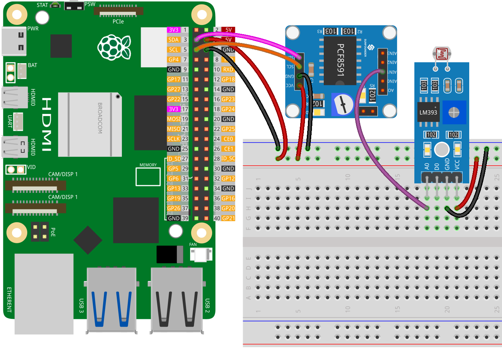

.. note::

    こんにちは、SunFounder Raspberry Pi & Arduino & ESP32 Enthusiasts Communityへようこそ！Facebook上で、仲間と一緒にRaspberry Pi、Arduino、ESP32をさらに深く探求しましょう。

    **なぜ参加するのか？**

    - **専門的なサポート**：購入後の問題や技術的な課題をコミュニティやチームの助けを借りて解決。
    - **学びと共有**：スキルを向上させるためのヒントやチュートリアルを交換。
    - **限定プレビュー**：新製品発表や予告編に早期アクセス。
    - **特別割引**：最新製品の特別割引を楽しむ。
    - **フェスティブプロモーションとプレゼント**：プレゼントやホリデープロモーションに参加。

    👉 私たちと一緒に探索と創造を始める準備はできましたか？[|link_sf_facebook|]をクリックして、今すぐ参加しましょう！
    
.. _pi_lesson11_photoresistor:

レッスン11: フォトレジスタモジュール
=====================================

.. note::
   Raspberry Piにはアナログ入力機能がないため、アナログ信号を処理するには :ref:`cpn_pcf8591` のようなモジュールが必要です。

このレッスンでは、Raspberry Piを使用してフォトレジスタモジュールからデータを読み取る方法を学びます。フォトレジスタモジュールをPCF8591に接続してアナログからデジタルへの変換を行い、Pythonを使用してその出力をリアルタイムで監視する方法を紹介します。

必要なコンポーネント
--------------------------

このプロジェクトでは、以下のコンポーネントが必要です。

一式揃ったキットを購入すると便利です。リンクはこちら:

.. list-table::
    :widths: 20 20 20
    :header-rows: 1

    *   - Name	
        - ITEMS IN THIS KIT
        - LINK
    *   - Universal Maker Sensor Kit
        - 94
        - |link_umsk|

以下のリンクから個別に購入することもできます。

.. list-table::
    :widths: 30 20
    :header-rows: 1

    *   - Component Introduction
        - Purchase Link

    *   - Raspberry Pi 5
        - \-
    *   - :ref:`cpn_photoresistor`
        - |link_photoresistor_sensor_module_buy|
    *   - :ref:`cpn_pcf8591`
        - |link_pcf8591_module_buy|
    *   - :ref:`cpn_breadboard`
        - |link_breadboard_buy|

配線
---------------------------

コード
---------------------------

.. code-block:: python

   import PCF8591 as ADC  # Import PCF8591 module
   import time  # Import time for delay
   
   ADC.setup(0x48)  # Initialize PCF8591 at address 0x48
   
   try:
       while True:  # Continuously read and print
           print(ADC.read(1))  # Read from Photoresistor at AIN1
           time.sleep(0.2)  # Delay of 0.2 seconds
   except KeyboardInterrupt:
       print("Exit")  # Exit on CTRL+C

コード解析
---------------------------

1. **ライブラリのインポート**:

   このセクションでは、必要なPythonライブラリをインポートします。 ``PCF8591`` ライブラリはPCF8591モジュールとのやり取りに使用され、 ``time`` はコード内で遅延を実装するために使用されます。

   .. code-block:: python

      import PCF8591 as ADC  # Import PCF8591 module
      import time  # Import time for delay

2. **PCF8591モジュールの初期化**:

   ここでは、PCF8591モジュールを初期化します。アドレス ``0x48`` はPCF8591モジュールのI²Cアドレスです。これは、Raspberry Piがモジュールと通信するために必要です。

   .. code-block:: python

      ADC.setup(0x48)  # Initialize PCF8591 at address 0x48

3. **メインループとデータの読み取り**:

   ``try``ブロックには、フォトレジスタモジュールからデータを一貫して読み取る連続ループが含まれています。 ``ADC.read(1)`` 関数は、PCF8591モジュールのチャンネル1（AIN1）に接続されたセンサーからのアナログ入力をキャプチャします。 ``time.sleep(0.2)`` を組み込むことで、各読み取り間に0.2秒の間隔を作ります。これにより、過剰なデータ処理負荷を避けることでRaspberry PiのCPU使用率が減少し、端末が急速にスクロールする情報で溢れるのを防ぎ、出力の監視と分析を容易にします。

   .. code-block:: python

      try:
          while True:  # Continuously read and print
              print(ADC.read(1))  # Read from Photoresistor at AIN1
              time.sleep(0.2)  # Delay of 0.2 seconds

4. **キーボード割り込みの処理**:

   ``except``ブロックは、キーボード割り込み（CTRL+Cを押すなど）をキャッチするために設計されています。この割り込みが発生すると、スクリプトは"exit"を表示し、実行を停止します。これは、Pythonで継続的に実行されるスクリプトを優雅に終了する一般的な方法です。

   .. code-block:: python

      except KeyboardInterrupt:
          print("exit")  # Exit on CTRL+C