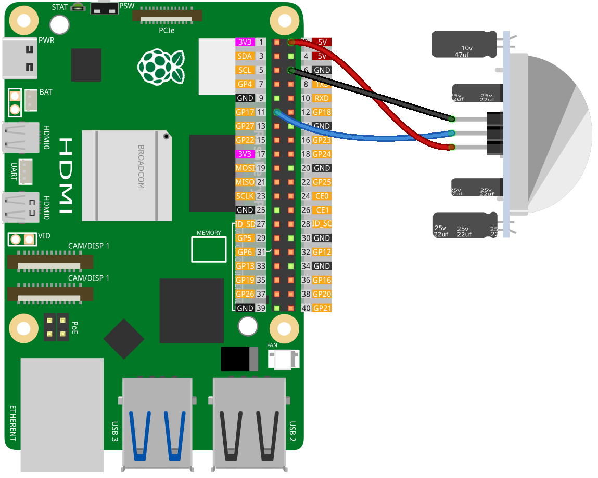

.. _pi_lesson12_pir_motion:

Lesson 12: PIR Motion Module (HC-SR501)
============================================

In this lesson, you will learn how to set up and use a motion sensor with the Raspberry Pi. We'll walk you through connecting a digital motion sensor to GPIO pin 17. You'll write a Python script to continually check the sensor's state, printing a message when motion is detected and another when the area is clear. This hands-on tutorial is focused on practical skills in electronic circuitry and Python programming, making it perfect for beginners who want to explore real-world applications of the Raspberry Pi in monitoring and automation projects.

Required Components
--------------------------

In this project, we need the following components. 

It's definitely convenient to buy a whole kit, here's the link: 

.. list-table::
    :widths: 20 20 20
    :header-rows: 1

    *   - Name	
        - ITEMS IN THIS KIT
        - LINK
    *   - Universal Maker Sensor Kit
        - 94
        - |link_umsk|

You can also buy them separately from the links below.

.. list-table::
    :widths: 30 20
    :header-rows: 1

    *   - Component Introduction
        - Purchase Link

    *   - Raspberry Pi 5
        - \-
    *   - :ref:`cpn_pir_motion`
        - \-
    *   - :ref:`cpn_breadboard`
        - |link_breadboard_buy|

Wiring
---------------------------

Code
---------------------------

.. code-block:: python

   from gpiozero import DigitalInputDevice
   from time import sleep

   # Initialize the motion sensor as a digital input device on GPIO pin 17
   motion_sensor = DigitalInputDevice(17)

   # Continuously monitor the state of the motion sensor
   while True:
       if motion_sensor.is_active:
           print("Somebody here!")
       else:
           print("Monitoring...")

       # Wait for 0.5 seconds before the next sensor check
       sleep(0.5)

Code Analysis
---------------------------

#. Importing Libraries
   
   The script starts by importing the ``DigitalInputDevice`` class from the gpiozero library for interfacing with the motion sensor, and the ``sleep`` function from the time module to introduce delays.

   .. code-block:: python

      from gpiozero import DigitalInputDevice
      from time import sleep

#. Initializing the Motion Sensor
   
   A ``DigitalInputDevice`` object named ``motion_sensor`` is created, connected to GPIO pin 17. This assumes that the motion sensor is connected to this GPIO pin on the Raspberry Pi.

   .. code-block:: python

      motion_sensor = DigitalInputDevice(17)

#. Implementing Continuous Monitoring Loop
   
   - The script employs a ``while True:`` loop for continuous monitoring.
   - Inside the loop, an ``if`` statement checks the ``is_active`` property of the ``motion_sensor``. 
   - If ``is_active`` is ``True``, it suggests that motion is detected, and "Somebody here!" is printed.
   - If ``is_active`` is ``False``, suggesting no motion is detected, "Monitoring..." is printed.
   - The ``sleep(0.5)`` function is used to pause the loop for 0.5 seconds between each sensor check, reducing the processing demand and controlling the frequency of sensor polling.

   .. raw:: html

       

   .. code-block:: python

      while True:
          if motion_sensor.is_active:
              print("Somebody here!")
          else:
              print("Monitoring...")
          sleep(0.5)

