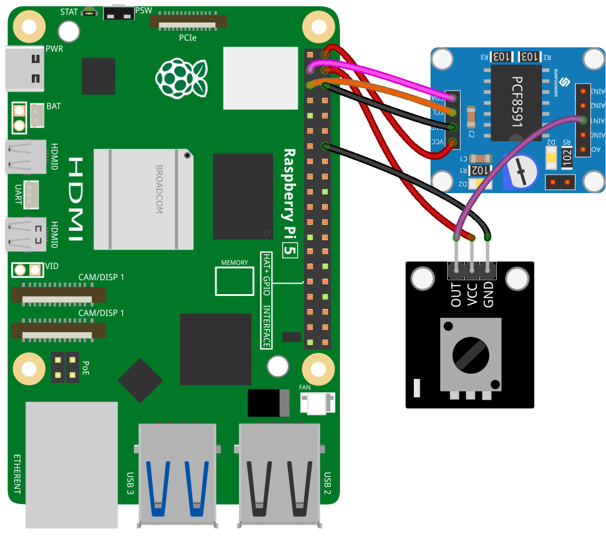

.. note::

   Hallo und willkommen in der SunFounder Raspberry Pi & Arduino & ESP32 Enthusiasten-Gemeinschaft auf Facebook! Tauchen Sie tiefer ein in die Welt von Raspberry Pi, Arduino und ESP32 mit anderen Enthusiasten.

   **Warum beitreten?**

   - **Expertenunterstützung**: Lösen Sie Nachverkaufsprobleme und technische Herausforderungen mit Hilfe unserer Gemeinschaft und unseres Teams.
   - **Lernen & Teilen**: Tauschen Sie Tipps und Anleitungen aus, um Ihre Fähigkeiten zu verbessern.
   - **Exklusive Vorschauen**: Erhalten Sie frühzeitigen Zugang zu neuen Produktankündigungen und exklusiven Einblicken.
   - **Spezialrabatte**: Genießen Sie exklusive Rabatte auf unsere neuesten Produkte.
   - **Festliche Aktionen und Gewinnspiele**: Nehmen Sie an Gewinnspielen und Feiertagsaktionen teil.

   👉 Sind Sie bereit, mit uns zu erkunden und zu erschaffen? Klicken Sie auf [|link_sf_facebook|] und treten Sie heute bei!

.. _pi_lesson13_potentiometer:

Lektion 13: Potentiometer-Modul
==================================

.. note::
   Der Raspberry Pi verfügt nicht über analoge Eingänge, daher benötigt er ein Modul wie das :ref:`cpn_pcf8591`, um analoge Signale zur Verarbeitung auszulesen.

In dieser Lektion lernen wir, wie man ein Potentiometer mit einem Raspberry Pi ausliest. Sie erfahren, wie man ein Potentiometer-Modul an den PCF8591 zur Analog-Digital-Wandlung anschließt und dessen Ausgabe in Echtzeit mit Python überwacht.

Erforderliche Komponenten
---------------------------

In diesem Projekt benötigen wir die folgenden Komponenten.

Es ist definitiv praktisch, ein ganzes Kit zu kaufen, hier ist der Link:

.. list-table::
    :widths: 20 20 20
    :header-rows: 1

    *   - Name	
        - ITEMS IN THIS KIT
        - LINK
    *   - Universal Maker Sensor Kit
        - 94
        - |link_umsk|

Sie können sie auch einzeln über die untenstehenden Links kaufen.

.. list-table::
    :widths: 30 20
    :header-rows: 1

    *   - Component Introduction
        - Purchase Link

    *   - Raspberry Pi 5
        - \-
    *   - :ref:`cpn_potentiometer`
        - |link_potentiometer_sensor_module_buy|
    *   - :ref:`cpn_pcf8591`
        - |link_pcf8591_module_buy|

Verkabelung
---------------------------

Code
---------------------------

.. code-block:: python

   import PCF8591 as ADC  # Import PCF8591 module
   import time  # Import time for delay
   
   ADC.setup(0x48)  # Initialize PCF8591 at address 0x48
   
   try:
       while True:  # Continuously read and print
           print(ADC.read(1))  # Read from Potentiometer at AIN1
           time.sleep(0.2)  # Delay of 0.2 seconds
   except KeyboardInterrupt:
       print("Exit")  # Exit on CTRL+C

Code-Analyse
---------------------------

1. **Bibliotheken importieren**:

   In diesem Abschnitt werden die erforderlichen Python-Bibliotheken importiert. Die ``PCF8591``-Bibliothek wird für die Interaktion mit dem PCF8591-Modul verwendet, und ``time`` dient zur Implementierung von Verzögerungen im Code.

   .. code-block:: python

      import PCF8591 as ADC  # Import PCF8591 module
      import time  # Import time for delay

2. **PCF8591-Modul initialisieren**:

   Hier wird das PCF8591-Modul initialisiert. Die Adresse ``0x48`` ist die I²C-Adresse des PCF8591-Moduls. Dies ist notwendig, damit der Raspberry Pi mit dem Modul kommunizieren kann.

   .. code-block:: python

      ADC.setup(0x48)  # Initialize PCF8591 at address 0x48

3. **Hauptschleife und Datenauslesung**:

   Der ``try``-Block enthält eine kontinuierliche Schleife, die fortlaufend Daten vom Potentiometer-Modul ausliest. Die Funktion ``ADC.read(1)`` erfasst den analogen Eingang vom Sensor, der an Kanal 1 (AIN1) des PCF8591-Moduls angeschlossen ist. Ein ``time.sleep(0.2)`` sorgt für eine Pause von 0,2 Sekunden zwischen den Auslesungen. Dies hilft nicht nur, die CPU-Belastung des Raspberry Pi zu verringern, indem übermäßige Datenverarbeitungsanforderungen vermieden werden, sondern verhindert auch, dass das Terminal mit schnell scrollenden Informationen überflutet wird, wodurch die Überwachung und Analyse der Ausgabe erleichtert wird.

   .. code-block:: python

      try:
          while True:  # Continuously read and print
              print(ADC.read(1))  # Read from Potentiometer at AIN1
              time.sleep(0.2)  # Delay of 0.2 seconds

4. **Tastaturunterbrechung behandeln**:

   Der ``except``-Block ist dazu ausgelegt, eine Tastaturunterbrechung (z. B. durch Drücken von CTRL+C) abzufangen. Wenn diese Unterbrechung auftritt, gibt das Skript "Beenden" aus und stoppt die Ausführung. Dies ist eine gängige Methode, um ein kontinuierlich laufendes Skript in Python sauber zu beenden.

   .. code-block:: python

      except KeyboardInterrupt:
          print("exit")  # Exit on CTRL+C