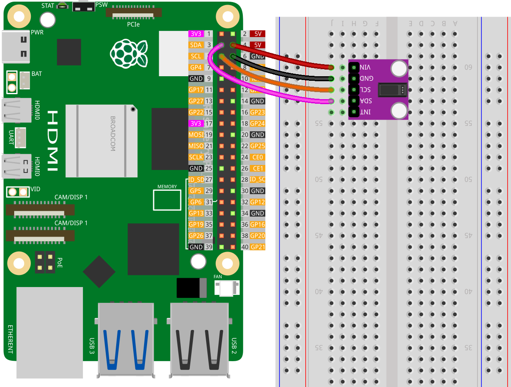

.. note::

   Hallo und willkommen in der SunFounder Raspberry Pi & Arduino & ESP32 Enthusiasten-Gemeinschaft auf Facebook! Tauchen Sie tiefer ein in die Welt von Raspberry Pi, Arduino und ESP32 mit anderen Enthusiasten.

   **Warum beitreten?**

   - **Expertenunterstützung**: Lösen Sie Nachverkaufsprobleme und technische Herausforderungen mit Hilfe unserer Gemeinschaft und unseres Teams.
   - **Lernen & Teilen**: Tauschen Sie Tipps und Anleitungen aus, um Ihre Fähigkeiten zu verbessern.
   - **Exklusive Vorschauen**: Erhalten Sie frühzeitigen Zugang zu neuen Produktankündigungen und exklusiven Einblicken.
   - **Spezialrabatte**: Genießen Sie exklusive Rabatte auf unsere neuesten Produkte.
   - **Festliche Aktionen und Gewinnspiele**: Nehmen Sie an Gewinnspielen und Feiertagsaktionen teil.

   👉 Sind Sie bereit, mit uns zu erkunden und zu erschaffen? Klicken Sie auf [|link_sf_facebook|] und treten Sie heute bei!

.. _pi_lesson14_max30102:

Lektion 14: Pulsoximeter und Herzfrequenzsensor-Modul (MAX30102)
=====================================================================

In diesem Tutorial lernen Sie, wie Sie den MAX30102-Sensor mit einem Raspberry Pi betreiben, vereinfacht durch die Nutzung des Open-Source MAX30102 Python-Treibers, der auf GitHub verfügbar ist. Dieser Ansatz erleichtert die Schnittstelle mit dem Modul und ermöglicht es Ihnen, sich auf das Verständnis der Grundlagen der Sensordatenerfassung und -analyse zu konzentrieren. Ideal für Anfänger bietet dieses Projekt praktische Erfahrungen mit der Implementierung von Sensoren und der Python-Programmierung auf der Raspberry Pi-Plattform.

Erforderliche Komponenten
---------------------------

In diesem Projekt benötigen wir die folgenden Komponenten.

Es ist definitiv praktisch, ein ganzes Kit zu kaufen, hier ist der Link:

.. list-table::
    :widths: 20 20 20
    :header-rows: 1

    *   - Name	
        - ITEMS IN THIS KIT
        - LINK
    *   - Universal Maker Sensor Kit
        - 94
        - |link_umsk|

Sie können sie auch einzeln über die untenstehenden Links kaufen.

.. list-table::
    :widths: 30 10
    :header-rows: 1

    *   - Component Introduction
        - Purchase Link

    *   - Raspberry Pi 5
        - \-
    *   - :ref:`cpn_max30102`
        - |link_max30102_module_buy|
    *   - :ref:`cpn_breadboard`
        - |link_breadboard_buy|

Verkabelung
---------------------------

Code
---------------------------

.. code-block:: python

   from heartrate_monitor import HeartRateMonitor
   import time
   
   # Print a message indicating the sensor is starting
   print('sensor starting...')
   
   # Set the duration for which the sensor data will be read (in seconds)
   duration = 30
   
   # Initialize the HeartRateMonitor object
   # Set print_raw to False to avoid printing raw data
   # Set print_result to True to print the calculated results
   hrm = HeartRateMonitor(print_raw=False, print_result=True)
   
   # Start the heart rate sensor
   hrm.start_sensor()
   
   try:
       time.sleep(duration)
   except KeyboardInterrupt:
       print('keyboard interrupt detected, exiting...')
   
   # Stop the sensor after the duration has elapsed
   hrm.stop_sensor()
   
   # Print a message indicating the sensor has stopped
   print('sensor stopped!')

Code-Analyse
---------------------------

#. Module importieren

   - Das Modul ``heartrate_monitor`` wird zur Schnittstelle mit dem Sensor verwendet. Für weitere Informationen über die Bibliothek ``heartrate_monitor`` besuchen Sie bitte |link_max30102_python_driver|.
   - Das Modul ``time`` hilft bei der Verwaltung der Dauer der Sensordatenerfassung.

   .. raw:: html

       

   .. code-block:: python

      from heartrate_monitor import HeartRateMonitor
      import time

#. Initialisierung des Herzfrequenzmonitors

   - Ein ``HeartRateMonitor``-Objekt wird mit spezifischen Druckoptionen erstellt.
   - ``print_raw`` steuert, ob Rohsensordaten gedruckt werden.
   - ``print_result`` steuert den Druck der verarbeiteten Ergebnisse (Herzfrequenz und SpO2).

   .. raw:: html

       

   .. code-block:: python

      hrm = HeartRateMonitor(print_raw=False, print_result=True)

#. Sensor starten

   Die Methode ``start_sensor`` aktiviert den Herzfrequenzsensor.

   .. code-block:: python

      hrm.start_sensor()

#. Sensor für eine bestimmte Dauer laufen lassen

   - Das Programm schläft für eine festgelegte Dauer, während der der Sensor Daten sammelt.
   - ``time.sleep(duration)`` hält das Programm für die angegebene Anzahl von Sekunden an.

   .. raw:: html

       

   .. code-block:: python

      try:
          time.sleep(duration)
      except KeyboardInterrupt:
          print('keyboard interrupt detected, exiting...')

#. Sensor stoppen

   Nach der festgelegten Dauer wird die Methode ``stop_sensor`` aufgerufen, um die Datenerfassung zu stoppen.

   .. code-block:: python

      hrm.stop_sensor()

#. Programm abschließen

   Gibt eine Nachricht aus, wenn der Sensor gestoppt wird.

   .. code-block:: python

      print('sensor stopped!')