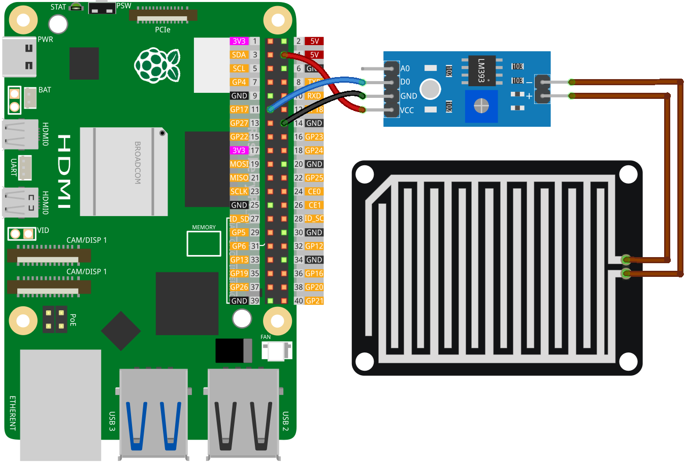

 .. note::

    Hallo und willkommen in der SunFounder Raspberry Pi & Arduino & ESP32 Enthusiasten-Gemeinschaft auf Facebook! Tauchen Sie tiefer ein in die Welt von Raspberry Pi, Arduino und ESP32 mit anderen Enthusiasten.

    **Warum beitreten?**

    - **Expertenunterstützung**: Lösen Sie Nachverkaufsprobleme und technische Herausforderungen mit Hilfe unserer Gemeinschaft und unseres Teams.
    - **Lernen & Teilen**: Tauschen Sie Tipps und Anleitungen aus, um Ihre Fähigkeiten zu verbessern.
    - **Exklusive Vorschauen**: Erhalten Sie frühzeitigen Zugang zu neuen Produktankündigungen und exklusiven Einblicken.
    - **Spezialrabatte**: Genießen Sie exklusive Rabatte auf unsere neuesten Produkte.
    - **Festliche Aktionen und Gewinnspiele**: Nehmen Sie an Gewinnspielen und Feiertagsaktionen teil.

    👉 Sind Sie bereit, mit uns zu erkunden und zu erschaffen? Klicken Sie auf [|link_sf_facebook|] und treten Sie heute bei!

.. _pi_lesson15_raindrop:

Lektion 15: Regensensor-Modul
=======================================

In dieser Lektion lernen Sie, wie Sie mit einem digitalen Regensensor und einem Raspberry Pi Regen erkennen können. Wir führen Sie durch den Anschluss eines Regensensors an GPIO-Pin 17 Ihres Raspberry Pi. Sie lernen, wie Sie den Raspberry Pi mit Python programmieren, um den Sensor kontinuierlich zu überwachen. Das Programm erkennt, ob es regnet oder nicht, und zeigt entsprechend eine Nachricht an. Dieses praktische Projekt ist eine hervorragende Einführung in die Umweltsensorik, die GPIO-Interfacing und die Python-Programmierung und eignet sich ideal für Anfänger, die sich für wetterbezogene Projekte mit dem Raspberry Pi interessieren.

Erforderliche Komponenten
--------------------------

In diesem Projekt benötigen wir die folgenden Komponenten.

Es ist definitiv praktisch, ein ganzes Kit zu kaufen, hier ist der Link:

.. list-table::
    :widths: 20 20 20
    :header-rows: 1

    *   - Name	
        - ITEMS IN THIS KIT
        - LINK
    *   - Universal Maker Sensor Kit
        - 94
        - |link_umsk|

Sie können sie auch einzeln über die untenstehenden Links kaufen.

.. list-table::
    :widths: 30 20
    :header-rows: 1

    *   - Component Introduction
        - Purchase Link

    *   - Raspberry Pi 5
        - \-
    *   - :ref:`cpn_raindrop`
        - |link_raindrop_sensor_module_buy|
    *   - :ref:`cpn_breadboard`
        - |link_breadboard_buy|

Verkabelung
---------------------------

Code
---------------------------

.. code-block:: python

   from gpiozero import DigitalInputDevice  
   from time import sleep  

   # Initialize the sensor as a digital input device on GPIO pin 17
   rain_sensor = DigitalInputDevice(17)

   while True:  # Infinite loop to continuously check the sensor status
       if rain_sensor.is_active:  # Check if the sensor is active (no rain)
           print("No rain detected.")  # Print message for no rain detected
       else:
           print("Rain detected!")  # Print message for rain detected
       sleep(1)  # Wait for 1 second before next check

Code-Analyse
---------------------------

#. Bibliotheken importieren
   
   Das Skript beginnt mit dem Import von ``DigitalInputDevice`` aus der gpiozero-Bibliothek zur Ansteuerung des Regensensors und ``sleep`` aus dem time-Modul zur Implementierung von Verzögerungen.

   .. code-block:: python

      from gpiozero import DigitalInputDevice  
      from time import sleep  

#. Regensensor initialisieren
   
   Ein ``DigitalInputDevice``-Objekt namens ``rain_sensor`` wird erstellt und mit GPIO-Pin 17 verbunden. Diese Zeile konfiguriert den Regensensor für die Kommunikation mit dem Raspberry Pi über diesen GPIO-Pin.

   .. code-block:: python

      rain_sensor = DigitalInputDevice(17)

#. Kontinuierliche Überwachungsschleife implementieren
   
   - Eine Endlosschleife (``while True:``) wird eingerichtet, um den Regensensor kontinuierlich zu überwachen.
   - Innerhalb der Schleife prüft eine ``if``-Anweisung die Eigenschaft ``is_active`` des ``rain_sensor``.
   - Wenn ``is_active`` ``True`` ist, bedeutet dies, dass kein Regen erkannt wird, und "Kein Regen erkannt." wird ausgegeben.
   - Wenn ``is_active`` ``False`` ist, bedeutet dies, dass Regen erkannt wird, und "Regen erkannt!" wird ausgegeben.
   - ``sleep(1)`` pausiert die Schleife für 1 Sekunde zwischen den Überprüfungen, was die Häufigkeit der Sensorabfragen steuert und die CPU-Auslastung reduziert.

   .. raw:: html

       

   .. code-block:: python

      while True:
          if rain_sensor.is_active:
              print("No rain detected.")
          else:
              print("Rain detected!")
          sleep(1)

