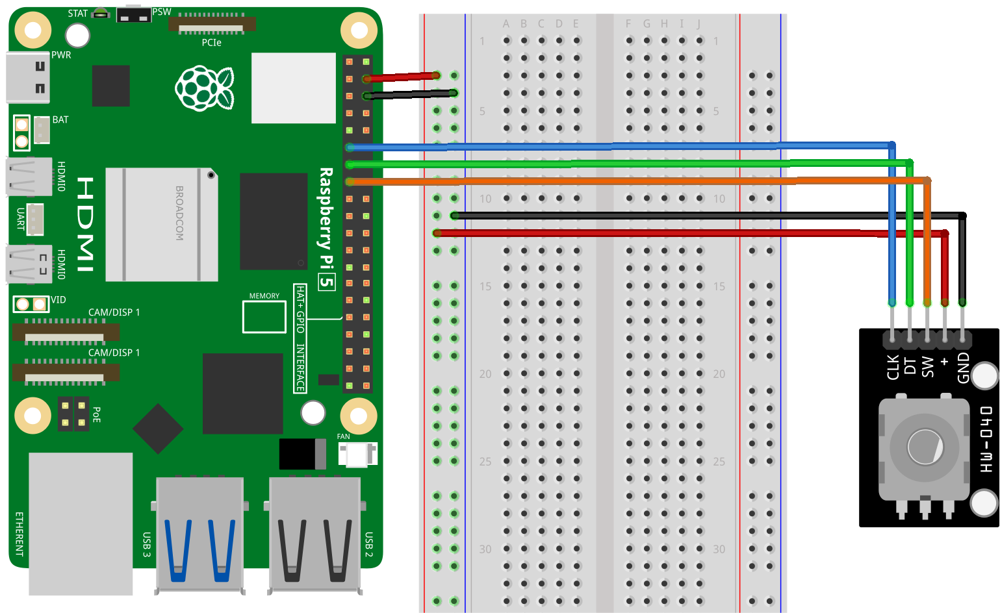

.. note::

    こんにちは、SunFounder Raspberry Pi & Arduino & ESP32 Enthusiasts Communityへようこそ！Facebook上で、仲間と一緒にRaspberry Pi、Arduino、ESP32をさらに深く探求しましょう。

    **なぜ参加するのか？**

    - **専門的なサポート**：購入後の問題や技術的な課題をコミュニティやチームの助けを借りて解決。
    - **学びと共有**：スキルを向上させるためのヒントやチュートリアルを交換。
    - **限定プレビュー**：新製品発表や予告編に早期アクセス。
    - **特別割引**：最新製品の特別割引を楽しむ。
    - **フェスティブプロモーションとプレゼント**：プレゼントやホリデープロモーションに参加。

    👉 私たちと一緒に探索と創造を始める準備はできましたか？[|link_sf_facebook|]をクリックして、今すぐ参加しましょう！

.. _pi_lesson17_rotary_encoder:

Lesson 17: Rotary Encoder Module
==================================

In this lesson, you will learn how to connect and program a rotary encoder with a Raspberry Pi. We will provide step-by-step instructions on writing a Python script that monitors the encoder's position and button state, with outputs displayed in the console. 

Required Components
--------------------------

In this project, we need the following components. 

It's definitely convenient to buy a whole kit, here's the link: 

.. list-table::
    :widths: 20 20 20
    :header-rows: 1

    *   - Name	
        - ITEMS IN THIS KIT
        - LINK
    *   - Universal Maker Sensor Kit
        - 94
        - |link_umsk|

You can also buy them separately from the links below.

.. list-table::
    :widths: 30 20
    :header-rows: 1

    *   - Component Introduction
        - Purchase Link

    *   - Raspberry Pi 5
        - \-
    *   - :ref:`cpn_rotary_encoder`
        - \-
    *   - :ref:`cpn_breadboard`
        - |link_breadboard_buy|

Wiring
---------------------------

Code
---------------------------

.. code-block:: python

   from gpiozero import RotaryEncoder, Button  
   from time import sleep  

   # Initialize the rotary encoder on GPIO pins 17(CLK) and 27(DT) with wrap-around at max_steps of 16
   encoder = RotaryEncoder(a=17, b=27, wrap=True, max_steps=16)
   # Initialize the rotary encoder's SW pin on GPIO pin 22
   button = Button(22)

   last_rotary_value = 0  # Variable to store the last value of rotary encoder

   try:
       while True:  # Infinite loop to continuously monitor the encoder
           current_rotary_value = encoder.steps  # Read current step count from rotary encoder

           # Check if the rotary encoder value has changed
           if last_rotary_value != current_rotary_value:
               print("Result =", current_rotary_value)  # Print the current value
               last_rotary_value = current_rotary_value  # Update the last value

           # Check if the rotary encoder is pressed
           if button.is_pressed:
               print("Button pressed!")  # Print message on button press
               button.wait_for_release()  # Wait until button is released

           sleep(0.1)  # Short delay to prevent excessive CPU usage

   except KeyboardInterrupt:
       print("Program terminated")  # Print message when program is terminated via keyboard interrupt

Code Analysis
---------------------------

#. Importing Libraries
   
   The script starts with importing the ``RotaryEncoder`` and ``Button`` classes from gpiozero for interfacing with the rotary encode, respectively, and the ``sleep`` function from the time module for adding delays.

   .. code-block:: python

      from gpiozero import RotaryEncoder, Button  
      from time import sleep  

#. Initializing the Rotary Encoder and Button
   
   - This line initializes a ``RotaryEncoder`` object from the ``gpiozero`` library. The encoder is connected to GPIO pins 17 and 27. 
   - The ``wrap=True`` parameter means the encoder's value will reset after reaching ``max_steps`` (16 in this case), mimicking a circular dial behavior.
   - Here, a ``Button`` object is created, connected to GPIO pin 22. This object will be used to detect when the rotary encoder is pressed.

   .. code-block:: python

      encoder = RotaryEncoder(a=17, b=27, wrap=True, max_steps=16)
      button = Button(22)

#. Implementing the Monitoring Loop
   
   - An infinite loop (``while True:``) is used to continuously monitor the rotary encoder.
   - The current value of the rotary encoder is read and compared with its last recorded value. If there's a change, the new value is printed.
   - The script checks if the rotary encoder is pressed. On detection of a press, it prints a message and waits until the rotary encoder is released.
   - A ``sleep(0.1)`` is included to add a brief delay, preventing excessive CPU usage.

   .. raw:: html

       

   .. code-block:: python

      last_rotary_value = 0

      try:
          while True:
              current_rotary_value = encoder.steps
              if last_rotary_value != current_rotary_value:
                  print("Result =", current_rotary_value)
                  last_rotary_value = current_rotary_value

              if button.is_pressed:
                  print("Button pressed!")
                  button.wait_for_release()

              sleep(0.1)

      except KeyboardInterrupt:
          print("Program terminated")