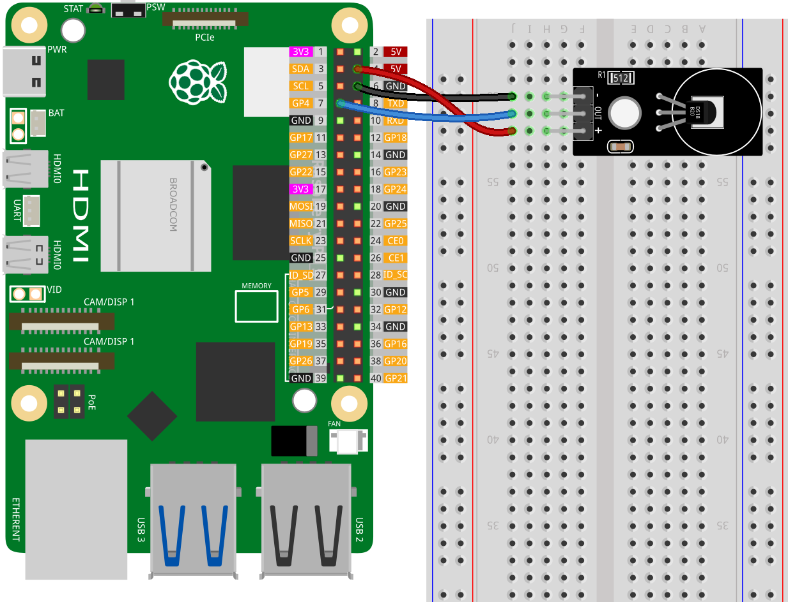

 .. note::

    Hallo und willkommen in der SunFounder Raspberry Pi & Arduino & ESP32 Enthusiasten-Gemeinschaft auf Facebook! Tauchen Sie tiefer ein in die Welt von Raspberry Pi, Arduino und ESP32 mit anderen Enthusiasten.

    **Warum beitreten?**

    - **Expertenunterstützung**: Lösen Sie Nachverkaufsprobleme und technische Herausforderungen mit Hilfe unserer Gemeinschaft und unseres Teams.
    - **Lernen & Teilen**: Tauschen Sie Tipps und Anleitungen aus, um Ihre Fähigkeiten zu verbessern.
    - **Exklusive Vorschauen**: Erhalten Sie frühzeitigen Zugang zu neuen Produktankündigungen und exklusiven Einblicken.
    - **Spezialrabatte**: Genießen Sie exklusive Rabatte auf unsere neuesten Produkte.
    - **Festliche Aktionen und Gewinnspiele**: Nehmen Sie an Gewinnspielen und Feiertagsaktionen teil.

    👉 Sind Sie bereit, mit uns zu erkunden und zu erschaffen? Klicken Sie auf [|link_sf_facebook|] und treten Sie heute bei!

.. _pi_lesson18_ds18b20:

Lektion 18: Temperatursensor-Modul (DS18B20)
================================================

In dieser Lektion lernen Sie, wie Sie mit einem Raspberry Pi Temperaturdaten von einem DS18B20-Temperatursensor auslesen. Sie werden verstehen, wie Sie die Geräte-Datei des Sensors finden, seine Rohdaten lesen und analysieren sowie diese Daten in Celsius- und Fahrenheit-Werte umwandeln können.

Erforderliche Komponenten
--------------------------

In diesem Projekt benötigen wir die folgenden Komponenten.

Es ist definitiv praktisch, ein ganzes Kit zu kaufen, hier ist der Link:

.. list-table::
    :widths: 20 20 20
    :header-rows: 1

    *   - Name	
        - ITEMS IN THIS KIT
        - LINK
    *   - Universal Maker Sensor Kit
        - 94
        - |link_umsk|

Sie können sie auch einzeln über die untenstehenden Links kaufen.

.. list-table::
    :widths: 30 20
    :header-rows: 1

    *   - Component Introduction
        - Purchase Link

    *   - Raspberry Pi 5
        - \-
    *   - :ref:`cpn_ds18b20`
        - \-
    *   - :ref:`cpn_breadboard`
        - |link_breadboard_buy|

Verkabelung
---------------------------

Code
---------------------------

.. note::
   Das DS18B20-Modul kommuniziert mit dem Raspberry Pi über das One-Wire-Protokoll. Bevor Sie den Code ausführen, müssen Sie die One-Wire-Funktion des Raspberry Pi aktivieren. Sie können dieses Tutorial verwenden: :ref:`pi_enable_1wire`. 

.. code-block:: python

   import glob
   import time
   
   # Path to the directory containing device files for 1-wire devices
   base_dir = "/sys/bus/w1/devices/"
   
   # Finds the first device folder that starts with "28", specific to DS18B20
   device_folder = glob.glob(base_dir + "28*")[0]
   
   # Device file containing the temperature data
   device_file = device_folder + "/w1_slave"
   
   
   def read_temp_raw():
       # Reads raw temperature data from the sensor
       f = open(device_file, "r")
       lines = f.readlines()
       f.close()
       return lines
   
   
   def read_temp():
       # Parses the raw temperature data and converts it to Celsius and Fahrenheit
       lines = read_temp_raw()
       # Waits for a valid temperature reading
       while lines[0].strip()[-3:] != "YES":
           time.sleep(0.2)
           lines = read_temp_raw()
       equals_pos = lines[1].find("t=")
       if equals_pos != -1:
           temp_string = lines[1][equals_pos + 2 :]
           temp_c = float(temp_string) / 1000.0  # Convert to Celsius
           temp_f = temp_c * 9.0 / 5.0 + 32.0  # Convert to Fahrenheit
           return temp_c, temp_f
   
   
   try:
       # Main loop to continuously read and print temperature
       while True:
           temp_c, temp_f = read_temp()
           formatted_output = f"Temperature: {temp_c:.2f}°C / {temp_f:.2f}°F"
           print(formatted_output)
           time.sleep(1)  # Wait for 1 second between readings
   except KeyboardInterrupt:
       # Gracefully exit the program on CTRL+C
       print("Exit")

Code-Analyse
---------------------------

#. Notwendige Bibliotheken importieren

   Die ``glob``-Bibliothek wird verwendet, um das Geräteverzeichnis des Temperatursensors zu durchsuchen. Die ``time``-Bibliothek wird verwendet, um Verzögerungen im Programm zu implementieren.

   .. code-block:: python

      import glob
      import time

#. Auffinden der Geräte-Datei des Temperatursensors

   Der Code sucht das Verzeichnis des DS18B20-Sensors, indem er nach einem Ordnernamen sucht, der mit "28" beginnt. Die Gerätedatei ``w1_slave`` enthält die Temperaturdaten.

   .. code-block:: python

      base_dir = "/sys/bus/w1/devices/"
      device_folder = glob.glob(base_dir + "28*")[0]
      device_file = device_folder + "/w1_slave"

#. Lesen der rohen Temperaturdaten

   Diese Funktion öffnet die Gerätedatei und liest deren Inhalt. Sie gibt die rohen Temperaturdaten als Liste von Zeichenfolgen zurück.

   .. code-block:: python

      def read_temp_raw():
          f = open(device_file, "r")
          lines = f.readlines()
          f.close()
          return lines

#. Analysieren und Umwandeln der Temperaturdaten

   Die Funktion ``read_temp`` ruft ``read_temp_raw`` auf, um die Rohdaten zu erhalten. Sie wartet auf eine gültige Temperaturmessung und extrahiert, analysiert und wandelt dann die Temperatur in Celsius und Fahrenheit um.

   .. code-block:: python

      def read_temp():
          lines = read_temp_raw()
          while lines[0].strip()[-3:] != "YES":
              time.sleep(0.2)
              lines = read_temp_raw()
          equals_pos = lines[1].find("t=")
          if equals_pos != -1:
              temp_string = lines[1][equals_pos + 2 :]
              temp_c = float(temp_string) / 1000.0
              temp_f = temp_c * 9.0 / 5.0 + 32.0
              return temp_c, temp_f

#. Hauptprogrammschleife und sauberes Beenden

   Der ``try``-Block enthält eine Endlosschleife, um die Temperatur kontinuierlich auszulesen und anzuzeigen. Der ``except``-Block fängt eine KeyboardInterrupt ab, um das Programm sauber zu beenden.

   .. code-block:: python

      try:
          while True:
              temp_c, temp_f = read_temp()
              formatted_output = f"Temperature: {temp_c:.2f}°C / {temp_f:.2f}°F"
              print(formatted_output)
              time.sleep(1)
      except KeyboardInterrupt:
          print("Exit")