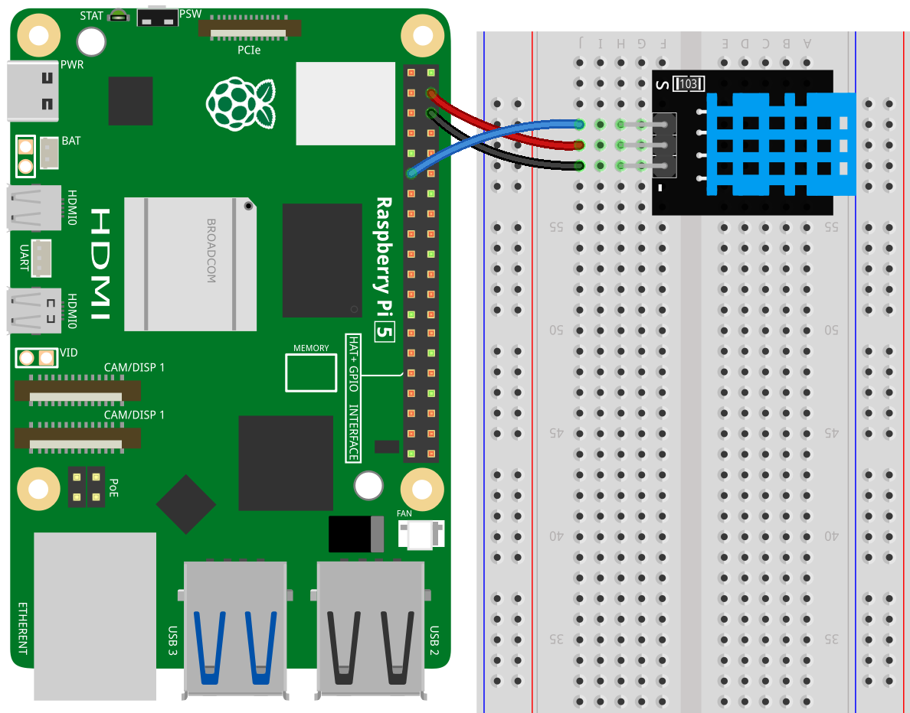
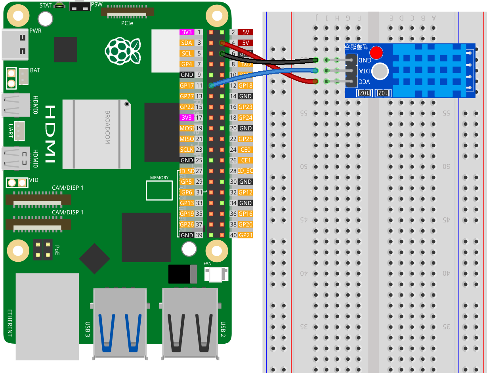

.. note::

    こんにちは、SunFounder Raspberry Pi & Arduino & ESP32 Enthusiasts Communityへようこそ！Facebook上で、仲間と一緒にRaspberry Pi、Arduino、ESP32をさらに深く探求しましょう。

    **なぜ参加するのか？**

    - **専門的なサポート**：購入後の問題や技術的な課題をコミュニティやチームの助けを借りて解決。
    - **学びと共有**：スキルを向上させるためのヒントやチュートリアルを交換。
    - **限定プレビュー**：新製品発表や予告編に早期アクセス。
    - **特別割引**：最新製品の特別割引を楽しむ。
    - **フェスティブプロモーションとプレゼント**：プレゼントやホリデープロモーションに参加。

    👉 私たちと一緒に探索と創造を始める準備はできましたか？[|link_sf_facebook|]をクリックして、今すぐ参加しましょう！
    
.. _pi_lesson19_dht11:

レッスン19: 温度・湿度センサーモジュール (DHT11)
====================================================================

このレッスンでは、DHT11温湿度センサーを使用してラズベリーパイからデータを接続して読み取る方法を学びます。センサーの設定方法、摂氏および華氏での温度の読み取り、および湿度の読み取り方法を学びます。このプロジェクトは、外部センサーの使用、リアルタイムデータの処理、およびPythonでの基本的な例外処理を紹介します。

必要なコンポーネント
--------------------------

このプロジェクトでは、以下のコンポーネントが必要です。

全キットを購入するのが便利です。こちらのリンクをご覧ください。

.. list-table::
    :widths: 20 20 20
    :header-rows: 1

    *   - Name	
        - ITEMS IN THIS KIT
        - LINK
    *   - Universal Maker Sensor Kit
        - 94
        - |link_umsk|

以下のリンクから個別に購入することもできます。

.. list-table::
    :widths: 30 10
    :header-rows: 1

    *   - Component Introduction
        - Purchase Link

    *   - Raspberry Pi 5
        - \-
    *   - :ref:`cpn_dht11`
        - |link_dht11_humiture_buy|
    *   - :ref:`cpn_breadboard`
        - |link_breadboard_buy|

配線
---------------------------

.. note:: 
   このキットには異なるバージョンのDHT11モジュールが含まれている場合があります。お持ちのモジュールに応じて配線方法を確認してください。

ライブラリのインストール
---------------------------

.. note::
    adafruit-circuitpython-dhtライブラリはBlinkaに依存しているため、Blinkaがインストールされていることを確認してください。ライブラリのインストールについては、:ref:`install_blinka` を参照してください。

ライブラリをインストールする前に、仮想Python環境がアクティブになっていることを確認してください。

.. code-block:: bash

   source ~/env/bin/activate

adafruit-circuitpython-dhtライブラリをインストールします：

.. code-block:: bash

   pip install adafruit-circuitpython-dht

コード
---------------------------

.. note::
   - 「ライブラリのインストール」手順に従って、コードを実行するために必要なPythonライブラリがインストールされていることを確認してください。
   - コードを実行する前に、blinkaがインストールされた仮想Python環境がアクティブになっていることを確認してください。次のようなコマンドで仮想環境をアクティブにできます：

     .. code-block:: bash
  
        source ~/env/bin/activate

   - このレッスンのコードは ``universal-maker-sensor-kit-main/pi/`` ディレクトリにありますが、以下のコードを直接コピーして貼り付けることもできます。ターミナルで以下のコマンドを実行してコードを実行します：

     .. code-block:: bash
  
        python 19_dht11_module.py

.. code-block:: python

   import time
   import board
   import adafruit_dht
   
   # Initial the dht device, with data pin connected to:
   dhtDevice = adafruit_dht.DHT11(board.D17)
   
   while True:
       try:
           # Print the values to the serial port
           temperature_c = dhtDevice.temperature
           temperature_f = temperature_c * (9 / 5) + 32
           humidity = dhtDevice.humidity
           print(
               "Temp: {:.1f} F / {:.1f} C    Humidity: {}% ".format(
                   temperature_f, temperature_c, humidity
               )
           )
   
       except RuntimeError as error:
           # Errors happen fairly often, DHT's are hard to read, just keep going
           print(error.args[0])
           time.sleep(2.0)
           continue
       except Exception as error:
           dhtDevice.exit()
           raise error
   
       time.sleep(2.0)

Code Analysis
---------------------------

#. ライブラリのインポート:

   このコードは、必要なライブラリをインポートすることから始まります。 ``time`` は遅延処理に使用され、 ``board`` はRaspberry PiのGPIOピンにアクセスし、 ``adafruit_dht`` はDHT11センサーと対話するために使用されます。 ``adafruit_dht`` ライブラリの詳細については、|Adafruit_CircuitPython_DHT| を参照してください。

   .. code-block:: python
    
      import time
      import board
      import adafruit_dht

#. センサーの初期化:

   DHT11センサーは、データピンがRaspberry PiのGPIO 17に接続された状態で初期化されます。このセットアップは、センサーがRaspberry Piと通信するために重要です。

   .. code-block:: python

      dhtDevice = adafruit_dht.DHT11(board.D17)

#. ループ内でのセンサーデータの読み取り:

   ``while True``ループは、プログラムが新しいデータを継続的にセンサーからチェックできるようにします。

   .. code-block:: python

      while True:

#. Try-Exceptブロック:

   ループ内では、try-exceptブロックを使用して、ランタイムエラーの可能性を処理します。DHTセンサーからの読み取りは、タイミングの問題やセンサーの癖により、しばしばエラーを引き起こすことがあります。

   .. code-block:: python

      try:
          # Sensor data reading code here
      except RuntimeError as error:
          # Handling common sensor reading errors
          print(error.args[0])
          time.sleep(2.0)
          continue
      except Exception as error:
          # Handling other exceptions and exiting
          dhtDevice.exit()
          raise error

#. センサーデータの読み取りと印刷:

   温度と湿度はセンサーから読み取られ、読みやすい形式に変換されます。温度は摂氏から華氏にも変換されます。

   .. code-block:: python

      temperature_c = dhtDevice.temperature
      temperature_f = temperature_c * (9 / 5) + 32
      humidity = dhtDevice.humidity
      print("Temp: {:.1f} F / {:.1f} C    Humidity: {}% ".format(temperature_f, temperature_c, humidity))

#. 読み取りエラーの処理:

   DHT11センサーはしばしばエラーを返すため、コードはこれらを処理するためにtry-exceptブロックを使用します。エラーが発生した場合、プログラムはセンサーから再び読み取る前に2秒待機します。

   .. code-block:: python

      except RuntimeError as error:
          print(error.args[0])
          time.sleep(2.0)
          continue

#. 一般的な例外処理:

   その他の例外が発生した場合、安全にセンサーを終了し、エラーを再度発生させることでこれを処理します。これにより、プログラムが不安定な状態で続行しないようにします。

   .. code-block:: python

      except Exception as error:
          dhtDevice.exit()
          raise error

#. 読み取り間隔の遅延:

   ループの最後に2秒の遅延が追加され、センサーの常時ポーリングを避けます。これにより誤読を防ぎます。

   .. code-block:: python

      time.sleep(2.0)