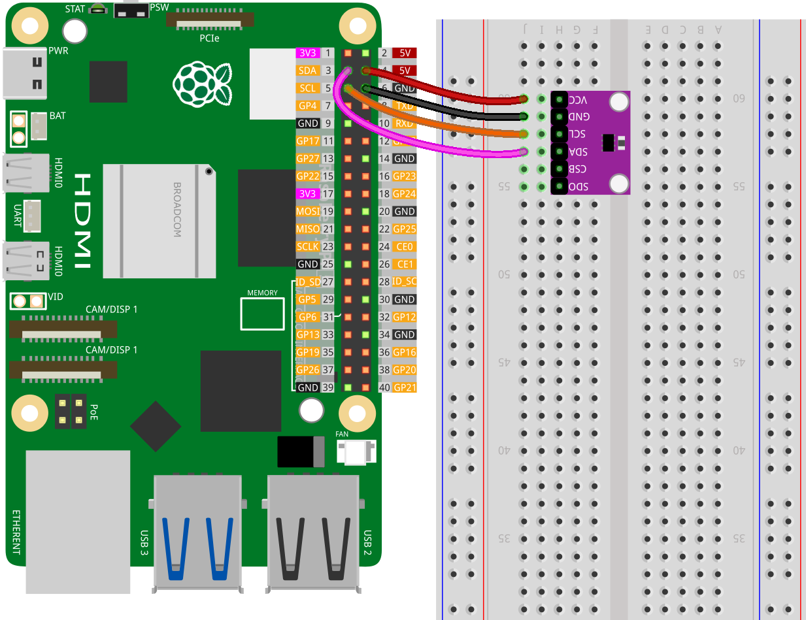

.. note::

    こんにちは、SunFounder Raspberry Pi & Arduino & ESP32 Enthusiasts Communityへようこそ！Facebook上で、仲間と一緒にRaspberry Pi、Arduino、ESP32をさらに深く探求しましょう。

    **なぜ参加するのか？**

    - **専門的なサポート**：購入後の問題や技術的な課題をコミュニティやチームの助けを借りて解決。
    - **学びと共有**：スキルを向上させるためのヒントやチュートリアルを交換。
    - **限定プレビュー**：新製品発表や予告編に早期アクセス。
    - **特別割引**：最新製品の特別割引を楽しむ。
    - **フェスティブプロモーションとプレゼント**：プレゼントやホリデープロモーションに参加。

    👉 私たちと一緒に探索と創造を始める準備はできましたか？[|link_sf_facebook|]をクリックして、今すぐ参加しましょう！
    
.. _pi_lesson20_bmp280:

レッスン20: 温度・湿度・気圧センサー (BMP280)
====================================================================

このレッスンでは、Raspberry Piを使用して温度、湿度、および気圧を測定するBMP280センサーを接続し、データを読み取る方法を学びます。センサーをセットアップし、温度、大気圧、標高を測定するPythonスクリプトを作成します。

Required Components
--------------------------

このプロジェクトでは、以下のコンポーネントが必要です。

全キットを購入すると便利です。リンクはこちら：

.. list-table::
    :widths: 20 20 20
    :header-rows: 1

    *   - Name	
        - ITEMS IN THIS KIT
        - LINK
    *   - Universal Maker Sensor Kit
        - 94
        - |link_umsk|

以下のリンクから個別に購入することもできます。

.. list-table::
    :widths: 30 10
    :header-rows: 1

    *   - Component Introduction
        - Purchase Link

    *   - Raspberry Pi 5
        - \-
    *   - :ref:`cpn_bmp280`
        - |link_bmp280_module_buy|
    *   - :ref:`cpn_breadboard`
        - |link_breadboard_buy|

Wiring
---------------------------

ライブラリのインストール
---------------------------

.. note::
    adafruit-circuitpython-bmp280ライブラリはBlinkaに依存していますので、Blinkaがインストールされていることを確認してください。ライブラリのインストールについては :ref:`install_blinka` を参照してください。

ライブラリをインストールする前に、仮想Python環境がアクティブになっていることを確認してください：

.. code-block:: bash

   source ~/env/bin/activate

adafruit-circuitpython-bmp280ライブラリをインストール：

.. code-block:: bash

   pip install adafruit-circuitpython-bmp280

コードの実行
---------------------------

.. note::
   - コードを実行する前に、「ライブラリのインストール」ステップに従って必要なPythonライブラリがインストールされていることを確認してください。
   - コードを実行する前に、blinkaがインストールされた仮想Python環境がアクティブになっていることを確認してください。仮想環境をアクティブにするには、以下のコマンドを使用します:

     .. code-block:: bash
  
        source ~/env/bin/activate

   - このレッスンのコードは ``universal-maker-sensor-kit-main/pi/`` ディレクトリにありますが、以下のコードを直接コピーして貼り付けても構いません。ターミナルで次のコマンドを実行してコードを実行します:

     .. code-block:: bash
  
        python 22_touch_sensor_module.py

.. code-block:: python

   import time
   import board
   
   import adafruit_bmp280
   
   # Create sensor object, communicating over the board's default I2C bus
   i2c = board.I2C()  # uses board.SCL and board.SDA
   bmp280 = adafruit_bmp280.Adafruit_BMP280_I2C(i2c,address=0x76)
   
   # change this to match the location's pressure (hPa) at sea level
   bmp280.sea_level_pressure = 1013.25
   
   try:
      while True:
         print("\nTemperature: %0.1f C" % bmp280.temperature)
         print("Pressure: %0.1f hPa" % bmp280.pressure)
         print("Altitude = %0.2f meters" % bmp280.altitude)
         time.sleep(2)
   except KeyboardInterrupt:
       print("Exit")  # Exit on CTRL+C

コード解析
---------------------------

#. センサーのセットアップ

   必要なライブラリをインポートし、BMP280センサーと対話するオブジェクトを作成します。 ``board.I2C()`` はI2C通信を設定します。 ``adafruit_bmp280.Adafruit_BMP280_I2C(i2c, address=0x76)`` はBMP280センサーをそのI2Cアドレスで初期化します。

   ``adafruit_bmp280`` ライブラリの詳細については、|link_Adafruit_CircuitPython_BMP280| を参照してください。

   .. code-block:: python

      import time
      import board
      import adafruit_bmp280
      i2c = board.I2C()
      bmp280 = adafruit_bmp280.Adafruit_BMP280_I2C(i2c, address=0x76)

#. 海面気圧の設定

   BMP280オブジェクトの ``sea_level_pressure`` プロパティを設定します。この値は高度を計算するために必要です。

   .. code-block:: python

      bmp280.sea_level_pressure = 1013.25

#. ループ内でのデータ読み取り

   ``while True`` ループを使用してセンサーからデータを連続的に読み取ります。 ``bmp280.temperature`` 、 ``bmp280.pressure`` 、および ``bmp280.altitude`` はそれぞれ温度、気圧、および高度を読み取ります。 ``time.sleep(2)`` はループを2秒間一時停止します。

   .. code-block:: python

      try:
         while True:
            print("\nTemperature: %0.1f C" % bmp280.temperature)
            print("Pressure: %0.1f hPa" % bmp280.pressure)
            print("Altitude = %0.2f meters" % bmp280.altitude)
            time.sleep(2)
      except KeyboardInterrupt:
         print("Exit")

#. 中断の処理

   ``try`` および ``except KeyboardInterrupt:`` ブロックは、CTRL+Cを押したときにプログラムが正常に終了できるようにします。

   .. code-block:: python

      try:
         # while loop code here
      except KeyboardInterrupt:
         print("Exit")