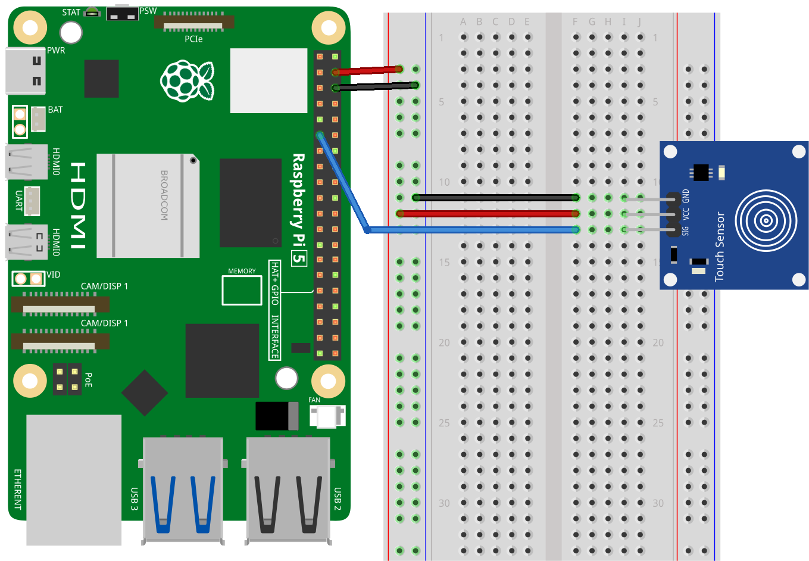

.. note::

    こんにちは、SunFounder Raspberry Pi & Arduino & ESP32 Enthusiasts Communityへようこそ！Facebook上で、仲間と一緒にRaspberry Pi、Arduino、ESP32をさらに深く探求しましょう。

    **なぜ参加するのか？**

    - **専門的なサポート**：購入後の問題や技術的な課題をコミュニティやチームの助けを借りて解決。
    - **学びと共有**：スキルを向上させるためのヒントやチュートリアルを交換。
    - **限定プレビュー**：新製品発表や予告編に早期アクセス。
    - **特別割引**：最新製品の特別割引を楽しむ。
    - **フェスティブプロモーションとプレゼント**：プレゼントやホリデープロモーションに参加。

    👉 私たちと一緒に探索と創造を始める準備はできましたか？[|link_sf_facebook|]をクリックして、今すぐ参加しましょう！

.. _pi_lesson22_touch_sensor:

Lesson 22: Touch Sensor Module
==================================

In this lesson, you will learn how to connect and program a touch sensor with the Raspberry Pi using Python. The focus will be on setting up the sensor on GPIO pin 17 and writing a simple script to detect and respond to touch and release events. This practical session is aimed at teaching the basics of sensor integration and event handling in Python, providing you with the skills needed for more advanced sensor-based projects. It's an ideal starting point for those new to working with electronics and the Raspberry Pi.

Required Components
--------------------------

In this project, we need the following components. 

It's definitely convenient to buy a whole kit, here's the link: 

.. list-table::
    :widths: 20 20 20
    :header-rows: 1

    *   - Name	
        - ITEMS IN THIS KIT
        - LINK
    *   - Universal Maker Sensor Kit
        - 94
        - |link_umsk|

You can also buy them separately from the links below.

.. list-table::
    :widths: 30 20
    :header-rows: 1

    *   - Component Introduction
        - Purchase Link

    *   - Raspberry Pi 5
        - \-
    *   - :ref:`cpn_touch`
        - |link_touch_buy|
    *   - :ref:`cpn_breadboard`
        - |link_breadboard_buy|

Wiring
---------------------------

Code
---------------------------

.. code-block:: python

   from gpiozero import Button
   from signal import pause

   # Function called when the sensor is touched
   def touched():
       # Print a message indicating the sensor is touched
       print("Touched!")  

   # Function called when the sensor is not touched
   def not_touched():
       # Print a message indicating the sensor is not touched
       print("Not touched!")  

   # Initialize a Button object for the touch sensor
   # GPIO 17: pin connected to the sensor
   # pull_up=None: disable internal pull-up/pull-down resistors
   # active_state=True: high voltage is considered the active state
   touch_sensor = Button(17, pull_up=None, active_state=True)

   # Assign functions to sensor events
   touch_sensor.when_pressed = touched
   touch_sensor.when_released = not_touched

   pause()  # Keep the program running to detect touch events

Code Analysis
---------------------------

#. Importing Libraries
   
   The script starts by importing the ``Button`` class from gpiozero for interfacing with the touch sensor, and ``pause`` from the signal module to keep the program running and responsive to events.

   .. code-block:: python

      from gpiozero import Button
      from signal import pause

#. Defining Callback Functions
   
   Two functions, ``touched`` and ``not_touched``, are defined to handle touch and release events from the sensor. Each function prints a message indicating the sensor's state.

   .. code-block:: python

      def touched():
          print("Touched!")  

      def not_touched():
          print("Not touched!")  

#. Initializing the Touch Sensor
   
   A ``Button`` object named ``touch_sensor`` is created for the touch sensor on GPIO pin 17. The ``pull_up`` parameter is set to ``None`` to disable internal pull-up/pull-down resistors, and ``active_state`` is set to ``True`` to consider high voltage as the active state.

   .. code-block:: python

      touch_sensor = Button(17, pull_up=None, active_state=True)

#. Assigning Functions to Sensor Events
   
   The ``when_pressed`` event of the ``touch_sensor`` is linked to the ``touched`` function, and the ``when_released`` event is linked to the ``not_touched`` function. This setup allows the script to react to touch and release events from the sensor.

   .. code-block:: python

      touch_sensor.when_pressed = touched
      touch_sensor.when_released = not_touched

#. Keeping the Program Running
   
   The ``pause()`` function is called to keep the program running indefinitely. This is necessary to continuously monitor and respond to touch sensor events.

   .. code-block:: python

      pause()