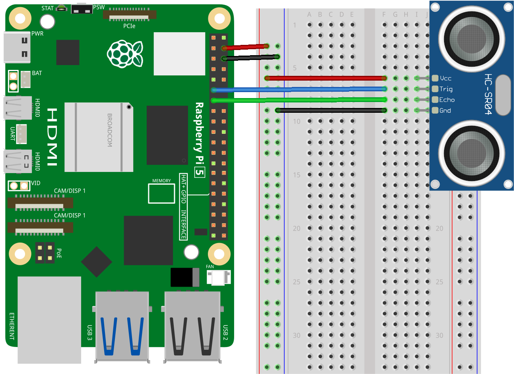

.. note::

   Hallo und willkommen in der SunFounder Raspberry Pi & Arduino & ESP32 Enthusiasten-Gemeinschaft auf Facebook! Tauchen Sie tiefer ein in die Welt von Raspberry Pi, Arduino und ESP32 mit anderen Enthusiasten.

   **Warum beitreten?**

   - **Expertenunterstützung**: Lösen Sie Nachverkaufsprobleme und technische Herausforderungen mit Hilfe unserer Gemeinschaft und unseres Teams.
   - **Lernen & Teilen**: Tauschen Sie Tipps und Anleitungen aus, um Ihre Fähigkeiten zu verbessern.
   - **Exklusive Vorschauen**: Erhalten Sie frühzeitigen Zugang zu neuen Produktankündigungen und exklusiven Einblicken.
   - **Spezialrabatte**: Genießen Sie exklusive Rabatte auf unsere neuesten Produkte.
   - **Festliche Aktionen und Gewinnspiele**: Nehmen Sie an Gewinnspielen und Feiertagsaktionen teil.

   👉 Sind Sie bereit, mit uns zu erkunden und zu erschaffen? Klicken Sie auf [|link_sf_facebook|] und treten Sie heute bei!

.. _pi_lesson23_ultrasonic:

Lektion 23: Ultraschallsensor-Modul (HC-SR04)
================================================

In dieser Lektion lernen Sie, wie Sie einen Ultraschall-Entfernungssensor an einen Raspberry Pi anschließen und ein Python-Skript zum Auslesen von Abstandsmessungen schreiben. Wir führen Sie durch den Prozess, den Trigger-Pin des Sensors mit GPIO 17 und den Echo-Pin mit GPIO 27 zu verbinden. Der bereitgestellte Python-Code hilft Ihnen, Entfernungen zu messen und in Zentimetern anzuzeigen.

Erforderliche Komponenten
--------------------------

In diesem Projekt benötigen wir die folgenden Komponenten.

Es ist definitiv praktisch, ein ganzes Kit zu kaufen, hier ist der Link:

.. list-table::
    :widths: 20 20 20
    :header-rows: 1

    *   - Name	
        - ITEMS IN THIS KIT
        - LINK
    *   - Universal Maker Sensor Kit
        - 94
        - |link_umsk|

Sie können sie auch einzeln über die untenstehenden Links kaufen.

.. list-table::
    :widths: 30 20
    :header-rows: 1

    *   - Component Introduction
        - Purchase Link

    *   - Raspberry Pi 5
        - \-
    *   - :ref:`cpn_ultrasonic`
        - |link_ultrasonic_buy|
    *   - :ref:`cpn_breadboard`
        - |link_breadboard_buy|

Verkabelung
---------------------------

Code
---------------------------

.. code-block:: python

   #!/usr/bin/env python3
   from gpiozero import DistanceSensor
   from time import sleep

   # Initialize the DistanceSensor using GPIO Zero library
   # Trigger pin is connected to GPIO 17, Echo pin to GPIO 27
   sensor = DistanceSensor(echo=27, trigger=17)

   try:
       # Main loop to continuously measure and report distance
       while True:
           dis = sensor.distance * 100  # Measure distance and convert from meters to centimeters
           print('Distance: {:.2f} cm'.format(dis))  # Print the distance with two decimal precision
           sleep(0.3)  # Wait for 0.3 seconds before the next measurement

   except KeyboardInterrupt:
       # Handle KeyboardInterrupt (Ctrl+C) to gracefully exit the loop
       pass

Code-Analyse
---------------------------

#. Bibliotheken importieren
   
   Das Skript beginnt mit dem Import von ``DistanceSensor`` aus der gpiozero-Bibliothek für den Ultraschallsensor und ``sleep`` aus dem time-Modul zur Steuerung der Zeit.

   .. code-block:: python

      from gpiozero import DistanceSensor
      from time import sleep

#. Initialisierung des Entfernungssensors
   
   Ein ``DistanceSensor``-Objekt namens ``sensor`` wird erstellt, wobei die Pins ``echo`` und ``trigger`` mit GPIO 27 bzw. GPIO 17 verbunden sind. Diese Pins werden verwendet, um die Ultraschallsignale für die Abstandsmessung zu senden und zu empfangen.

   .. code-block:: python

      sensor = DistanceSensor(echo=27, trigger=17)

#. Implementierung der kontinuierlichen Überwachungsschleife
   
   - Ein ``try``-Block mit einer Endlosschleife (``while True:``) wird verwendet, um kontinuierlich den Abstand zu messen.
   - Innerhalb der Schleife gibt ``sensor.distance`` die gemessene Entfernung in Metern an, die dann in Zentimeter umgerechnet und in ``dis`` gespeichert wird.
   - Die Entfernung wird mit zwei Dezimalstellen Präzision unter Verwendung der ``format``-Methode ausgegeben.
   - ``sleep(0.3)`` fügt eine Verzögerung von 0,3 Sekunden zwischen jeder Messung hinzu, um die Frequenz der Messungen zu steuern und die CPU-Belastung zu reduzieren.

   .. raw:: html

       

   .. code-block:: python

      try:
          while True:
              dis = sensor.distance * 100
              print('Distance: {:.2f} cm'.format(dis))
              sleep(0.3)

#. Behandlung von KeyboardInterrupt für einen sauberen Abbruch
   
   Der ``except``-Block wird verwendet, um eine KeyboardInterrupt (typischerweise Strg+C) abzufangen. Wenn dies auftritt, beendet das Skript die Schleife sauber ohne zusätzliche Aktionen.

   .. code-block:: python

      except KeyboardInterrupt:
          pass