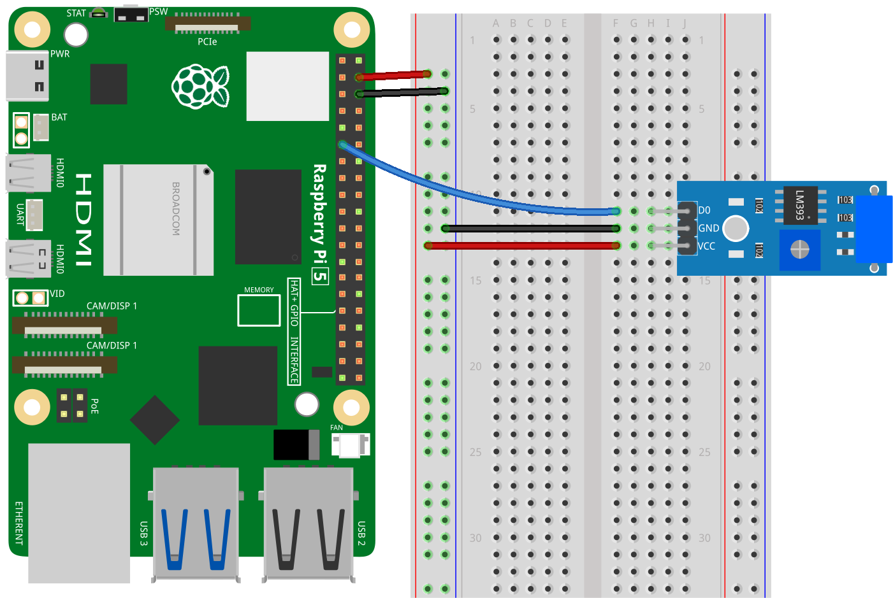

.. _pi_lesson24_vibration_sensor:

Lesson 24: Vibration Sensor Module (SW-420)
==============================================

In this lesson, you will learn how to use a vibration sensor with the Raspberry Pi. We'll help you connect the sensor to GPIO pin 17 and guide you through writing a simple Python script. This script will monitor the sensor and print a message whenever vibration is detected. This lesson is focused on giving beginners a hands-on experience in connecting a simple sensor to the Raspberry Pi and writing a straightforward script to interact with it. 

Required Components
---------------------------

* Raspberry Pi 
* :ref:`cpn_vibration`
* :ref:`cpn_breadboard`

Wiring
---------------------------

Code
---------------------------

.. code-block:: python

   from gpiozero import Button
   import time

   # Initialize a Button object for the vibration sensor
   # GPIO 17: pin connected to the sensor
   # pull_up=None: disable internal pull-up/pull-down resistors
   # active_state=True: high voltage is considered the active state
   vibration_sensor = Button(17, pull_up=None, active_state=True)

   # Continuously check the vibration sensor's state
   while True:
       # If the sensor detects vibration (is pressed), print a message
       if vibration_sensor.is_pressed:
           print("Vibration detected!")
       # If no vibration is detected, print ellipses
       else:
           print("...")

       # Pause for 0.1 seconds to lower the demand on the CPU
       time.sleep(0.1)

Code Analysis
---------------------------

#. **Importing Libraries**

   First, we import necessary libraries: ``gpiozero`` for interacting with the GPIO pins, and ``time`` for handling time-related functions.

   .. code-block:: python

      from gpiozero import InputDevice
      import time

#. **Setting Up the Vibration Sensor**

   We initialize the vibration sensor by creating an instance of ``InputDevice`` from the ``gpiozero`` library. The vibration sensor is connected to GPIO pin 17 on the Raspberry Pi.

   .. code-block:: python

      vibration_sensor = InputDevice(17)

#. **Continuous Monitoring Loop**

   A ``while True`` loop is used for continuous monitoring. This loop will run indefinitely until the program is manually stopped.

   .. code-block:: python

      while True:

#. **Sensor State Check and Output**

   - Inside the loop, we use an ``if`` statement to check the state of the vibration sensor. If ``vibration_sensor.is_active`` is ``True``, it means no vibration is detected, and "Vibration detected!" is printed.
   - If ``vibration_sensor.is_active`` is ``False``, indicating vibration, "..." is printed instead.
   - This distinction is crucial for understanding how the sensor's output is interpreted in the code.

   .. code-block:: python

          if vibration_sensor.is_active:
              print("Vibration detected!")
          else:
              print("...")

#. **Delay**

   Finally, ``time.sleep(1)`` adds a 1-second delay between each iteration of the loop. This delay is crucial to prevent the program from overloading the CPU and to make the output readable.

   .. code-block:: python

          time.sleep(1)

