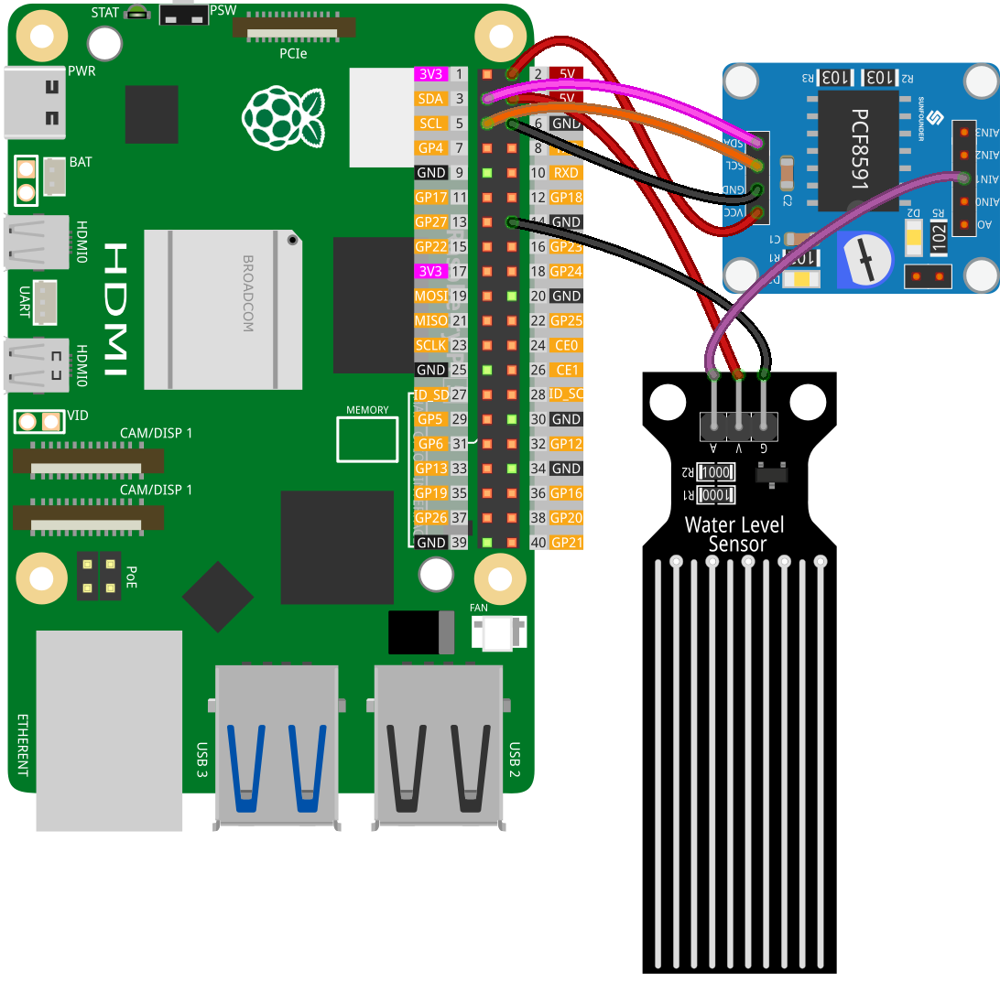

.. _pi_lesson25_water_level:

Lesson 25: Water Level Sensor Module
=========================================

.. note::
   The Raspberry Pi does not have analog input capabilities, so it needs a module like the :ref:`cpn_pcf8591` to read analog signals for processing.

In this lesson, we'll learn how to read from a water level sensor using a Raspberry Pi. You'll find out how to connect a water level sensor module to the PCF8591 for analog-to-digital conversion and monitor its output in real-time with Python.

Required Components
--------------------------

In this project, we need the following components. 

It's definitely convenient to buy a whole kit, here's the link: 

.. list-table::
    :widths: 20 20 20
    :header-rows: 1

    *   - Name	
        - ITEMS IN THIS KIT
        - LINK
    *   - Universal Maker Sensor Kit
        - 94
        - |link_umsk|

You can also buy them separately from the links below.

.. list-table::
    :widths: 30 20
    :header-rows: 1

    *   - Component Introduction
        - Purchase Link

    *   - Raspberry Pi 5
        - \-
    *   - :ref:`cpn_water_level`
        - \-
    *   - :ref:`cpn_pcf8591`
        - |link_pcf8591_module_buy|

Wiring
---------------------------

Code
---------------------------

.. code-block:: python

   import PCF8591 as ADC  # Import PCF8591 module
   import time  # Import time for delay
   
   ADC.setup(0x48)  # Initialize PCF8591 at address 0x48
   
   try:
       while True:  # Continuously read and print
           print(ADC.read(1))  # Read from Water level sensor module at AIN1
           time.sleep(0.2)  # Delay of 0.2 seconds
   except KeyboardInterrupt:
       print("Exit")  # Exit on CTRL+C

Code Analysis
---------------------------

1. **Import Libraries**:

   This section imports necessary Python libraries. The ``PCF8591`` library is used for interacting with the PCF8591 module, and ``time`` is for implementing delays in the code.

   .. code-block:: python

      import PCF8591 as ADC  # Import PCF8591 module
      import time  # Import time for delay

2. **Initialize PCF8591 Module**:

   Here, the PCF8591 module is initialized. The address ``0x48`` is the I²C address of the PCF8591 module. This is necessary for the Raspberry Pi to communicate with the module.

   .. code-block:: python

      ADC.setup(0x48)  # Initialize PCF8591 at address 0x48

3. **Main Loop and Reading Data**:

   The ``try`` block includes a continuous loop that consistently reads data from the water level sensor module. The ``ADC.read(1)`` function captures the analog input from the sensor connected to channel 1 (AIN1) of the PCF8591 module. Incorporating a ``time.sleep(0.2)`` creates a 0.2-second pause between each reading. This not only helps in reducing CPU usage on the Raspberry Pi by avoiding excessive data processing demands, but also prevents the terminal from being overrun with rapidly scrolling information, making it easier to monitor and analyze the output.

   .. code-block:: python

      try:
          while True:  # Continuously read and print
              print(ADC.read(1))  # Read from Water level sensor module at AIN1
              time.sleep(0.2)  # Delay of 0.2 seconds

4. **Handling Keyboard Interrupt**:

   The ``except`` block is designed to catch a KeyboardInterrupt (like pressing CTRL+C). When this interrupt occurs, the script prints "exit" and stops running. This is a common way to gracefully exit a continuously running script in Python.

   .. code-block:: python

      except KeyboardInterrupt:
          print("exit")  # Exit on CTRL+C