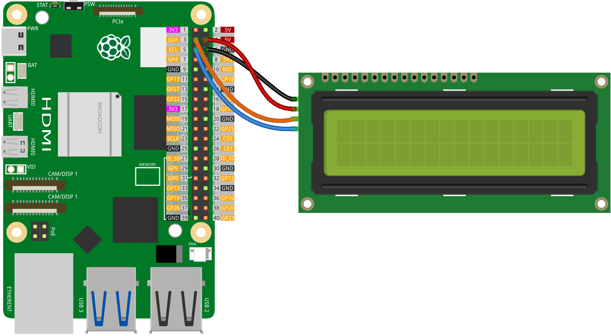

.. note::

    こんにちは、SunFounder Raspberry Pi & Arduino & ESP32 Enthusiasts Communityへようこそ！Facebook上で、仲間と一緒にRaspberry Pi、Arduino、ESP32をさらに深く探求しましょう。

    **なぜ参加するのか？**

    - **専門的なサポート**：購入後の問題や技術的な課題をコミュニティやチームの助けを借りて解決。
    - **学びと共有**：スキルを向上させるためのヒントやチュートリアルを交換。
    - **限定プレビュー**：新製品発表や予告編に早期アクセス。
    - **特別割引**：最新製品の特別割引を楽しむ。
    - **フェスティブプロモーションとプレゼント**：プレゼントやホリデープロモーションに参加。

    👉 私たちと一緒に探索と創造を始める準備はできましたか？[|link_sf_facebook|]をクリックして、今すぐ参加しましょう！

.. _pi_lesson26_lcd:

Lesson 26: I2C LCD 1602
==================================

In this lesson, you will learn the basics of displaying text on an LCD screen using a Raspberry Pi. We'll start by showing you how to connect a standard LCD to the Raspberry Pi using the I2C interface. You'll learn how to set up the LCD with simple parameters like the Raspberry Pi model and I2C address. Then, we'll walk you through writing a basic Python script to display messages like "Hello World!" on the screen. This straightforward project is aimed at beginners, offering a foundational introduction to interfacing hardware with the Raspberry Pi and basic Python programming.

Required Components
--------------------------

In this project, we need the following components. 

It's definitely convenient to buy a whole kit, here's the link: 

.. list-table::
    :widths: 20 20 20
    :header-rows: 1

    *   - Name	
        - ITEMS IN THIS KIT
        - LINK
    *   - Universal Maker Sensor Kit
        - 94
        - |link_umsk|

You can also buy them separately from the links below.

.. list-table::
    :widths: 30 20
    :header-rows: 1

    *   - Component Introduction
        - Purchase Link

    *   - Raspberry Pi 5
        - \-
    *   - :ref:`cpn_i2c_lcd1602`
        - |link_i2clcd1602_buy|

Wiring
---------------------------

Code
---------------------------

.. code-block:: python

   import time
   from LCD import LCD

   # Initialize the LCD with specific parameters: Raspberry Pi revision, I2C address, and backlight status
   lcd = LCD(2, 0x27, True)  # Using Raspberry Pi revision 2, I2C address 0x27, backlight enabled

   # Display messages on the LCD
   lcd.message("Hello World!", 1)        # Display 'Hello World!' on line 1
   lcd.message("    - Sunfounder", 2)    # Display '    - Sunfounder' on line 2

   # Keep the messages displayed for 5 seconds
   time.sleep(5)

   # Clear the LCD display
   lcd.clear()

Code Analysis
---------------------------

#. Import Libraries
   
   Import the ``time`` module for creating delays and the ``LCD`` module for controlling the LCD.

   For more detail about the ``LCD`` library, please refer to |link_lcd1602_python_driver_pi|.

   .. code-block:: python

      import time
      from LCD import LCD

#. Initialize the LCD
   
   Create an ``LCD`` object with specific parameters: the Raspberry Pi revision, the I2C address of the LCD, and the backlight status. In this case, Raspberry Pi revision 2(and higher version), I2C address 0x27, and backlight enabled.

   .. code-block:: python

      lcd = LCD(2, 0x27, True)

#. Display Messages on the LCD
   
   Use the ``message`` method of the ``LCD`` object to display text on the LCD. The first argument is the text, and the second argument is the line number.

   .. code-block:: python

      lcd.message("Hello World!", 1)
      lcd.message("    - Sunfounder", 2)

#. Keep the Messages Displayed
   
   Pause the program for 5 seconds, keeping the messages on the LCD during this time.

   .. code-block:: python

      time.sleep(5)

#. Clear the LCD Display
   
   After the delay, clear the display using the ``clear`` method of the ``LCD`` object.

   .. code-block:: python

      lcd.clear()

