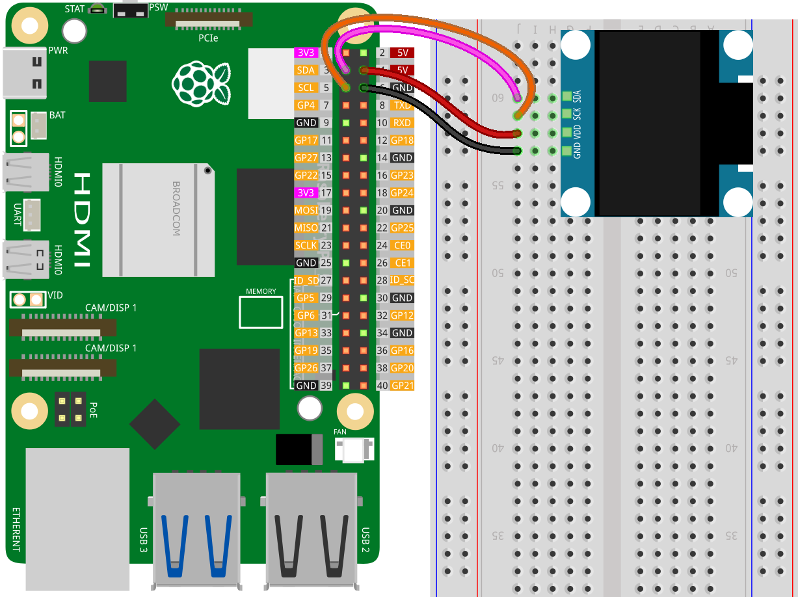

.. note::

   Hallo und willkommen in der SunFounder Raspberry Pi & Arduino & ESP32 Enthusiasten-Gemeinschaft auf Facebook! Tauchen Sie tiefer ein in die Welt von Raspberry Pi, Arduino und ESP32 mit anderen Enthusiasten.

   **Warum beitreten?**

   - **Expertenunterstützung**: Lösen Sie Nachverkaufsprobleme und technische Herausforderungen mit Hilfe unserer Gemeinschaft und unseres Teams.
   - **Lernen & Teilen**: Tauschen Sie Tipps und Anleitungen aus, um Ihre Fähigkeiten zu verbessern.
   - **Exklusive Vorschauen**: Erhalten Sie frühzeitigen Zugang zu neuen Produktankündigungen und exklusiven Einblicken.
   - **Spezialrabatte**: Genießen Sie exklusive Rabatte auf unsere neuesten Produkte.
   - **Festliche Aktionen und Gewinnspiele**: Nehmen Sie an Gewinnspielen und Feiertagsaktionen teil.

   👉 Sind Sie bereit, mit uns zu erkunden und zu erschaffen? Klicken Sie auf [|link_sf_facebook|] und treten Sie heute bei!

.. _pi_lesson27_oled:

Lektion 27: OLED-Display-Modul (SSD1306)
============================================

In dieser Lektion lernen Sie, wie Sie ein Raspberry Pi mit einem OLED-Display-Modul (SSD1306) unter Verwendung von Python verbinden. Sie lernen, wie Sie eine I2C-Kommunikation zwischen dem Raspberry Pi und dem OLED-Display herstellen und die Python Imaging Library (PIL) für die Erstellung von Grafiken und Text verwenden. Die Lektion führt Sie durch das Zeichnen von Formen und Texten auf dem OLED-Bildschirm und bietet ein praktisches Beispiel mit der Nachricht "Hello World!".

Erforderliche Komponenten
--------------------------

In diesem Projekt benötigen wir die folgenden Komponenten.

Es ist definitiv praktisch, ein ganzes Kit zu kaufen, hier ist der Link:

.. list-table::
    :widths: 20 20 20
    :header-rows: 1

    *   - Name	
        - ITEMS IN THIS KIT
        - LINK
    *   - Universal Maker Sensor Kit
        - 94
        - |link_umsk|

Sie können sie auch einzeln über die untenstehenden Links kaufen.

.. list-table::
    :widths: 30 20
    :header-rows: 1

    *   - Component Introduction
        - Purchase Link

    *   - Raspberry Pi 5
        - \-
    *   - :ref:`cpn_oled`
        - \-
    *   - :ref:`cpn_breadboard`
        - |link_breadboard_buy|

Verkabelung
---------------------------

Bibliothek installieren
---------------------------

.. note::
    Die adafruit-circuitpython-ssd1306-Bibliothek basiert auf Blinka. Stellen Sie daher sicher, dass Blinka installiert ist. Anweisungen zur Installation der Bibliotheken finden Sie unter :ref:`install_blinka`.

Bevor Sie die Bibliothek installieren, stellen Sie sicher, dass die virtuelle Python-Umgebung aktiviert ist:

.. code-block:: bash

   source ~/env/bin/activate

Installieren Sie die adafruit-circuitpython-ssd1306-Bibliothek:

.. code-block:: bash

   pip install adafruit-circuitpython-ssd1306
Code ausführen
---------------------------

.. note::
   - Bitte stellen Sie sicher, dass Sie die Python-Bibliothek installiert haben, die für die Ausführung des Codes gemäß den Schritten unter "Bibliothek installieren" erforderlich ist.
   - Bevor Sie den Code ausführen, stellen Sie sicher, dass Sie die virtuelle Python-Umgebung mit installiertem Blinka aktiviert haben. Sie können die virtuelle Umgebung mit folgendem Befehl aktivieren:

     .. code-block:: bash
  
        source ~/env/bin/activate

   - Finden Sie den Code für diese Lektion im Verzeichnis ``universal-maker-sensor-kit-main/pi/`` oder kopieren Sie den untenstehenden Code direkt und führen Sie ihn im Terminal aus:

     .. code-block:: bash
  
        python 27_ssd1306_oled_module.py

.. code-block:: python

   import board
   import digitalio
   from PIL import Image, ImageDraw, ImageFont
   import adafruit_ssd1306
   
   # Initialize OLED display dimensions
   WIDTH = 128
   HEIGHT = 64
   
   # Set up I2C communication with the OLED display
   i2c = board.I2C()  # Utilizes board's SCL and SDA pins
   oled = adafruit_ssd1306.SSD1306_I2C(WIDTH, HEIGHT, i2c, addr=0x3C)
   
   # Clear the OLED display
   oled.fill(0)
   oled.show()
   
   # Create a new image with 1-bit color for drawing
   image = Image.new("1", (oled.width, oled.height))
   
   # Obtain a drawing object to manipulate the image
   draw = ImageDraw.Draw(image)
   
   # Draw a filled white rectangle as the background
   draw.rectangle((0, 0, oled.width, oled.height), outline=255, fill=255)
   
   # Define border size for an inner rectangle
   BORDER = 5
   # Draw a smaller black rectangle inside the larger one
   draw.rectangle(
       (BORDER, BORDER, oled.width - BORDER - 1, oled.height - BORDER - 1),
       outline=0,
       fill=0,
   )
   
   # Load the default font for text
   font = ImageFont.load_default()
   
   def getfontsize(font, text):
       # Calculate the size of the text in pixels
       left, top, right, bottom = font.getbbox(text)
       return right - left, bottom - top
   
   # Define the text to be displayed
   text = "Hello World!"
   # Get the width and height of the text in pixels
   (font_width, font_height) = getfontsize(font, text)
   # Draw the text, centered on the display
   draw.text(
       (oled.width // 2 - font_width // 2, oled.height // 2 - font_height // 2),
       text,
       font=font,
       fill=255,
   )
   
   # Send the image to the OLED display
   oled.image(image)
   oled.show()

Code-Analyse
---------------------------

#. Notwendige Bibliotheken importieren

   Hier importieren wir die für das Projekt benötigten Bibliotheken. ``board`` dient zur Schnittstelle mit der Raspberry Pi-Hardware, ``PIL`` zur Bildverarbeitung und ``adafruit_ssd1306`` zur Steuerung des OLED-Displays.

   Weitere Informationen zur ``adafruit_ssd1306``-Bibliothek finden Sie unter |Adafruit_Adafruit_CircuitPython_SSD1306|.

   .. code-block:: python

      import board
      import digitalio
      from PIL import Image, ImageDraw, ImageFont
      import adafruit_ssd1306

#. Initialisierung des OLED-Displays

   Die Abmessungen des OLED-Displays werden festgelegt und die I2C-Kommunikation wird eingerichtet. Das ``adafruit_ssd1306.SSD1306_I2C``-Objekt wird erstellt, um mit dem OLED zu interagieren.

   .. code-block:: python

      # Initialize OLED display dimensions
      WIDTH = 128
      HEIGHT = 64

      # Set up I2C communication with the OLED display
      i2c = board.I2C()
      oled = adafruit_ssd1306.SSD1306_I2C(WIDTH, HEIGHT, i2c, addr=0x3C)

#. Löschen des Displays

   Das OLED-Display wird durch Füllen mit Nullen (schwarz) gelöscht.

   .. code-block:: python

      # Clear the OLED display
      oled.fill(0)
      oled.show()

#. Erstellen eines Bildpuffers

   Ein Bildpuffer wird mithilfe von PIL erstellt. Hier werden die Grafiken gezeichnet, bevor sie auf dem Bildschirm angezeigt werden.

   Die PIL (Python Imaging Library) fügt Ihrem Python-Interpreter Bildverarbeitungsfunktionen hinzu. Weitere Informationen finden Sie im |link_pil_handbook|.

   .. code-block:: python

      # Create a new image with 1-bit color for drawing
      image = Image.new("1", (oled.width, oled.height))

      # Obtain a drawing object to manipulate the image
      draw = ImageDraw.Draw(image)

#. Zeichnen von Grafiken

   Hier werden ein weißes Rechteck (Hintergrund) und ein kleineres schwarzes Rechteck (Randeffekt) auf den Bildpuffer gezeichnet.

   .. code-block:: python

      # Draw a filled white rectangle as the background
      draw.rectangle((0, 0, oled.width, oled.height), outline=255, fill=255)

      # Define border size for an inner rectangle
      BORDER = 5
      # Draw a smaller black rectangle inside the larger one
      draw.rectangle(
          (BORDER, BORDER, oled.width - BORDER - 1, oled.height - BORDER - 1),
          outline=0,
          fill=0,
      )

#. Hinzufügen von Text

   Die Standardschriftart wird geladen und eine Funktion zur Berechnung der Textgröße definiert. Anschließend wird "Hello World!" zentriert und auf den Bildpuffer gezeichnet.

   .. code-block:: python

      # Load the default font for text
      font = ImageFont.load_default()

      def getfontsize(font, text):
          # Calculate the size of the text in pixels
          left, top, right, bottom = font.getbbox(text)
          return right - left, bottom - top

      # Define the text to be displayed
      text = "Hello World!"
      # Get the width and height of the text in pixels
      (font_width, font_height) = getfontsize(font, text)
      # Draw the text, centered on the display
      draw.text(
          (oled.width // 2 - font_width // 2, oled.height // 2 - font_height // 2),
          text,
          font=font,
          fill=255,
      )

#. Bild anzeigen

   Schließlich wird der Bildpuffer zur Visualisierung an das OLED-Display gesendet.

   .. code-block:: python

      # Send the image to the OLED display
      oled.image(image)
      oled.show()