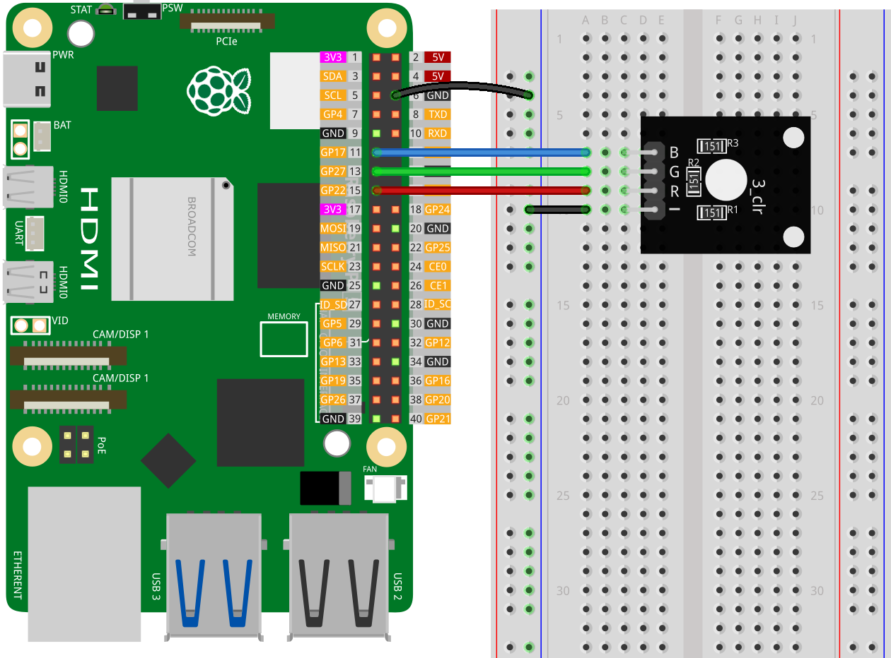

.. note::

   Hallo und willkommen in der SunFounder Raspberry Pi & Arduino & ESP32 Enthusiasten-Gemeinschaft auf Facebook! Tauchen Sie tiefer ein in die Welt von Raspberry Pi, Arduino und ESP32 mit anderen Enthusiasten.

   **Warum beitreten?**

   - **Expertenunterstützung**: Lösen Sie Nachverkaufsprobleme und technische Herausforderungen mit Hilfe unserer Gemeinschaft und unseres Teams.
   - **Lernen & Teilen**: Tauschen Sie Tipps und Anleitungen aus, um Ihre Fähigkeiten zu verbessern.
   - **Exklusive Vorschauen**: Erhalten Sie frühzeitigen Zugang zu neuen Produktankündigungen und exklusiven Einblicken.
   - **Spezialrabatte**: Genießen Sie exklusive Rabatte auf unsere neuesten Produkte.
   - **Festliche Aktionen und Gewinnspiele**: Nehmen Sie an Gewinnspielen und Feiertagsaktionen teil.

   👉 Sind Sie bereit, mit uns zu erkunden und zu erschaffen? Klicken Sie auf [|link_sf_facebook|] und treten Sie heute bei!

.. _pi_lesson28_rgb_module:

Lektion 28: RGB-Modul
==================================

In dieser Lektion lernen Sie, wie Sie ein RGB-LED-Modul mit einem Raspberry Pi steuern können. Sie erfahren, wie Sie mit Python die Farbe der LED auf Rot, Grün, Blau und Gelb ändern und sie dann ausschalten können. Dieses Projekt ist eine einfache Einführung in die Arbeit mit RGB-LEDs und die GPIO-Schnittstelle, ideal für Anfänger, die mit dem Raspberry Pi und der Python-Programmierung beginnen.

Benötigte Komponenten
--------------------------

Für dieses Projekt benötigen wir die folgenden Komponenten. 

Es ist definitiv praktisch, ein ganzes Kit zu kaufen, hier ist der Link: 

.. list-table::
    :widths: 20 20 20
    :header-rows: 1

    *   - Name	
        - ITEMS IN THIS KIT
        - LINK
    *   - Universal Maker Sensor Kit
        - 94
        - |link_umsk|

Sie können sie auch separat über die untenstehenden Links kaufen.

.. list-table::
    :widths: 30 20
    :header-rows: 1

    *   - Component Introduction
        - Purchase Link

    *   - Raspberry Pi 5
        - \-
    *   - :ref:`cpn_rgb`
        - \-
    *   - :ref:`cpn_breadboard`
        - |link_breadboard_buy|

Verkabelung
---------------------------

Code
---------------------------

.. code-block:: python

   from gpiozero import RGBLED  
   from time import sleep  
   from colorzero import Color  

   # GPIO pin assignments for the RGB LED
   red_pin = 22
   green_pin = 27
   blue_pin = 17

   # Initialize the RGB LED with red, green, and blue components connected to their respective GPIO pins
   led = RGBLED(red=red_pin, green=green_pin, blue=blue_pin)

   # Set the LED to red color (red: 100%, green: 0%, blue: 0%) and wait for 1 second
   led.color = (1, 0, 0)
   sleep(1)

   # Set the LED to green color (red: 0%, green: 100%, blue: 0%) and wait for 1 second
   led.color = (0, 1, 0)
   sleep(1)

   # Set the LED to blue color (red: 0%, green: 0%, blue: 100%) and wait for 1 second
   led.color = (0, 0, 1)
   sleep(1)

   # Set the LED to yellow color using the Color class and wait for 1 second
   led.color = Color('yellow')
   sleep(1)

   # Turn the LED off
   led.off()

Code-Analyse
---------------------------

#. Bibliotheken importieren
   
   Das Skript beginnt mit dem Import der Klasse ``RGBLED`` aus gpiozero zur Steuerung der RGB-LED und der Funktion ``sleep`` aus dem Modul time für Verzögerungen. Es importiert auch die Klasse ``Color`` aus colorzero für Farbbestimmungen.

   .. code-block:: python

      from gpiozero import RGBLED  
      from time import sleep  
      from colorzero import Color  

#. Initialisierung der RGB-LED
   
   - GPIO-Pins für jede Farbkomponente der RGB-LED werden definiert. 
   - Die RGB-LED wird mit ihren roten, grünen und blauen Komponenten, die mit den GPIO-Pins 22, 27 und 17 verbunden sind, initialisiert.

   .. code-block:: python

      red_pin = 22
      green_pin = 27
      blue_pin = 17
      led = RGBLED(red=red_pin, green=green_pin, blue=blue_pin)

#. Farben der LED einstellen
   
   - Die Farbe der LED wird nacheinander auf Rot, Grün und Blau gesetzt, jeweils gefolgt von einer 1-sekündigen Pause. 
   - Farben werden durch Tupel (rot, grün, blau) dargestellt, wobei jeder Wert zwischen 0 und 1 liegt und die Intensität angibt.

   .. code-block:: python

      led.color = (1, 0, 0)
      sleep(1)
      led.color = (0, 1, 0)
      sleep(1)
      led.color = (0, 0, 1)
      sleep(1)

#. Verwendung der Color-Klasse
   
   Das Skript zeigt, wie die Klasse ``Color`` aus colorzero verwendet wird, um die LED auf eine benannte Farbe (``yellow``) zu setzen und dann 1 Sekunde zu warten.

   Zusätzlich zur Verwendung der vordefinierten Farben direkt, können Sie auch Farben auf verschiedene Weise definieren. Weitere Details finden Sie unter |link_gpiozero_color|.

   .. code-block:: python

      led.color = Color('yellow')
      sleep(1)

#. Ausschalten der LED
   
   Schließlich schaltet das Skript die LED mit ``led.off()`` aus.

   .. code-block:: python

      led.off()
