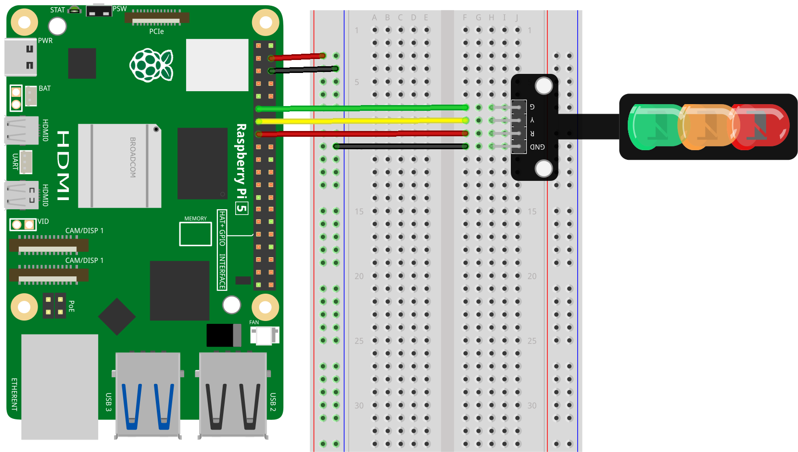

 .. note::

    Hallo und willkommen in der SunFounder Raspberry Pi & Arduino & ESP32 Enthusiasten-Gemeinschaft auf Facebook! Tauchen Sie tiefer ein in die Welt von Raspberry Pi, Arduino und ESP32 mit anderen Enthusiasten.

    **Warum beitreten?**

    - **Expertenunterstützung**: Lösen Sie Nachverkaufsprobleme und technische Herausforderungen mit Hilfe unserer Gemeinschaft und unseres Teams.
    - **Lernen & Teilen**: Tauschen Sie Tipps und Anleitungen aus, um Ihre Fähigkeiten zu verbessern.
    - **Exklusive Vorschauen**: Erhalten Sie frühzeitigen Zugang zu neuen Produktankündigungen und exklusiven Einblicken.
    - **Spezialrabatte**: Genießen Sie exklusive Rabatte auf unsere neuesten Produkte.
    - **Festliche Aktionen und Gewinnspiele**: Nehmen Sie an Gewinnspielen und Feiertagsaktionen teil.

    👉 Sind Sie bereit, mit uns zu erkunden und zu erschaffen? Klicken Sie auf [|link_sf_facebook|] und treten Sie heute bei!

.. _pi_lesson29_traffic_light_module:

Lektion 29: Ampelmodul
==================================

In dieser Lektion lernen Sie, wie man eine Ampel mit einem Raspberry Pi simuliert. Sie werden den Raspberry Pi so programmieren, dass er diese LEDs in einer Abfolge steuert, die einer Ampel ähnelt: Die rote LED wird für 3 Sekunden aktiv sein, die gelbe LED wird in einem bestimmten Muster blinken und dann wird die grüne LED für 3 Sekunden eingeschaltet. Dieses Projekt ist eine praktische Möglichkeit, mit der GPIO-Schnittstelle und der Python-Programmierung zu beginnen, und eignet sich für diejenigen, die neu in der Kombination von Hardware und Software mit dem Raspberry Pi sind.

Benötigte Komponenten
--------------------------

Für dieses Projekt benötigen wir die folgenden Komponenten.

Es ist auf jeden Fall praktisch, ein ganzes Kit zu kaufen, hier ist der Link:

.. list-table::
    :widths: 20 20 20
    :header-rows: 1

    *   - Name
        - ITEMS IN THIS KIT
        - LINK
    *   - Universal Maker Sensor Kit
        - 94
        - |link_umsk|

Sie können sie auch separat über die unten stehenden Links kaufen.

.. list-table::
    :widths: 30 20
    :header-rows: 1

    *   - Component Introduction
        - Purchase Link

    *   - Raspberry Pi 5
        - \-
    *   - :ref:`cpn_traffic`
        - |link_traffic_light_module_buy|
    *   - :ref:`cpn_breadboard`
        - |link_breadboard_buy|

Verkabelung
---------------------------

Code
---------------------------

.. code-block:: python

   from gpiozero import LED
   from time import sleep

   # Initialize LED pins
   red = LED(22)    # Red LED connected to GPIO pin 22
   yellow = LED(27) # Yellow LED connected to GPIO pin 27
   green = LED(17)  # Green LED connected to GPIO pin 17

   # LED control in a continuous loop
   try:
       while True:
           # Red LED cycle
           red.on()     # Turn on red LED
           sleep(3)     # Red LED on for 3 seconds
           red.off()    # Turn off red LED

           # Yellow LED blinking pattern
           yellow.on()  # Turn on yellow LED
           sleep(0.5)   # Yellow LED on for 0.5 second
           yellow.off() # Turn off yellow LED
           sleep(0.5)   # Off for 0.5 second
           yellow.on()  # Repeat blinking
           sleep(0.5)   # Yellow LED on for 0.5 second
           yellow.off() # Turn off yellow LED
           sleep(0.5)   # Off for 0.5 second
           yellow.on()  # Repeat blinking
           sleep(0.5)   # Yellow LED on for 0.5 second
           yellow.off() # Turn off yellow LED
           sleep(0.5)   # Off for 0.5 second

           # Green LED cycle
           green.on()   # Turn on green LED
           sleep(3)     # Green LED on for 3 seconds
           green.off()  # Turn off green LED

   except KeyboardInterrupt:
       # Turn off all LEDs and exit safely on keyboard interrupt
       red.off()
       yellow.off()
       green.off()

Code-Analyse
---------------------------

#. Bibliotheken importieren
   
   Die Bibliothek ``gpiozero`` wird importiert, um die GPIO-Pins zu steuern, und die ``sleep``-Funktion der ``time``-Bibliothek wird für zeitliche Verzögerungen verwendet.

   .. code-block:: python

      from gpiozero import LED
      from time import sleep

#. LED-Pins initialisieren
   
   Hier wird jede LED einem spezifischen GPIO-Pin des Raspberry Pi zugeordnet, indem die ``LED``-Klasse der ``gpiozero``-Bibliothek verwendet wird.

   .. code-block:: python

      red = LED(22)    # Red LED connected to GPIO pin 22
      yellow = LED(27) # Yellow LED connected to GPIO pin 27
      green = LED(17)  # Green LED connected to GPIO pin 17

#. LED-Steuerungsschleife
   
   Die Schleife ``while True:`` läuft kontinuierlich und schaltet jede LED in einem spezifischen Muster ein und aus, wobei die Funktionen ``on()``, ``off()`` und ``sleep()`` verwendet werden.

   - Die rote LED wird für 3 Sekunden eingeschaltet.
   - Die gelbe LED blinkt: 0,5 Sekunden ein, 0,5 Sekunden aus, dreimal wiederholt.
   - Die grüne LED wird für 3 Sekunden eingeschaltet.

   .. code-block:: python

      try:
          while True:
              # Red LED cycle
              red.on()
              sleep(3)
              red.off()

              # Yellow LED blinking pattern
              # [The pattern is repeated three times]
              
              # Green LED cycle
              green.on()
              sleep(3)
              green.off()

#. Ausnahmebehandlung
   
   Der ``except``-Block fängt eine ``KeyboardInterrupt``-Ausnahme ab (normalerweise durch Drücken von Strg+C erzeugt). Er stellt sicher, dass alle LEDs ausgeschaltet werden, bevor das Programm beendet wird, um zu verhindern, dass die LEDs in einem undefinierten Zustand bleiben.

   .. code-block:: python

      except KeyboardInterrupt:
          red.off()
          yellow.off()
          green.off()