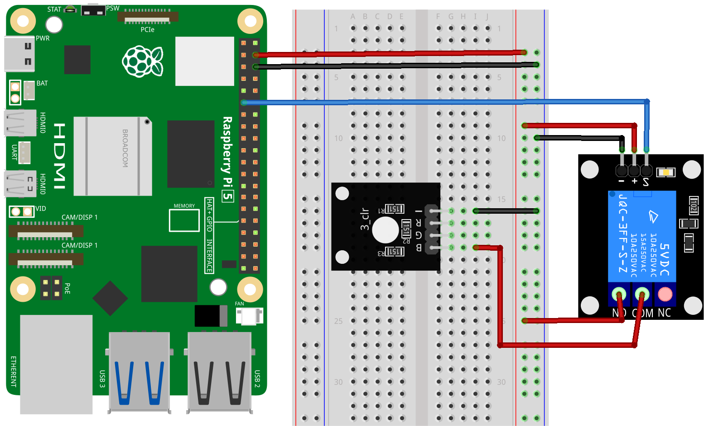

.. note::

    こんにちは、SunFounder Raspberry Pi & Arduino & ESP32 Enthusiasts Communityへようこそ！Facebook上で、仲間と一緒にRaspberry Pi、Arduino、ESP32をさらに深く探求しましょう。

    **なぜ参加するのか？**

    - **専門的なサポート**：購入後の問題や技術的な課題をコミュニティやチームの助けを借りて解決。
    - **学びと共有**：スキルを向上させるためのヒントやチュートリアルを交換。
    - **限定プレビュー**：新製品発表や予告編に早期アクセス。
    - **特別割引**：最新製品の特別割引を楽しむ。
    - **フェスティブプロモーションとプレゼント**：プレゼントやホリデープロモーションに参加。

    👉 私たちと一緒に探索と創造を始める準備はできましたか？[|link_sf_facebook|]をクリックして、今すぐ参加しましょう！

.. _pi_lesson30_relay_module:

Lesson 30: Relay Module
==================================

In this lesson, you will learn how to control a relay module using a Raspberry Pi. You'll learn how to write a simple Python script to turn the relay on and off at one-second intervals. This project is a practical introduction to using GPIO pins for controlling external devices, providing a basic understanding of how relays work in electronic circuits. It's a straightforward and informative exercise, well-suited for beginners starting with Raspberry Pi and hardware control.

Required Components
--------------------------

In this project, we need the following components. 

It's definitely convenient to buy a whole kit, here's the link: 

.. list-table::
    :widths: 20 20 20
    :header-rows: 1

    *   - Name	
        - ITEMS IN THIS KIT
        - LINK
    *   - Universal Maker Sensor Kit
        - 94
        - |link_umsk|

You can also buy them separately from the links below.

.. list-table::
    :widths: 30 20
    :header-rows: 1

    *   - Component Introduction
        - Purchase Link

    *   - Raspberry Pi 5
        - \-
    *   - :ref:`cpn_relay`
        - \-
    *   - :ref:`cpn_rgb`
        - \-
    *   - :ref:`cpn_breadboard`
        - |link_breadboard_buy|

Wiring
---------------------------

Code
---------------------------

.. code-block:: python

   from gpiozero import OutputDevice
   from time import sleep

   # Replace with your GPIO pin number
   relay_pin = 17  # Example using GPIO17

   # Initialize relay object
   relay = OutputDevice(relay_pin)

   try:
      while True:
         # Turn on the relay
         relay.on()
         sleep(1)  # Relay remains on for 1 second

         # Turn off the relay
         relay.off()
         sleep(1)  # Relay remains off for 1 second

   except KeyboardInterrupt:
      # Capture Ctrl+C and safely close the program
      relay.off()
      print("Program interrupted by user")

Code Analysis
---------------------------

#. Import Libraries
   
   Import the ``gpiozero`` library for GPIO control and the ``time`` library for delays.

   .. code-block:: python

      from gpiozero import OutputDevice
      from time import sleep

#. Initialize the Relay
   
   Define the GPIO pin connected to the relay and initialize an ``OutputDevice`` object with that pin.

   .. code-block:: python

      relay_pin = 17  # Example using GPIO17
      relay = OutputDevice(relay_pin)

#. Relay Control in a Loop
   
   The ``while True:`` loop continuously toggles the relay. ``relay.on()`` and ``relay.off()`` are used to control the relay, and ``sleep(1)`` creates a one-second delay between each state.

   .. code-block:: python

      try:
          while True:
              relay.on()
              sleep(1)  # Relay remains on for 1 second
              relay.off()
              sleep(1)  # Relay remains off for 1 second

#. Exception Handling
   
   The ``except`` block captures a ``KeyboardInterrupt`` (Ctrl+C). It ensures the relay is turned off and the program exits safely.

   .. code-block:: python

      except KeyboardInterrupt:
          relay.off()
          print("Program interrupted by user")