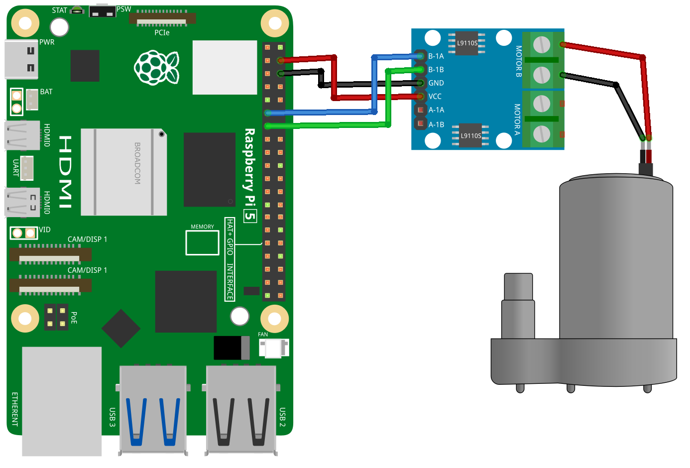

.. _pi_lesson31_pump:

Lesson 31: Centrifugal Pump
==================================

In this lesson, you will learn how to control a pump using a Raspberry Pi. You'll learn how to write a Python script to activate the pump, control its speed, and then stop it after a set period. This project provides a basic understanding of pump control through GPIO interfacing and Python programming, making it a suitable starting point for beginners interested in Raspberry Pi and simple pump applications.

Required Components
---------------------------

.. list-table::
    :widths: 30 20
    :header-rows: 1

    *   - Component Introduction
        - Purchase Link

    *   - Raspberry Pi 5
        - \-
    *   - :ref:`cpn_pump`
        - \-
    *   - :ref:`cpn_l9110`
        - \-

Wiring
---------------------------

Code
---------------------------

.. code-block:: python

   from gpiozero import Motor
   from time import sleep
   
   # Define pump pins
   pump = Motor(forward=17, backward=27)  # Using Raspberry Pi GPIO pin numbers
   
   # Activate the pump
   pump.forward(speed=1)  # Set pump speed, range is 0 to 1
   sleep(5)               # Run the pump for 5 seconds
   
   # Deactivate the pump
   pump.stop()            # Stop the pump

Code Analysis
---------------------------

#. Import Libraries
   
   The ``gpiozero`` library is used for controlling the motor, and the ``time`` library's ``sleep`` function is for delays.

   .. code-block:: python

      from gpiozero import Motor
      from time import sleep

#. Define Pump Pins
   
   A ``Motor`` object is created with two GPIO pins: one for forward and one for backward operation. In this case, GPIO 17 and 27 are used.

   .. code-block:: python

      pump = Motor(forward=17, backward=27)

#. Activate the pump
   
   The motor is activated in the forward direction with a specified speed using ``pump.forward(speed=1)``. The speed parameter ranges from 0 (stopped) to 1 (full speed). The motor runs for 5 seconds, as defined by ``sleep(5)``.

   .. code-block:: python

      pump.forward(speed=1)
      sleep(5)

#. Deactivate the pump
   
   The motor is stopped using ``pump.stop()``. This is essential for safely halting the motor's operation after the required duration.

   .. code-block:: python

      pump.stop()